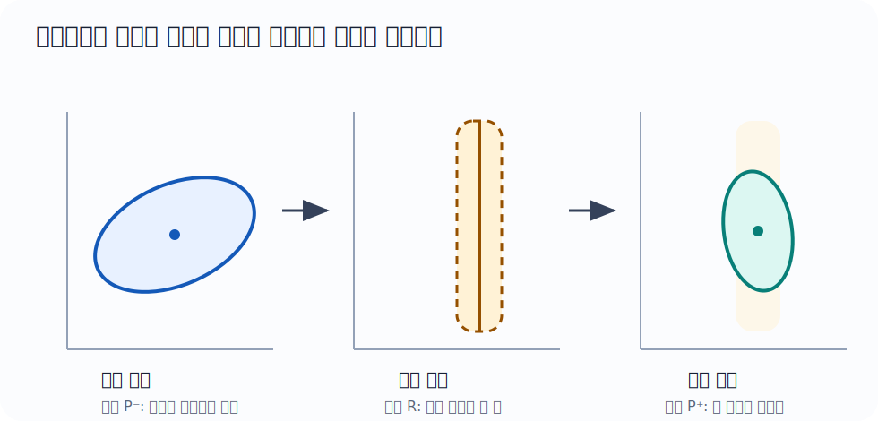
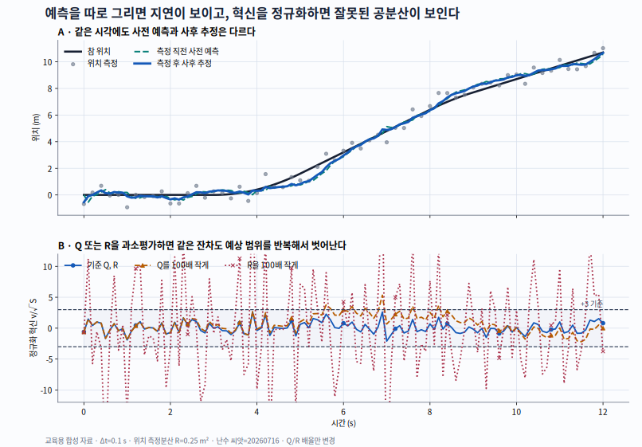
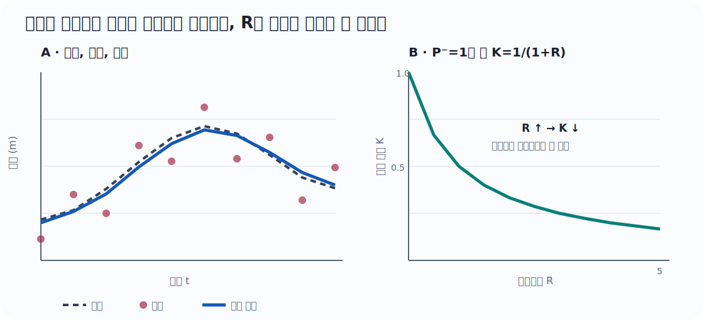
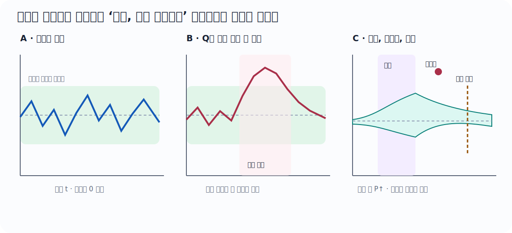

::: {.concept-hero}
## 30초 핵심

칼만 필터(Kalman Filter, KF)는 단순한 저역통과필터(low-pass filter)가 아니다. **“시스템이 어떻게 움직이는가”라는 예측과 “센서가 무엇을 보았는가”라는 측정을, 각각의 불확실성으로 절충하는 재귀적 상태추정기**다.

```text
이전 추정 ──동역학──▶ 사전 예측 ──측정과 비교──▶ 사후 추정
 (평균,P)              (평균,P⁻)        혁신           (평균,P⁺)
```

- 모델이 더 확실하면 예측을 더 믿는다.
- 센서가 더 확실하면 측정으로 더 크게 보정한다.
- 선형–가우스(Gaussian) 모델에서는 매 단계의 전체 사후분포가 정확히 가우스 분포이며, 칼만 필터가 그 평균과 공분산을 정확하게 계산한다.
:::

::: {.concept-scorecard}
### 이 장의 위치

- **중요도 5/5** · 로봇의 상태추정·센서 융합에서 반복해서 쓰이는 기준 구조
- **난이도 4/5** · 적용은 행렬 계산, 완전 유도는 조건부 가우스 분포와 직교투영이 필요
- **실무 빈도 5/5** · 로봇 운영체제(Robot Operating System, ROS) 상태추정, 관성센서 문서, 센서 로그와 공분산 메시지에서 일상적으로 만남
- **먼저 읽을 최소 선수** · 평균·분산, 상태와 측정의 차이, 행렬 곱의 모양
- **지금 없어도 되는 것** · 확률과정 전체, 측도론, 비선형 필터, 리 군(Lie group)
- **쓰임** · 엔코더+관성측정장치(Inertial Measurement Unit, IMU) · 위성항법시스템(Global Navigation Satellite System, GNSS)+관성항법 · 비전/라이다 위치추정 · 추정값 기반 제어
:::

::: {.learning-objectives}
### 이 장을 마치면

- 예측(prediction)과 보정(correction)의 평균·공분산 식을 기호의 모양과 단위까지 설명한다.
- $Q$, $R$, $P$를 임의의 조절값이 아니라 물리적 오차 모형으로 구성한다.
- 센서 자료율, 시간표시(timestamp), 좌표계, 편향(bias), 이상치(outlier)가 필터에 미치는 영향을 진단한다.
- 스칼라 식에서 행렬 식, 가우스 조건부 유도, 가중최소제곱 유도로 깊이를 높여 간다.
- 공개 제품 문서의 사실과 교재가 세운 모형을 구분한다.
:::

:::: {.depth-intuition}
## 왜 중요한가

엔코더(encoder)는 짧은 시간에는 부드러운 관절 정보를 주지만 영점 오차나 기구 오차가 있고, 위성항법시스템(Global Navigation Satellite System, GNSS)은 절대 위치를 주지만 잡음이 크거나 끊긴다. 관성측정장치(Inertial Measurement Unit, IMU)는 높은 자료율(data rate)로 변화를 알려 주지만 편향(bias)이 누적된다. 칼만 필터는 평균만 섞지 않고 **동역학, 단위, 방향별 공분산(covariance), 시간 순서**를 함께 사용한다.

::: {.term-card}
### 먼저 고정할 용어

- [상태(state)]{.atlas-term data-en="state" data-definition="현재값을 알면 입력과 모델을 이용해 미래의 시스템 거동을 기술할 수 있도록 선택한 최소 변수 묶음이다."}: 로봇의 실제 위치·속도·편향처럼 알고 싶은 값
- [측정(measurement)]{.atlas-term data-en="measurement" data-definition="센서가 내놓는 관측값이다. 로봇의 내부 상태 자체가 아니라 상태와 잡음의 함수로 모델링한다."}: 엔코더 각도, GNSS 위치, IMU 각속도처럼 실제로 받은 값
- [사전 추정(prior estimate)]{.atlas-term data-en="prior estimate" data-definition="현재 측정을 반영하기 전, 이전 사후 추정을 동역학으로 예측한 상태 추정이다. 칼만 필터에서는 보통 위첨자 마이너스(−)로 표시한다."}: 위첨자 $-$
- [사후 추정(posterior estimate)]{.atlas-term data-en="posterior estimate" data-definition="현재 측정을 반영한 뒤의 상태 추정이다. 칼만 필터에서는 보통 위첨자 플러스(+)로 표시하고 다음 시각 예측의 출발점으로 쓴다."}: 위첨자 $+$
- [혁신(innovation)]{.atlas-term data-en="innovation" data-definition="상태추정에서 실제 측정과 사전 예측 측정의 차이다. 새 측정이 예측에 더하는 정보라는 뜻으로 잔차(residual)와 유사하지만 시점과 조건이 명확하다."}: $\nu_k=z_k-H_k\hat x_k^-$
- [칼만 이득(Kalman gain)]{.atlas-term data-en="Kalman gain" data-definition="혁신을 상태 보정량으로 바꾸는 행렬이다. 사전 공분산과 측정 공분산으로부터 유도되며 방향별로 예측과 측정의 상대 신뢰도를 나타낸다."}: $K_k$
:::

```{mermaid}
%%| fig-cap: "칼만 필터의 예측–혁신–보정 흐름. 이전 사후 추정을 동역학과 과정 잡음으로 예측하고, 실제 측정과의 혁신을 칼만 이득으로 반영해 현재 사후 추정을 만든다."
%%| fig-alt: "왼쪽의 이전 사후 추정에서 동역학 F와 입력 u를 거쳐 사전 예측으로 이동한다. 과정 잡음 Q가 예측 공분산에 들어가고, 예측 측정 H x-hat-minus와 측정 z 및 측정 잡음 R이 혁신 nu를 만든다. 혁신에 칼만 이득 K를 적용해 오른쪽의 현재 사후 추정을 얻는다."
flowchart LR
  accTitle: 칼만 필터의 예측, 혁신, 보정 흐름
  accDescr: 이전 사후 추정을 동역학으로 예측하고 실제 측정과의 혁신을 칼만 이득으로 반영해 현재 사후 추정을 얻는 흐름이다.
  A["이전 사후 추정<br/>x̂⁺, P⁺"] -->|"동역학 F, 입력 u"| B["사전 예측<br/>x̂⁻, P⁻"]
  Q["과정 잡음 Q"] --> B
  B --> C["예측 측정 Hx̂⁻"]
  Z["실제 측정 z<br/>측정 잡음 R"] --> D["혁신 ν=z-Hx̂⁻"]
  C --> D
  D -->|"칼만 이득 K"| E["현재 사후 추정<br/>x̂⁺, P⁺"]
```

그림의 화살표를 한 문장으로 줄이면 **예측하고, 얼마나 빗나갔는지 재고, 믿을 만큼만 고친다**이다.

## 먼저 떠올릴 이미지: 두 자의 눈금을 합치기

예측이 $10\pm2$ m, 센서가 $12\pm1$ m라고 하자. 센서의 분산이 작으므로 새 추정은 12에 더 가깝다. 두 추정의 불확실성이 같다면 중간에 가깝다. “칼만 이득이 무엇을 더 믿을지 정한다”가 첫 직관이다.

## 지금 필요한 선수 체크

- [ ] 평균과 분산이 추정값과 불확실성을 각각 나타냄을 안다.
- [ ] 상태 $x_k$와 측정 $z_k$가 다를 수 있음을 설명한다.
- [ ] $F$가 상태를 다음 시간으로, $H$가 상태를 센서 공간으로 보낸다는 뜻을 안다.

부족하면 [평균과 공분산](../probability/mean-covariance.qmd), [상태공간](../systems/state-space.qmd)을 보고 여기로 돌아온다. 직관 단계에서는 확률과정 전체나 특이값 분해(Singular Value Decomposition, SVD)가 필요하지 않다.

## 스칼라 최소 예

사전 추정이 $\hat x^-=10$, 분산 $P^-=4$, 센서 측정이 $z=12$, 측정 잡음 분산 $R=1$이라 하자.

$$
K=\frac{P^-}{P^-+R}=\frac45=0.8,
$$
$$
\hat x^+=\hat x^-+K(z-\hat x^-)
=10+0.8(2)=11.6,
$$
$$
P^+=(1-K)P^-=0.8.
$$
혁신은 $z-\hat x^-=2$다. 측정이 더 정밀하므로 새 평균이 측정 쪽으로 크게 움직이고 분산은 두 입력보다 작아졌다.

::: {.callout-important title="칼만 이득은 임의의 평활화 비율이 아니다"}
$K=0.8$은 예쁘게 보이도록 고른 상수가 아니라 사전 불확실성과 측정 불확실성으로부터 유도된다. 시간에 따라 $P^-$가 달라지면 $K$도 달라진다.
:::

{fig-alt="왼쪽의 넓은 사전 타원, 가운데의 좁은 측정 띠, 오른쪽의 작아진 사후 타원을 차례로 보여 준다."}

그림에서 사후 타원은 단순히 두 중심의 중간에 있지 않다. **각 방향의 불확실성이 작은 정보가 그 방향을 더 강하게 결정한다.**

::::

:::: {.depth-application}
## 모형과 기호

::: {.block-metrics}
`중요도 5/5`{.metric-badge .metric-badge--importance} `난이도 3/5`{.metric-badge .metric-badge--difficulty}
:::

선형 이산시간 모델을

$$
x_k=F_{k-1}x_{k-1}+B_{k-1}u_{k-1}+w_{k-1},
$$
$$
z_k=H_kx_k+v_k
$$
로 둔다. 기본 모델에서

$$
w_{k-1}\sim\mathcal N(0,Q_{k-1}),\qquad
v_k\sim\mathcal N(0,R_k)
$$
이며, 기본 유도에서는 두 잡음과 초기 오차가 서로 독립이라고 가정한다.

### 기호의 뜻과 모양(shape)

수학식의 벡터는 모두 **열벡터**다. 아래 NumPy 코드에서는 같은 벡터를 1차원 배열(array)로 저장하므로, 수학 모양 $n\times1$이 코드에서는 `(n,)`가 된다.

| 기호 | 의미 | 수학 모양 / NumPy 배열 모양 |
|---|---|---|
| $\hat x_k^-,\hat x_k^+$ | 측정 전 사전 / 측정 후 사후 평균 | $n\times1$ / `(n,)` |
| $P_k^-,P_k^+$ | 사전 / 사후 오차 공분산 | $n\times n$ / `(n,n)` |
| $F_k,Q_k$ | 상태전이 / 과정 잡음 공분산 | $n\times n$ / `(n,n)` |
| $B_k,u_k$ | 제어입력 행렬 / 제어입력 | $n\times r$, $r\times1$ / `(n,r)`, `(r,)` |
| $H_k$ | 상태를 측정공간으로 보내는 행렬 | $m\times n$ / `(m,n)` |
| $z_k,v_k,\nu_k$ | 측정 / 측정 잡음 / 혁신 | $m\times1$ / `(m,)` |
| $R_k,S_k$ | 측정 잡음 / 혁신 공분산 | $m\times m$ / `(m,m)` |
| $K_k$ | 혁신을 상태 수정량으로 보내는 칼만 이득 | $n\times m$ / `(n,m)` |
| $I$ | 상태공간 항등행렬 | $n\times n$ / `(n,n)` |

### 1. 예측(prediction) {#sec-kf-prediction}

::: {.formula-card data-importance="5" data-difficulty="2"}
#### 예측 식

::: {.block-metrics}
`중요도 5/5`{.metric-badge .metric-badge--importance} `난이도 2/5`{.metric-badge .metric-badge--difficulty}
:::

$$
\hat x_k^-=F_{k-1}\hat x_{k-1}^+ + B_{k-1}u_{k-1},
$$
$$
P_k^-=F_{k-1}P_{k-1}^+F_{k-1}^\top+Q_{k-1}.
$$

**답하는 질문:** 직전 사후 추정과 제어입력만 있을 때, 다음 측정 직전의 상태와 불확실성을 어떻게 옮기는가?  
**중요도 5/5인 이유:** 모든 측정 사이와 결측 구간에서 반드시 실행되는 재귀의 절반이다.  
**난이도 2/5인 이유:** 행렬 곱은 단순하지만, 혼합 단위 공분산과 실제 표본시간을 맞춰야 한다.  
**기호·모양:** $\hat x^\pm\in\mathbb R^{n\times1}$, $F,Q,P^\pm\in\mathbb R^{n\times n}$, $B\in\mathbb R^{n\times r}$, $u\in\mathbb R^{r\times1}$.  
**단위·좌표계:** $\hat x$의 각 행은 위치 m, 속도 m/s처럼 서로 다른 단위를 가질 수 있다. $F,B,Q$의 각 행·열 단위가 그 상태 순서와 일치하고, 모든 상태가 같은 기준시각과 선언한 좌표계에 있어야 한다.  
**성립 조건:** 알려진 입력 $u$와 선형 상태전이, 평균 0인 과정 잡음, 이전 오차와 과정 잡음의 비상관을 기본으로 둔다. 상관이 있으면 뒤 유도처럼 교차항을 추가한다.  
**가장 작은 수치 예:** 스칼라에서 $F=1$, $B u=0$, $\hat x^+=10$, $P^+=4$, $Q=1$이면 $\hat x^-=10$, $P^-=5$다.  
**실패 조건:** 음의 $\Delta t$, 다른 좌표계의 상태 혼합, 잡음밀도를 이산 $Q$로 그대로 복사, 실제 입력 오차를 0으로 가정하면 자신감 있게 틀린 예측이 된다.  
**다음 연결:** 측정이 도착하면 [혁신과 보정](#sec-kf-correction)으로 넘어가고, 측정이 없으면 이 예측만 반복한다.  
**두 가지 검산:** $F(n\times n)P(n\times n)F^\top(n\times n)$와 $Q(n\times n)$의 모양이 같고, $Q=0,F=I$이면 $P^-=P^+$라는 특수값을 되찾는다.
:::

동역학으로 평균과 기존 불확실성을 앞으로 보내고, 이번 단계에서 모델이 놓칠 변동 $Q$를 더한다.

### 2. 보정(correction) {#sec-kf-correction}

::: {.formula-card data-importance="5" data-difficulty="3"}
#### 보정 식

::: {.block-metrics}
`중요도 5/5`{.metric-badge .metric-badge--importance} `난이도 3/5`{.metric-badge .metric-badge--difficulty}
:::

$$
\nu_k=z_k-H_k\hat x_k^- \qquad\text{(혁신)},
$$
$$
S_k=H_kP_k^-H_k^\top+R_k,
$$
$$
K_k=P_k^-H_k^\top S_k^{-1},
$$
$$
\hat x_k^+=\hat x_k^-+K_k\nu_k.
$$

**답하는 질문:** 새 측정이 예측과 얼마나 다르며, 그 차이를 상태의 어느 성분에 얼마나 반영할 것인가?  
**중요도 5/5인 이유:** 센서 융합에서 “무엇을 얼마나 믿는가”가 $S$와 $K$에 직접 드러난다.  
**난이도 3/5인 이유:** 측정공간과 상태공간의 모양·단위가 다르고, 역행렬 대신 안전한 선형계 풀이가 필요하다.  
**기호·모양:** $\nu,z\in\mathbb R^{m\times1}$, $H\in\mathbb R^{m\times n}$, $S,R\in\mathbb R^{m\times m}$, $K\in\mathbb R^{n\times m}$.  
**단위·좌표계:** $\nu$의 각 행 단위는 해당 센서값, $S_{ij}$는 두 측정 성분 단위의 곱, $K_{ij}$는 상태 $i$의 단위를 측정 $j$의 단위로 나눈 값이다. $z$와 $H\hat x^-$는 같은 좌표계·시각이어야 뺄 수 있다.  
**성립 조건:** 측정식이 선형이고 측정 잡음이 사전 오차와 비상관이며, 안전한 기본형에서는 $P^-\succeq0$, $R\succ0$라서 $S\succ0$이다.  
**가장 작은 수치 예:** [$\hat x^-=10$, $P^-=4$, $z=12$, $R=1$인 스칼라 계산](#스칼라-최소-예)에서는 $K=0.8$, $\hat x^+=11.6$이다.  
**실패 조건:** 시각·좌표계가 다른 잔차, 실제보다 작은 $R$, 상관된 측정의 중복 사용, 특이하거나 나쁜 조건의 $S$에 명시적 역행렬을 쓰면 갱신이 폭주하거나 과신한다.  
**다음 연결:** 상태 평균을 고친 뒤 아래 [조지프 공분산 갱신](#sec-kf-joseph-card)으로 불확실성도 같은 가정 아래 고친다.  
**두 가지 검산:** $K\nu$는 $n\times1$이라 $\hat x^-$에 더할 수 있고, $R\to\infty$이면 스칼라 $K\to0$이라 측정을 무시한다.
:::

공분산 갱신은 교과서의 짧은 식

$$P_k^+=(I-K_kH_k)P_k^-$$

보다 유한 정밀도(finite precision) 계산에서 더 안전한 조지프(Joseph) 형식을 기본 구현으로 둔다.

::: {.formula-card #sec-kf-joseph-card data-importance="5" data-difficulty="3"}
#### 조지프 공분산 갱신

$$
P_k^+=(I-K_kH_k)P_k^-(I-K_kH_k)^\top+K_kR_kK_k^\top.
$$

**답하는 질문:** 상태를 고친 뒤 남은 오차 공분산을 수치적으로 안전하게 어떻게 계산하는가?  
**중요도 5/5인 이유:** 공분산이 대칭·양의 준정부호성을 잃으면 다음 이득과 일관성 진단 전체가 무너진다.  
**난이도 3/5인 이유:** 식은 길지만 “남은 사전오차 + 주입된 측정잡음” 두 항으로 읽으면 된다.  
**기호·모양:** $I,K H,P^+,P^-\in\mathbb R^{n\times n}$이고 $K R K^\top\in\mathbb R^{n\times n}$이다.  
**단위·좌표계:** $P^+_{ij}$의 단위는 상태 $i$와 $j$ 단위의 곱이며, $K,H,R$는 위 보정과 같은 시각·좌표계·상태 순서를 사용한다.  
**성립 조건:** 사전 오차와 측정 잡음이 비상관이고 $P^-,R\succeq0$여야 한다.  
**가장 작은 수치 예:** 앞 스칼라 예에서 $(1-0.8)^2\,4+0.8^2\,1=0.8$이며, 짧은 식 $(1-0.8)4=0.8$과 일치한다.  
**실패 조건:** 오래된 $K$나 다른 센서의 $R$을 섞고, 상태 순서를 바꾸거나 큰 비대칭을 단순 대칭화로 숨기면 올바른 공분산이 아니다.  
**다음 연결:** [양의 준정부호성 증명](#sec-kf-joseph-proof)에서 왜 안전한지 확인한다.  
**두 가지 검산:** 모든 곱의 모양이 $n\times n$이고, 임의의 $a$에 대해 두 이차형식의 합 $a^\top P^+a\ge0$이다.
:::

::: {.callout-warning title="$S^{-1}$를 직접 만들지 않는다"}
수식은 역행렬(inverse)로 쓰지만 코드는 $S_kX=(P_k^-H_k^\top)^\top$를 촐레스키 분해(Cholesky factorization) 또는 선형시스템 풀이로 계산한 뒤 전치한다. 갱신 뒤에는 작은 반올림 오차를 줄이기 위해 $P\leftarrow(P+P^\top)/2$를 사용할 수 있지만, 큰 비대칭을 숨기는 용도로 쓰면 안 된다.
:::

## $Q,R,P_0$의 의미 {#sec-kf-covariances}

이 절만 바로 읽는다면 먼저 세 문장을 고정한다.

| 행렬 | 무엇의 오차인가 | 질문 | 자료가 나오는 곳 |
|---|---|---|---|
| $P_0$ | 초기 상태 $x_0-\hat x_0$ | “초기화 직후 상태를 얼마나 모르는가?” | 초기화 절차, 정지·재시작 반복 실험 |
| $Q_k$ | 한 예측 구간의 모형 오차 $w_k$ | “$F,B,u$가 이번 $\Delta t$ 동안 놓친 변화는 얼마인가?” | 빠진 가속도·편향 표류의 물리모형, 궤적 로그 |
| $R_k$ | 한 측정의 오차 $v_k=z_k-H_kx_k$ | “이 센서값이 같은 시각의 참 측정값에서 얼마나 벗어나는가?” | 독립 기준기와 센서 반복 측정, 전단부가 내놓는 공분산 |

세 행렬은 단순한 “반응속도 조절 손잡이”가 아니다. 상태가 $x=[p,v]^\top$이면 공분산의 단위는

$$
[P] = [Q] =
\begin{bmatrix}
\mathrm{m^2} & \mathrm{m^2/s}\\
\mathrm{m^2/s} & \mathrm{m^2/s^2}
\end{bmatrix}
$$

처럼 행 상태 단위와 열 상태 단위의 곱이다. $R$은 측정공간 단위를 따른다. 위치 센서 하나라면 $\mathrm{m^2}$이고, 위치와 각도를 함께 측정하면 교차성분은 m·rad다.

### $R$: 센서 반복 오차에서 시작한다

독립 기준값 $x_i^{\mathrm{ref}}$와 시간 정렬된 측정 $z_i$가 있으면 먼저

$$
r_i=z_i-h(x_i^{\mathrm{ref}}),\qquad
\bar r=\frac1N\sum_{i=1}^{N}r_i
$$

를 계산한다. $\bar r$가 0이 아니면 그것은 무조건 $R$을 키워 숨길 잡음이 아니라 **편향 상태, 보정값 또는 측정모형** 후보다. 평균을 분리한 뒤 표본 공분산

$$
\hat R=\frac1{N-1}\sum_{i=1}^{N}(r_i-\bar r)(r_i-\bar r)^\top
$$

를 초기값으로 쓴다. 가우스 우도의 분산 최대우도추정(Maximum Likelihood Estimation, MLE)은 분모가 $N$이지만, 여기서는 유한 표본의 공분산을 추정하는 목적이라 $N-1$을 쓴다. 두 분모의 차이는 [최대우도추정의 분산 절](../statistics/maximum-likelihood-estimation.qmd)과 연결된다.

다음 조건을 기록하지 않으면 같은 숫자를 다른 시스템에 복사할 수 없다.

- 센서 내부 저역통과필터와 출력률, 표본 간 시간상관
- 원단위(g, deg/s, mm)를 필터 단위(m/s², rad/s, m)로 바꾼 배율
- 정지·등속·회전·온도 변화 중 어떤 구간에서 얻었는지
- 여러 축의 교차공분산을 보존했는지, 단순 대각행렬로 버렸는지
- 라이다 오도메트리처럼 전단부가 만든 측정이면 원시 점 잡음뿐 아니라 정합 실패와 환경 구조까지 포함하는지

혁신 $\nu=z-H\hat x^-$의 표본분산을 곧바로 $R$로 두면 안 된다. 혁신에는 측정 잡음뿐 아니라 사전 오차 $HP^-H^\top$도 들어가므로 이론상 $S=HP^-H^\top+R$와 비교해야 한다.

### $P_0$: 초기화 절차의 결과를 분포로 적는다

$P_0$는 “필터가 아직 불안하니 크게”가 아니라 **초기 추정기가 만든 오차**의 공분산이다. 예를 들어 시작 위치 표준편차가 $0.50\ \mathrm m$, 정지 상태 속도 표준편차가 $0.20\ \mathrm{m/s}$이고 둘을 독립으로 둘 근거가 있으면

$$
P_0=\operatorname{diag}(0.50^2,0.20^2)
=\begin{bmatrix}0.25&0\\0&0.04\end{bmatrix}.
$$

같은 측정에서 위치와 속도를 함께 계산했다면 교차공분산을 0으로 두기 전에 반복 초기화 로그로 확인한다. 아직 관측하지 못한 편향 상태의 분산을 0으로 두면 “편향을 정확히 안다”고 선언하는 셈이다. 반대로 무한대를 흉내 낸 지나치게 큰 수는 조건수를 망칠 수 있으므로, 물리적으로 가능한 범위의 유한 분산과 초기화 전용 측정을 사용한다.

### $Q$: 빠진 물리를 한 예측 구간으로 적분한다

같은 “백색 가속도 잡음”이라는 말도 어떤 확률량을 주었는지에 따라 이산 $Q$가 다르다. 상태 $x=[p,v]^\top$에서 한 구간 동안 일정하지만 모르는 가속도 $a_k\sim\mathcal N(0,\sigma_a^2)$를 넣으면

$$
w_k=G a_k,\qquad
G=\begin{bmatrix}\tfrac12\Delta t^2\\\Delta t\end{bmatrix},
$$

이므로

$$
Q_k=G\sigma_a^2G^\top
=\sigma_a^2
\begin{bmatrix}
\tfrac14\Delta t^4 & \tfrac12\Delta t^3\\
\tfrac12\Delta t^3 & \Delta t^2
\end{bmatrix}.
$$

반면 연속시간 백색 가속도의 **전력스펙트럼밀도**(power spectral density) $q_a$를 구간 전체에 적분하는 모형은

$$
Q_k=q_a
\begin{bmatrix}
\tfrac13\Delta t^3 & \tfrac12\Delta t^2\\
\tfrac12\Delta t^2 & \Delta t
\end{bmatrix}
$$

가 된다. 두 식은 잡음 정의가 다르므로 지수와 단위를 섞어 고를 수 없다. 편향 무작위보행 $\dot b=\eta_b$, 세기 $q_b$라면 해당 대각성분은 기본적으로 $q_b\Delta t$다. 표본시간이 변하면 $F$뿐 아니라 $Q(\Delta t)$도 매 사건 다시 계산한다.

::: {.callout-note title="$Q,R,P_0$를 정하는 실무 순서"}
1. 상태 순서·단위·좌표계와 실제 $\Delta t$를 먼저 고정한다.  
2. 데이터시트의 잡음밀도와 출력 표본분산을 구분하고 단위를 변환한다.  
3. 독립 기준기와 시간 정렬된 로그로 $R$과 편향을 분리한다.  
4. 상태식이 빠뜨린 가속도·미끄럼·편향 표류를 골라 연속 또는 구간상수 모형에서 $Q(\Delta t)$를 유도한다.  
5. 재시작 실험으로 초기 추정 오차를 모아 $P_0$를 정한다.  
6. 별도 검증 로그에서 혁신 평균·자기상관·정규화 혁신제곱(NIS)을 보고, 참상태가 있으면 정규화 추정오차제곱(Normalized Estimation Error Squared, NEES)도 확인한다.  
7. 수치를 바꾸면 센서 설정·펌웨어·대역폭·온도·자료 구간과 함께 버전으로 남긴다.
:::

**두 가지 검산:** 위 두 $Q$는 모두 대칭이고 양의 준정부호다. 또한 $\Delta t\to0$이면 모든 성분이 0으로 가므로 “시간이 흐르지 않았는데 과정 불확실성이 생긴다”는 모순이 없다.

{fig-alt="교육용 합성 자료의 두 패널 그래프. 위에는 검은 참 위치, 회색 측정점, 청록색 점선 사전 예측, 파란 실선 사후 추정이 시간 0초부터 12초까지 표시된다. 아래에는 기준 Q와 R의 파란 원 실선, Q를 100배 작게 둔 주황 삼각형 파선, R을 100배 작게 둔 자홍색 엑스 점선의 정규화 혁신과 플러스 마이너스 3 기준선이 표시된다."}

위 그림은 제품 성능 자료가 아니라 $\Delta t=0.1$ s, 위치 측정분산 $R=0.25\ \mathrm{m^2}$, 난수 씨앗 `20260716`을 고정한 교육용 합성 실험이다. 같은 측정을 썼기 때문에 차이는 $Q,R$ 설정에서만 온다.

표의 위치 평균제곱근오차(Root Mean Square Error, RMSE)는 추정 위치와 합성 참 위치의 차이를 미터 단위로 요약한다.

| 설정 | 위치 RMSE | 평균 NIS | $|\nu|/\sqrt S>3$ 비율 | 읽을 징후 |
|---|---:|---:|---:|---|
| 기준 $Q,R$ | 0.2988 m | 0.839 | 0.0% | 사전 예측은 기동 때 늦지만 측정 후 회복 |
| $Q$를 100배 작게 | 0.6710 m | 2.575 | 5.8% | 빠진 가속도를 인정하지 않아 같은 부호 혁신이 이어짐 |
| $R$을 100배 작게 | 0.3297 m | 64.223 | 74.4% | 센서를 과신해 정상 잡음도 예상 범위를 반복해서 벗어남 |

평균 NIS가 1에 가깝다는 사실만으로 모형이 완성되는 것은 아니다. 시간상관과 기동 구간의 부호, 독립 검증 궤적의 RMSE를 함께 봐야 한다. 그림 재현 코드는 저장소의 `scripts/generate_kalman_tuning_figure.py`에 있다.

{fig-alt="두 패널의 합성 그래프. 왼쪽 가로축은 시간 t(초), 세로축은 위치(미터)이며 참값, 측정점, 사후 추정을 비교한다. 오른쪽 가로축은 측정분산 R(제곱미터), 세로축은 무차원 칼만 이득 K이며, 사전분산 P 마이너스를 1 제곱미터로 고정했을 때 K가 1 나누기 1 더하기 R의 수치 형태로 감소한다."}

오른쪽 곡선은 스칼라 $P^-=1\ \mathrm{m^2}$을 고정한 정적 기준이다. 가로축 $R$의 단위는 $\mathrm{m^2}$이고 세로축 $K$는 무차원이다. $R\to0$이면 $K\to1$이라 측정을 거의 그대로 반영하고, $R\to\infty$이면 $K\to0$이라 예측을 거의 유지한다.

## 실제 데이터 흐름: 빠른 관성측정장치(Inertial Measurement Unit, IMU)와 느린 라이다(Light Detection and Ranging, LiDAR) {#sec-kf-real-sensors}

::: {.block-metrics}
`중요도 5/5`{.metric-badge .metric-badge--importance} `난이도 4/5`{.metric-badge .metric-badge--difficulty}
:::

::: {.case-card}
### Unitree Go2와 L2로 읽는 비동기 센서 융합

**확실성:** 제품 사양·소프트웨어 개발 도구모음(Software Development Kit, SDK) 예시·ROS 메시지 계약은 공식 문서로 확인했다. Go2 몸체에 대한 L2의 정확한 장착변환, 라이다 오도메트리 알고리즘, 상태벡터, $F,H,Q,R$과 필터 주기는 공개 자료가 확인하지 않으므로 **이 교재의 교육용 구성**으로 분리한다.  
**시스템·작업:** Unitree Go2 사족보행 로봇과 4D LiDAR L2, 3차원 지도 작성·비동기 위치추정 흐름, 2026-07-16 확인.  
**센서·장착 좌표계:** L2 점군 좌표계 $L$의 원점은 센서 바닥 장착면 중심이다. 공식 SDK는 오른손 좌표축과 내부 관성측정장치 좌표계 $I$를 정의하며, 두 축은 평행하고 $L$에서 본 $I$ 원점은 $[-0.007698,-0.014655,0.006670]$ m다. **L2에서 Go2 몸체 기준좌표계까지의 외부 보정값은 이 공개 예시만으로 알 수 없으므로 실제 장착 후 측정해야 한다.**  
**연결·시간표시:** 공식 SDK의 기본 통신은 이더넷(Ethernet) 작업 모드 0이고 직렬 통신(serial)은 모드 8이다. ROS 2 기본 주제는 `unilidar/cloud`·`unilidar/imu`, 기준좌표계 이름은 `unilidar_lidar`·`unilidar_imu`다. 필터는 수신시각이 아니라 센서 `stamp`를 기준으로 사건을 정렬한다.  
**가격 기준:** 2026-07-16, 미국 달러, 세금·배송·통합용 컴퓨터 제외. 견적형 제품은 숫자를 만들지 않았다.

| 구성 | 공식 확인된 자료 | 교재에서 쓰는 역할 | 가격·구매 정보 |
|---|---|---|---|
| Unitree Go2 사족보행 로봇 | 현행 공식 제품 페이지가 4D LiDAR L2 탑재와 L2를 이용한 3차원 지도 기능을 설명 | 실제 **로봇–센서 조합**을 확인하는 사례. 내부 상태추정 알고리즘은 추측하지 않음 | 공식 제품 페이지 US$1,600부터 · 사양·지역별 확인 필요 |
| Unitree 4D LiDAR L2 | 점군 64,000점/s, 수평 회전 5.55 Hz, 내장 관성측정장치(IMU) 표본화 1 kHz·활성 시 보고 500 Hz | 관성측정장치는 빠른 예측 입력, 점군은 스캔 정합 뒤 더 느린 위치 측정 | 공식 상점 $419 |
| ROS 2 `robot_localization` | `ekf_localization_node`, `ukf_localization_node`; `Odometry`, `Imu`, 공분산 포함 측정 지원 | 실제 메시지·좌표계·공분산 계약을 읽는 공개 구현 사례 | 오픈 소스 소프트웨어 |
| MicroStrain 3DM-GX5 계열 | 제조사 문서가 온보드 자동적응 확장 칼만 필터(Extended Kalman Filter, EKF)를 명시 | 상용 장치가 원시 관성측정장치 자료와 필터 출력을 분리하는 공식 사례 | 공개 정가 없음 · 견적 필요 |

**설정 주의:** L2 매뉴얼의 공장 기본 관성측정장치(IMU) 설정과 현행 소프트웨어 개발 도구모음(Software Development Kit, SDK)의 기본 작업 모드 설명이 서로 다르다. 따라서 실제 장비에서는 **관성측정장치 활성화와 작업 모드를 확인한 뒤** 500 Hz 보고를 기대해야 한다.  
**가격 주의:** Go2의 US$1,600은 공식 제품 페이지의 시작가다. 공식 상점에서 선택한 구성·조종기·배송·세금에 따라 실제 결제액이 달라지므로 L2 단품 가격과 단순 합산하지 않는다.  
**공식 근거:** [Unitree Go2 공식 제품 페이지](https://www.unitree.com/go2/), [Unitree L2 공식 제품 페이지](https://www.unitree.com/L2/), [Unitree L2 사용자 매뉴얼](https://oss-global-cdn.unitree.com/static/Unitree%204D%20LiDAR%20L2%20User%20Manual.pdf), [Unitree 공식 SDK](https://github.com/unitreerobotics/unilidar_sdk2), [ROS 2 robot_localization 문서](https://docs.ros.org/en/rolling/p/robot_localization/), [ROS 2 Imu 메시지](https://docs.ros.org/en/rolling/p/sensor_msgs/msg/Imu.html), [현행 HBK MicroStrain 3DM-GX5-AHRS 공식 페이지](https://www.hbkworld.com/en/products/transducers/inertial-sensors/attitude-and-heading/3dm-gx5-ahrs).  
**자료 확인일:** 2026-07-16

#### 공식 SDK가 보여 주는 실제 원시 형식 표본 · 아래 합성 계산에는 사용하지 않음

아래는 성능 시험값이 아니라 Unitree 공식 SDK의 이더넷 실행 예시에서 발췌한 **실제 메시지 형식 표본**이다. 관성 표본과 점군 표본은 서로 다른 공식 예시 시각에서 왔으므로 동기화된 한 로그 묶음이 아니며, 뒤의 합성 보정 계산에 입력하지 않는다.

| 자료 | 공식 예시 필드와 값 | 필터에 넣기 전에 확인할 것 |
|---|---|---|
| 관성 표본 | `system stamp=1730191291.3044135571`, `stamp=1730191291.304411172`, `seq=87` | 두 시계의 차이는 약 $2.39\ \mu\mathrm s$지만 한 표본만으로 전체 지연을 보정하지 않음 |
| 자세·각속도 | 사원수 $[-0.3645,0.0077,0.0099,0.9293]$, 각속도 $[0.0209,-0.0644,0.0146]$ | 사원수 순서 $(x,y,z,w)$, 좌표축, ROS 사용 시 rad/s 계약 |
| 선가속도 | $[0.2215,0.3537,9.5822]$ | ROS 사용 시 m/s² 계약, 중력 포함 여부·방향·센서 편향 |
| 점군 묶음 | `stamp=1730724860.502892`, `id=32`, `cloud size=5205`, `ringNum=18` | 점별 상대시간과 묶음 기준시각을 보존 |
| 첫 점 | $(x,y,z,\text{intensity},\text{time},\text{ring})=(1.554845,-1.070981,0,0,0,1)$ | $L$ 좌표계에서 몸체·세계 좌표계로 변환하고, 전단부의 품질·공분산을 함께 출력 |

::: {.callout-warning title="실제 표본과 합성 계산의 경계"}
이 표는 **공식 SDK가 어떤 필드와 수치를 출력하는지**만 보여 준다. 공개 예시에는 같은 사건에 정렬된 관성·점군, 실제 장착변환, 스캔 정합 결과와 공분산이 모두 없으므로 이 값만으로 뒤의 칼만 보정을 재현할 수 없다. 따라서 아래의 $\hat x^-,P^-,z,R$은 이 표에서 계산한 값이 아니라 명시적으로 새로 만든 교육용 합성 입력이다. 이를 Unitree 실제 로그의 필터 결과나 제품 성능으로 해석하지 않는다.
:::

공식 예시에 표시된 시스템 지연 `0.001880 s`는 그 실행의 진단값일 뿐 모든 장비의 고정 지연 사양이 아니다. 로그마다 센서시각–호스트시각 관계를 추정해야 한다.

#### 전처리에서 알고리즘 입력까지

1. `stamp`로 사건을 정렬하고, 역순·중복·시계 도약을 기록한다.  
2. $T_{LI}$와 실제로 측정한 몸체 외부 보정으로 관성·점군의 축을 통일한다.  
3. 관성측정장치의 자세로 선가속도를 선택한 세계축으로 회전하고 중력·보정 편향을 분리한다.  
4. 점군은 점별 상대시간으로 운동왜곡을 다룬 뒤 스캔 정합 또는 라이다 오도메트리에서 위치 $z^L$와 공분산 $R_L$을 만든다.  
5. 빠른 관성 사건에서는 $u=a_m$로 예측하고, 더 느린 $z^L$가 실제 측정시각과 함께 도착할 때만 $H_L$로 보정한다.  
6. 출력 $\hat x^+,P^+$와 혁신·NIS를 제어·지도 작성에 전달하되, 제조사 내부 구현이라고 부르지 않는다.

```{mermaid}
%%| fig-cap: "Unitree L2의 공식 메시지 계약을 출발점으로 구성한 교육용 비동기 센서 융합 흐름. 관성 사건은 예측에, 점군에서 얻은 라이다 오도메트리는 도착 시점의 보정에 사용한다."
%%| fig-alt: "L2 관성측정장치의 가속도, 각속도, 시간표시는 단위, 축, 중력, 시간을 정렬한 뒤 사건 시각까지의 예측으로 간다. L2 점군의 거리, 각도, 반사도는 스캔 정합 또는 라이다 오도메트리를 거쳐 자세와 공분산을 만들고, 도착할 때만 측정 보정으로 간다. 예측과 보정을 합쳐 상태와 공분산을 제어 및 위치추정에 출력한다. 이 흐름의 알고리즘 구성은 제품 내부 구현이 아니라 교육용이다."
flowchart LR
  accTitle: Unitree L2를 예로 든 비동기 센서 융합 흐름
  accDescr: 관성 자료는 단위와 축과 시간을 정렬해 예측에 쓰고, 점군에서 만든 라이다 오도메트리는 도착할 때만 보정에 쓰는 교육용 흐름이다.
  I["L2 관성측정장치(IMU)<br/>가속도·각속도·시간표시<br/>활성·모드 확인 후 500 Hz"] --> C["단위·축·중력·시간 정렬"]
  L["L2 점군<br/>거리·각도·반사도<br/>64,000점/s"] --> S["스캔 정합 / 라이다 오도메트리<br/>자세+공분산"]
  C --> E["사건 시각까지 예측"]
  S --> U["도착할 때만 측정 보정"]
  E --> U
  U --> O["상태·공분산<br/>제어/위치추정"]
```

::: {.callout-warning title="원시 라이다 점을 칼만 필터에 바로 넣지 않는다"}
`robot_localization`의 대표 입력은 자세·속도와 공분산을 가진 메시지다. 점군(`PointCloud2`)은 먼저 스캔 정합이나 라이다 오도메트리 전단부를 거쳐야 한다. 전단부와 필터가 같은 정보를 중복 사용하면 독립성 가정도 다시 검토한다.
:::

### 한 축만 떼어 낸 교육용 상태모형

실제 3차원 자세는 비선형이므로 뒤의 확장 칼만 필터(EKF)로 넘어간다. 여기서는 선형 칼만 필터의 데이터 흐름을 정확히 보기 위해 한 축의 위치 $p$, 속도 $v$, 가속도 편향 $b_a$만 둔다.

$$
x_k=\begin{bmatrix}p_k&v_k&b_{a,k}\end{bmatrix}^\top,\qquad
u_k=a_{m,k}.
$$

상태식은

$$
x_{k+1}=F_kx_k+B_ku_k+w_k
$$

로 둔다. 여기서 $u_k=a_{m,k}$는 센서축 값을 선택한 세계축으로 회전하고 중력을 제거한 **한 축 가속도**다. 한 구간 $[t_k,t_{k+1})$ 안에서 가속도와 편향이 일정하다고 근사한다. 시간 간격이 $\Delta t$이면

$$
F_k=
\begin{bmatrix}
1&\Delta t&-\tfrac12\Delta t^2\\
0&1&-\Delta t\\
0&0&1
\end{bmatrix},\qquad
B_k=
\begin{bmatrix}\tfrac12\Delta t^2\\\Delta t\\0\end{bmatrix}.
$$

라이다 오도메트리(LiDAR odometry)가 위치 $z_k^{L}$를 줄 때 $H_L=[1\;0\;0]$이다. $F_k$의 세 번째 열에 음수가 들어가는 이유는 실제 가속도를 $a_m-b_a$로 쓰기 때문이다. 편향을 크게 추정할수록 같은 센서값에서 이동량을 작게 예측한다. 편향 표류는 $b_{a,k+1}=b_{a,k}+w_{b,k}$로 두고 그 분산을 $Q$의 편향–편향 성분 $Q_{bb}$에 넣는다.

| 도착 시각 | 사건 | 수행 | 하지 않는 일 |
|---:|---|---|---|
| 0.000 s | 초기화 | $\hat x_0,P_0$ 설정 | 가짜 0 측정 생성 안 함 |
| 0.002 s | IMU | 실제 $\Delta t$로 예측 | 라이다 보정 안 함 |
| 0.004 s | IMU | 다시 예측 | 고정 주기라고 가정 안 함 |
| 0.180 s 이후 | 5.55 Hz 회전 스캔을 처리한 더 느린 교육용 라이다 오도메트리 | 전단부 결과 시각까지 예측 후 $H_L,R_L$로 보정 | 스캔률을 오도메트리 출력률로 단정하지 않음 |
| 결측 구간 | 측정 없음 | 예측 공분산을 전파하고 $Q$를 반영 | 0을 관측했다고 해석 안 함 |

### 숫자로 한 번 보정하기 · 제품 측정값이 아닌 교육용 합성 예시

Go2에 장착된 L2라는 **하드웨어 맥락**만 실제 공개 사실이다. 아래 계산은 위 공식 SDK 표본을 전처리한 결과가 아니며, 같은 자료 묶음을 이어서 사용하지도 않는다. 계산 재현을 위해 라이다 오도메트리 전단부의 출력 형식을 본뜬 다음 측정 표본과 사전 상태를 별도로 합성했다.

```text
stamp_s: 100.180
frame_id: map
position_x_m: 0.220
position_covariance_xx_m2: 0.010
```

이 합성 표본의 `position_x_m`을 $z$로, `position_covariance_xx_m2`를 $R$로 읽는다. 값은 Go2나 L2의 정확도 측정 결과가 아니다. 한 축의 라이다 오도메트리가 도착하기 직전 합성 사전 상태와 공분산을

$$
\hat x^-=
\begin{bmatrix}
0.180\ \mathrm m\\
1.000\ \mathrm{m/s}\\
0.050\ \mathrm{m/s^2}
\end{bmatrix},\qquad
P^-=
\begin{bmatrix}
0.040&0.020&-0.001\\
0.020&0.250&-0.005\\
-0.001&-0.005&0.0025
\end{bmatrix}
$$

로 두자. $P^-$의 각 행·열 단위는 각각 위치·속도·가속도편향의 곱 단위다. 위치 측정은 $H=[1\;0\;0]$, 측정분산은 $R=0.010\ \mathrm{m^2}$이고 전단부가 $z=0.220\ \mathrm m$를 내놓았다고 하자.

$$
\nu=z-H\hat x^-=0.040\ \mathrm m,
\qquad
S=HP^-H^\top+R=0.050\ \mathrm{m^2},
$$

$$
K=P^-H^\top S^{-1}
=\begin{bmatrix}0.8&0.4\ \mathrm{s^{-1}}&-0.02\ \mathrm{s^{-2}}\end{bmatrix}^\top.
$$

따라서

$$
\hat x^+=\hat x^-+K\nu
=\begin{bmatrix}
0.212\ \mathrm m\\
1.016\ \mathrm{m/s}\\
0.0492\ \mathrm{m/s^2}
\end{bmatrix}.
$$

위치만 측정했는데 속도와 편향도 바뀐 이유는 $P^-$의 교차공분산이 0이 아니기 때문이다. 조지프 형식으로 계산한 위치분산은 $0.040$에서 $0.008\ \mathrm{m^2}$로 줄어든다. 반면 교차공분산을 임의로 0으로 만들면 같은 측정으로 속도·편향을 고칠 통계적 연결도 사라진다.

**결과·사용:** 이 합성 한 단계에서 위치는 $0.180$ m에서 $0.212$ m로, 속도는 $1.000$ m/s에서 $1.016$ m/s로, 편향은 $0.0500$ m/s²에서 $0.0492$ m/s²로 바뀐다. 실제 성공 여부는 한 표본의 이동이 아니라 별도 기준궤적의 위치 오차, 혁신의 평균·자기상관, NIS 일관성으로 판정한다.  
**남는 한계:** 3차원 자세·접촉·미끄럼·라이다 정합은 비선형이며, Go2 내부 센서 융합 구조와 L2 장착변환은 공개 자료만으로 확정하지 않았다.
:::

::: {.engineering-meaning}
### 좌표계·단위가 먼저다

ROS의 관성 메시지는 선가속도 m/s², 각속도 rad/s를 사용한다. 장치 문서의 g 또는 deg/s를 그대로 넣으면 $R$ 조정보다 훨씬 큰 오류가 난다. 북–동–하(North-East-Down, NED)와 동–북–상(East-North-Up, ENU) 좌표축, 센서와 몸체 사이 외부 보정, 중력 제거, 지렛팔 효과, 실제 시간표시를 먼저 확인한다.
:::

::: {.case-card}
### 상용 확장 칼만 필터(EKF)에서 무엇까지 공개되는가

MicroStrain 3DM-GX5 계열의 현행 공식 문서는 가속도계·자이로스코프·자력계·온도 센서와 온보드 **자동적응 확장 칼만 필터(Auto-Adaptive EKF)**를 명시한다. 필터 상태, 편향 추적, 불확실성 같은 출력도 설명한다. 반면 내부 상태 차원, 모든 행렬과 조정값 전체는 공개 문서만으로 확정할 수 없다. 따라서 이 사례는 “상용 장치에도 EKF가 쓰인다”는 근거이지, 이 장의 $F,H,Q,R$이 그 제품 내부와 같다는 근거가 아니다.
:::

## 예측·필터링·평활화 구분

- 예측(prediction): $z_{1:k-1}$로 $x_k$ 추정
- 필터링(filtering): $z_{1:k}$로 $x_k$ 추정
- 평활화(smoothing): 미래 측정까지 포함한 $z_{1:T}$로 과거 $x_k$, $k<T$ 추정

오프라인 저역통과 처리를 “스무딩”이라 부르는 신호처리 용법과 베이즈 상태 평활화를 문맥으로 구분한다.

| 방법 | 쓰는 정보 | 시간 방향 | 불확실성 출력 | 잘 맞는 상황 |
|---|---|---|---|---|
| 이동평균 | 최근 측정창 | 인과 또는 가운데창 | 보통 없음 | 등간격 신호의 단순 잡음 완화 |
| 저역통과필터 | 주파수 응답과 과거 신호 | 주로 인과 | 보통 없음 | 대역이 분리된 신호 |
| 칼만 필터 | 동역학, 측정모형, $Q,R$ | 과거→현재 | $P_k$ | 시간에 따라 상태가 변하고 센서가 여러 종류일 때 |
| 라우흐–퉁–스트리벨(Rauch–Tung–Striebel, RTS) 평활기 | 칼만 필터의 전·후방 결과 | 과거↔미래 | 평활 공분산 | 기록을 모두 받은 뒤 과거 궤적 개선 |
| 입자 필터 | 비선형·비가우스 상태모형 | 과거→현재 | 가중 표본분포 | 여러 가설·두꺼운 꼬리·강한 비선형 |

::: {.tradeoff-card}
### 장점·한계·선택 기준

**장점:** 재귀적이라 모든 과거 자료를 저장하지 않아도 되고, 동역학과 센서의 방향별 불확실성을 함께 계산하며, 선형–가우스 조건에서는 정확하다.  
**한계:** 모형·좌표계·시간·공분산이 잘못되면 자신감 있게 틀릴 수 있고, 기본형은 하나의 가우스 봉우리만 표현한다.  
**선택:** 단순 신호 완화만 필요하면 저역통과필터가 더 투명할 수 있다. 상태와 센서모형이 있고 불확실성까지 필요하면 칼만 필터가 적합하다. 여러 위치 가설을 동시에 유지해야 하면 입자 필터를 검토한다.
:::

## 전제 장부

| 라벨 | 내용 |
|---|---|
| 정확한 결론 | 선형–가우스 모형과 올바른 초기 가우스 분포 아래 칼만 필터는 정확한 필터링 사후 평균·공분산을 준다. |
| 더 약한 결론 | 가우스가 아니어도 알려진 2차 모멘트 아래 같은 식은 아핀 최소평균제곱오차 추정기(평균을 제거한 좌표에서는 선형)가 된다. 전체 사후분포가 가우스라는 뜻은 아니다. |
| 잡음 가정 | 기본 유도는 $w,v$가 평균 0, 시간적으로 백색(white), 서로·초기오차와 비상관이라고 둔다. |
| 모형 가정 | $F,H,Q,R$가 알려져 있고 시간표시(timestamp)와 좌표계(frame)가 맞다. |
| 근사 아님 | 선형–가우스 경우 보정은 국소 근사가 아니다. |
| 구현 주의 | 공분산의 양의 준정부호성과 대칭성을 수치적으로 보존해야 한다. |

## 실전 진단

혁신이 “평균 0이고 모형이 예측한 $S_k$와 맞는가”를 확인한다. 대표적으로 **정규화 혁신제곱(Normalized Innovation Squared, NIS)**을 사용한다.

$$\operatorname{NIS}_k=\nu_k^\top S_k^{-1}\nu_k$$

NIS가 지속적으로 너무 크면 잡음 과소평가, 편향, 잘못된 모형, 이상치 가능성이 있다. 너무 작으면 공분산을 과대평가했거나 측정을 중복 사용했을 수 있다. 한두 표본이 아니라 통계적 구간과 시간상관을 함께 본다.

{fig-alt="세 패널의 정적 진단 모식도이며 수치 축척의 성능 곡선이 아니다. 가로축은 초나 밀리초로 보정된 수치축이 아니라 사건의 시간 순서 t만 나타낸다. A와 B의 세로축은 단위 없는 정규화 혁신 nu 나누기 제곱근 S다. A는 0 주변 허용띠, B는 작은 Q 때문에 기동 중 같은 부호로 이어지는 큰 정규화 혁신을 보인다. C는 결측 구간에서 상태 단위의 제곱 단위를 갖는 공분산 P가 커지고, 이상치와 지연 도착을 별도 사건으로 표시한다."}

이 그림은 정량 성능 곡선이 아니라 로그 **모양**을 비교하는 모식도다. 가로축 $t$에는 특정 시간 단위를 부여하지 않았고 사건의 앞뒤만 표현한다. A·B의 $\nu/\sqrt S$는 무차원이고, C의 $P$ 단위는 선택한 상태에 따라 위치라면 $\mathrm{m^2}$, 속도라면 $\mathrm{m^2/s^2}$처럼 달라진다.

첫 패널처럼 허용띠 안에 있다는 사실만으로 충분하지는 않다. 시간에 따라 한쪽 부호가 이어지는지, 기동과 함께 커지는지, 특정 센서가 도착할 때만 튀는지를 함께 봐야 편향·작은 $Q$·시간 지연을 구분할 수 있다.

::: {.failure-mode}
### 재현 실패 · 실제보다 작은 $R$과 이상치가 상태를 납치한다

1. **상황과 설정:** 참 위치가 0 m인 정지 로봇의 사전 추정을 $\hat x^-=0$ m, $P^-=0.25\ \mathrm{m^2}$로 둔다. 위치 센서의 실제 반복 표준편차는 1 m라서 $R_{\text{실제}}=1\ \mathrm{m^2}$인데, 설정 파일에는 $R_{\text{설정}}=0.01\ \mathrm{m^2}$가 들어 있다. 이번 표본은 이상치 $z=4$ m다.  
2. **잘못된 판단·구현:** “센서 메시지가 왔으니 항상 갱신한다”고 두고, 단위·반복실험·NIS 문턱 없이 작은 $R$을 신뢰한다.  
3. **로그·그래프의 증상:** $S=0.25+0.01=0.26\ \mathrm{m^2}$, $K=0.25/0.26\approx0.9615$라서 사후 평균이 $3.8462$ m로 튄다. 사후 분산은 약 $0.0096\ \mathrm{m^2}$까지 작아져, 필터는 틀린 위치를 오히려 매우 확신한다.  
4. **근본 원인:** 표준편차와 분산을 혼동했거나 다른 대역폭·환경의 값을 복사했고, 가우스 정상 측정이라는 가정을 깨는 이상치를 정상 갱신에 넣었다.  
5. **최소 재현 계산:** 아래 코드는 한 번의 잘못된 갱신과 진단값을 독립적으로 재현한다.

```python
import numpy as np

x_prior_m = 0.0
P_prior_m2 = 0.25
z_m = 4.0
R_config_m2 = 0.01

innovation_m = z_m - x_prior_m
S_m2 = P_prior_m2 + R_config_m2
K = P_prior_m2 / S_m2
x_wrong_m = x_prior_m + K * innovation_m
P_wrong_m2 = (1.0 - K) ** 2 * P_prior_m2 + K**2 * R_config_m2
nis = innovation_m**2 / S_m2

print(np.round([K, x_wrong_m, P_wrong_m2, nis], 4))
# [0.9615, 3.8462, 0.0096, 61.5385]
```

6. **진단 순서:** (a) $z$와 $H\hat x^-$의 시각·좌표계·단위를 확인하고, (b) $\nu=4$ m와 $S=0.26\ \mathrm{m^2}$를 다시 계산하고, (c) 1차원 1% 오경보 문턱 $\chi^2_{1,0.99}\approx6.63$과 NIS $61.54$를 비교하고, (d) 별도 반복 로그에서 $R$을 재추정하며, (e) 같은 정보가 중복 융합됐는지 본다.  
7. **수정 방법:** 실제 센서 설정·단위·대역폭에서 $R$을 다시 추정하고, 이 표본은 NIS 문턱을 넘으므로 상태 갱신을 건너뛰되 이상치 사건을 로그에 남긴다. 센서 고장·가림이 이어지면 단일 표본 제거가 아니라 고장 상태와 복구 조건을 관리한다.  
8. **수정 후 재검증 지표:** 이 사건을 거부하면 $\hat x=0$ m, $P=0.25\ \mathrm{m^2}$가 유지된다. 다음 정상 표본 $z=0.2$ m와 올바른 $R=1\ \mathrm{m^2}$에서는 NIS $=0.2^2/1.25=0.032$이고, $K=0.2$, $\hat x^+=0.04$ m, $P^+=0.20\ \mathrm{m^2}$로 무리 없이 갱신된다. 여러 표본에서 NIS 통과율뿐 아니라 혁신 평균과 자기상관도 다시 본다.  
9. **남는 한계:** 카이제곱 문턱은 선형 모형·올바른 공분산·가우스 혁신 가정 아래 해석된다. 시간상관·두꺼운 꼬리·다중 가설에서는 강건 손실, 고장 검출, 혼합모형 또는 입자 필터 같은 별도 설계가 필요하다.
:::

이론 관문 뒤에는 [칼만 필터 파이썬 실습](../../../courseware/labs/kalman-lab.qmd)에서 예측–보정, 혁신과 공분산 변화를 직접 확인한다.

::: {.algorithm-card}
### 알고리즘 · 결측과 이상치를 포함한 비동기 칼만 필터

**입력:** 시간순 사건 $(t_i,\text{kind}_i,z_i,u_i)$, 이전 $\hat x,P,t$, 사건별 $F(\Delta t),B(\Delta t),Q(\Delta t),H,R$, 유의수준 $\alpha$  
**출력:** 매 사건 뒤의 $\hat x,P$, 혁신 $\nu$, NIS, 측정 사용 여부  
**가정:** 선형 모형, 올바른 단위·좌표계·시간표시, $P,Q\succeq0$, $R\succ0$이므로 $S=HPH^\top+R\succ0$

```text
01  x, P, t ← x0, P0, t0
02  시간표시로 정렬한 사건열의 각 사건에 대해:
03      Δt ← 사건.시각 - t
04      Δt ≥ 0인지 확인
05      F, B, Q ← 이산화(Δt)
06      x ← F x + B u
07      P ← F P Fᵀ + Q
08      t ← 사건.시각
09      사건에 유효한 측정이 없으면 다음 사건으로
10      ν ← z - H x
11      S ← H P Hᵀ + R
12      y ← 선형계 풀이(S, ν)
13      NIS ← νᵀ y
14      m ← ν의 길이
15      NIS > χ²_{m,1-α}이면 이상치를 기록하고 다음 사건으로
16      K ← 선형계 풀이(S, (P Hᵀ)ᵀ)ᵀ
17      x ← x + K ν
18      A ← I - K H
19      P ← A P Aᵀ + K R Kᵀ
20      P ← (P + Pᵀ) / 2
```

올바른 선형–가우스 모형에서는 $\operatorname{NIS}\sim\chi_m^2$이므로 문턱 $\chi^2_{m,1-\alpha}$는 측정 차원 $m$과 허용할 오경보율 $\alpha$가 함께 정한다. 이 가정이 맞지 않거나 표본이 시간상관을 가지면 단일 카이제곱 문턱만으로 건전성을 보장할 수 없다.

**병목:** 측정 차원이 $m$이면 11–16행의 $m\times m$ 선형계 풀이가 핵심이다.  
**실패 조건:** 음의 $\Delta t$, 잘못된 좌표계, 비양의 공분산, 상관된 측정의 중복 사용, 유의수준을 기록하지 않은 고정 문턱값의 무비판적 사용.
:::

아래 코드는 같은 예측·보정을 그대로 옮긴 최소 구현이다.

```python
import numpy as np

def predict(x, P, F, Q, B=None, u=None):
    if B is not None and u is not None:
        x = F @ x + B @ u
    else:
        x = F @ x
    P = F @ P @ F.T + Q
    return x, P

def update(x, P, z, H, R):
    nu = z - H @ x
    S = H @ P @ H.T + R
    PHt = P @ H.T
    K = np.linalg.solve(S, PHt.T).T
    x = x + K @ nu
    A = np.eye(P.shape[0]) - K @ H
    P = A @ P @ A.T + K @ R @ K.T
    P = 0.5 * (P + P.T)
    nis = float(nu @ np.linalg.solve(S, nu))
    return x, P, nu, nis
```

::: {.simulation-placeholder}
### 정적 실험 · $Q$, $R$, 결측률을 바꾸면 무엇이 보이는가

**상태:** 상호작용 기능 준비 중 — 현재는 기준값의 정적 결과  
**실험 질문:** 과정모형과 센서의 신뢰도 또는 측정 도착률을 바꾸면 예측·추정·혁신의 어느 부분이 먼저 달라지는가?

| 미래 조작값 | 범위·방식 | 기준값 | 단위 |
|---|---|---:|---|
| $Q$ 배율 | 0.01–100, 로그 눈금 | 1 | 무차원 |
| $R$ 배율 | 0.01–100, 로그 눈금 | 1 | 무차원 |
| 결측률 | 0–80 | 0 | % |
| 이상치 | 끄기/켜기 | 끄기 | 범주 |

**고정 기본 입력:** $\Delta t=0.1$ s, 121표본, 초기 $x_0=[0,0]^\top$, $P_0=\operatorname{diag}(1\ \mathrm{m^2},0.5\ \mathrm{m^2/s^2})$, 위치 측정분산 $R=0.25\ \mathrm{m^2}$, 연속시간 가속도 잡음 세기 $q_a=0.20\ \mathrm{m^2/s^3}$, 3–5 s의 $0.8\ \mathrm{m/s^2}$ 기동과 8–9 s의 $-0.6\ \mathrm{m/s^2}$ 기동, 난수 씨앗 `20260716`.  
**현재 정적 결과:** 위의 “사전 예측과 $Q,R$ 비교” 그림과 다음 표는 같은 입력을 쓴다. 값을 바꾸면 사전–사후 간격, 정규화 혁신, NIS, RMSE가 함께 변할 것으로 예상한다. 결측을 늘리면 보정점이 줄고 이 모형에서는 예측 공분산이 대체로 더 커진다.

**미래 계산 계약:** 입력

```text
{
  time_s: float[N], measurement_m: float[N] | null,
  q_scale: float, r_scale: float,
  dropout_rate: float, inject_outlier: bool,
  seed: int
}
```

에서 출력

```text
{
  prior_state: float[N,2], posterior_state: float[N,2],
  covariance: float[N,2,2], kalman_gain: float[N,2,1],
  innovation_m: float[N], nis: float[N], rmse_m: float
}
```

을 만든다. `null` 측정은 0 m로 바꾸지 않고 예측만 수행한다.

| 정적 조건 | 예상 칼만 이득 | 그래프에서 보이는 징후 | 먼저 확인할 것 |
|---|---|---|---|
| 기준 $Q,R$ | 모형과 측정에 따라 변함 | 혁신 평균이 0에 가깝고 불확실성과 오차가 대체로 맞음 | NIS 분포와 시간상관 |
| $R$을 100배 작게 보고 | 지나치게 큼 | 추정이 잡음 측정을 쫓아 흔들림 | 측정 단위·반복실험 분산 |
| $Q$를 100배 작게 보고 | 예측을 과신 | 기동 때 추정이 늦고 NIS가 커짐 | 빠진 가속·편향 상태 |
| 결측 80% | 보정 횟수 감소 | 이 교육용 모형에서는 결측 중 $P$가 대체로 커지고 측정 도착 때 줄어듦 | 0 측정으로 대체하지 않았는가 |
| 이상치 + 문턱 없음 | 순간적으로 매우 큼 | 상태가 한 번 크게 튀고 회복 지연 | NIS·센서 상태·중복 측정 |
:::

## 언제 실패하는가

1. $Q,R$를 단위와 물리 모델 없이 임의 조정
2. 편향을 상태에 넣지 않아 혁신에 지속적 평균이 생김
3. 같은 센서 정보를 독립이라고 가정해 두 번 사용
4. 시간표시 오프셋·지연·좌표계 오류
5. 비선형 모형에 선형 칼만 필터를 그대로 사용
6. 이상치를 가우스 측정으로 과신
7. 관측 불가능한 상태를 공분산이 작은 것처럼 보고
8. 명시적 역행렬과 단순 공분산 갱신으로 양의 준정부호성 손실
9. 측정 누락 때 잘못된 0 측정으로 갱신
10. 가변 $\Delta t$인데 고정 $F,Q$ 사용
::::

:::: {.depth-derivation}
## 예측 공분산을 한 줄씩 유도한다

::: {.block-metrics}
`중요도 5/5`{.metric-badge .metric-badge--importance} `난이도 3/5`{.metric-badge .metric-badge--difficulty}
:::

오차를 $e_{k-1}^+=x_{k-1}-\hat x_{k-1}^+$라 하자. 과정 잡음 $w$의 평균이 0이고 이전 오차와 비상관이라고 둔다.

::: {.derivation-step}
### 1단계 · 실제 상태식에서 예측 평균을 뺀다

$$
\begin{aligned}
e_k^-
&=x_k-\hat x_k^-\\
&=\left(Fx_{k-1}+Bu+w\right)
 -\left(F\hat x_{k-1}^+ + Bu\right)\\
&=F\left(x_{k-1}-\hat x_{k-1}^+\right)+w\\
&=Fe_{k-1}^+ + w.
\end{aligned}
$$

**바뀐 부분:** 실제 상태와 예측 평균의 공통 입력 $Bu$가 소거되고, $F$를 묶었다.  
**근거:** 분배법칙과 오차의 정의.  
**조건:** 실제 모형과 필터가 같은 알려진 입력 $u$를 사용한다. 입력에도 오차가 있으면 그 효과를 $Q$ 또는 별도 상태로 넣어야 한다.
:::

::: {.derivation-step}
### 2단계 · 오차의 외적을 전개한다

$$
\begin{aligned}
e_k^-e_k^{-\top}
&=(Fe^+ + w)(Fe^+ + w)^\top\\
&=Fe^+e^{+\top}F^\top
  +Fe^+w^\top
  +we^{+\top}F^\top
  +ww^\top.
\end{aligned}
$$

**바뀐 부분:** $(a+b)(a+b)^\top$을 네 항으로 전개했다.  
**주의:** 벡터 곱은 순서를 바꿀 수 없다. $Fe^+w^\top$와 $we^{+\top}F^\top$은 서로의 전치다.
:::

::: {.derivation-step}
### 3단계 · 기대값을 취하고 가정을 쓴다

$$
\begin{aligned}
P_k^-=\mathbb E[e_k^-e_k^{-\top}]
&=F\,\mathbb E[e^+e^{+\top}]F^\top
  +F\,\mathbb E[e^+w^\top]
  +\mathbb E[we^{+\top}]F^\top
  +\mathbb E[ww^\top]\\
&=FP_{k-1}^+F^\top+Q.
\end{aligned}
$$

**바뀐 부분:** $\mathbb E[e^+e^{+\top}]=P^+$, $\mathbb E[ww^\top]=Q$를 대입하고 두 교차항을 0으로 만들었다.  
**근거:** $e^+$와 $w$가 비상관이라는 가정.  
**가정이 깨지면:** $C=\mathbb E[e^+w^\top]$를 사용해 $FC+C^\top F^\top$를 더해야 한다.
:::

**모양 검산:** $F(n\times n)P(n\times n)F^\top(n\times n)$와 $Q(n\times n)$는 더할 수 있다.  
**준정부호 검산:** $Q\succeq0$이므로 $P_k^-\succeq FP_{k-1}^+F^\top$이다. 다만 $F$가 수축적이면 $P_k^-$가 이전 $P_{k-1}^+$보다 작아질 수 있으므로, 측정 없이 시간이 흐를 때 공분산이 항상 증가한다고 말할 수는 없다.

## 스칼라 보정을 가우스 곱으로 끝까지 유도한다

::: {.block-metrics}
`중요도 5/5`{.metric-badge .metric-badge--importance} `난이도 4/5`{.metric-badge .metric-badge--difficulty}
:::

측정 모형이 $z=x+v$, $v\sim\mathcal N(0,R)$이고 사전분포가 $x\sim\mathcal N(\mu^-,P^-)$라고 하자. 베이즈 법칙에서 $z$는 이미 관측했으므로 $x$에 무관한 정규화 상수는 잠시 생략한다.

::: {.derivation-step}
### 1단계 · 사전분포와 우도를 곱한다

$$
p(x\mid z)\propto
\exp\!\left[-\frac{(x-\mu^-)^2}{2P^-}\right]
\exp\!\left[-\frac{(z-x)^2}{2R}\right].
$$

**바뀐 부분:** $p(x\mid z)\propto p(z\mid x)p(x)$를 썼다.  
**조건:** $P^->0$, $R>0$이며 측정 잡음이 사전 오차와 독립이다.
:::

::: {.derivation-step}
### 2단계 · 지수의 이차식을 모은다

$$
-2\log p(x\mid z)
=\left(\frac1{P^-}+\frac1R\right)x^2
-2\left(\frac{\mu^-}{P^-}+\frac zR\right)x
+C.
$$

**바뀐 부분:** 두 제곱을 전개하고 $x^2$, $x$, 상수항을 각각 묶었다. $C$는 $x$와 무관하므로 평균과 분산을 찾는 데 영향을 주지 않는다.
:::

::: {.derivation-step}
### 3단계 · 완전제곱으로 사후 평균과 분산을 읽는다

가우스 지수 $\frac{1}{P^+}(x-\mu^+)^2$와 계수를 맞추면

$$
\frac1{P^+}=\frac1{P^-}+\frac1R,\qquad
\frac{\mu^+}{P^+}=\frac{\mu^-}{P^-}+\frac zR.
$$

첫 식에서 $P^+=\frac{P^-R}{P^-+R}$이다. 이를 둘째 식에 넣고 정리하면

$$
\begin{aligned}
\mu^+
&=\frac{R}{P^-+R}\mu^-+\frac{P^-}{P^-+R}z\\
&=\mu^-+\underbrace{\frac{P^-}{P^-+R}}_{K}(z-\mu^-).
\end{aligned}
$$

**바뀐 부분:** 두 가중합을 “사전 평균 + 이득 × 혁신”으로 다시 묶었다.  
**검산:** $R\to0$이면 $K\to1$과 $\mu^+\to z$이고, $R\to\infty$이면 $K\to0$과 $\mu^+\to\mu^-$다.
:::

## 행렬 보정을 가우스 조건부 분포로 유도한다

사전 상태와 측정의 공동분포는

$$
\begin{bmatrix}x_k\\z_k\end{bmatrix}
\sim\mathcal N\!\left(
\begin{bmatrix}\hat x_k^-\\H_k\hat x_k^-\end{bmatrix},
\begin{bmatrix}
P_k^- & P_k^-H_k^\top\\
H_kP_k^- & H_kP_k^-H_k^\top+R_k
\end{bmatrix}
\right).
$$
왜냐하면 $z=Hx+v$이고 $v$가 $x$와 독립이기 때문이다. [가우스 조건부 공식](../probability/gaussian-conditioning.qmd)에

$$\Sigma_{xz}=P^-H^\top,\qquad \Sigma_{zz}=S$$

를 대입하면

$$
\hat x^+=\hat x^-+P^-H^\top S^{-1}(z-H\hat x^-)
$$
와

$$
P^+=P^- - P^-H^\top S^{-1}HP^-
$$
가 나온다. $K=P^-H^\top S^{-1}$로 이름 붙이면 앞의 보정 식과 같다.

## 보정을 가중최소제곱으로 다시 유도한다

같은 갱신은 다음 목적함수의 최소점이다.

$$
\hat x^+
=\arg\min_x
\left[
(x-\hat x^-)^\top(P^-)^{-1}(x-\hat x^-)
+(z-Hx)^\top R^{-1}(z-Hx)
\right]
$$

첫 항은 사전 추정에서 멀어지는 비용, 둘째 항은 측정 잔차 비용이다. 각각 $P^-$와 $R$의 역공분산으로 방향별 단위를 없애고 신뢰도를 반영한다.

::: {.derivation-step}
### 1단계 · 두 이차형식을 미분한다

대칭인 $P^-,R$에 대해

$$
\nabla_x J
=2(P^-)^{-1}(x-\hat x^-)
-2H^\top R^{-1}(z-Hx).
$$

**바뀐 부분:** $\nabla_x(x-a)^\top W(x-a)=2W(x-a)$와 연쇄법칙을 썼다. 측정 잔차 $z-Hx$를 미분하면 $-H$가 나와 둘째 항의 부호가 음수가 된다.  
**조건:** 여기서는 $P^-\succ0$, $R\succ0$로 두어 역행렬과 유일한 최소점을 보장한다.
:::

::: {.derivation-step}
### 2단계 · 기울기를 0으로 두고 미지수 항을 모은다

$$
\left[(P^-)^{-1}+H^\top R^{-1}H\right]x
=(P^-)^{-1}\hat x^-+H^\top R^{-1}z.
$$

**바뀐 부분:** $x$를 포함하는 항은 왼쪽, 알려진 항은 오른쪽으로 옮겼다. 이 식은 정보형식(information form)의 정상방정식이다.
:::

::: {.derivation-step}
### 3단계 · 혁신 형태로 다시 쓴다

행렬 역행렬 보조정리(Woodbury identity)를 적용하면

$$
\left[(P^-)^{-1}+H^\top R^{-1}H\right]^{-1}
=P^- -P^-H^\top(HP^-H^\top+R)^{-1}HP^-.
$$

이를 정상방정식의 해에 넣어 정리하면

$$
\hat x^+=\hat x^-+P^-H^\top(HP^-H^\top+R)^{-1}(z-H\hat x^-).
$$

**바뀐 부분:** 상태 차원의 직접 역행렬을 측정 차원의 혁신 공분산 풀이로 바꾸고, $z-H\hat x^-$를 묶었다.  
**공학적 의미:** 일괄 가중최소제곱과 재귀 상태추정은 서로 다른 공식이 아니라 같은 이차 비용을 다른 방식으로 계산한 것이다.
:::

## 혁신과 사후 오차의 직교성 {#sec-kf-orthogonality}

혁신 $\nu$에는 선형이고 측정 $z$에는 아핀인 추정기 $\hat x^+=\hat x^-+K\nu$의 사후 오차는

$$e^+=(x-\hat x^-)-K\nu.$$

최적 선형투영에서 $e^+$는 사용한 정보 $\nu$와 직교해야 한다.

$$
\mathbb E[e^+\nu^\top]
=P^-H^\top-KS=0
$$
이므로 $K=P^-H^\top S^{-1}$다. 이것은 최소제곱의 $A^\top r=0$과 같은 직교성 원리다.
::::

:::: {.depth-proof}
## 정리 1: 조지프(Joseph) 형식은 공분산의 양의 준정부호성을 보존한다 {#sec-kf-joseph-proof}

::: {.block-metrics}
`중요도 4/5`{.metric-badge .metric-badge--importance} `난이도 4/5`{.metric-badge .metric-badge--difficulty}
:::

측정식 $z=Hx+v$와 갱신식 $\hat x^+=\hat x^-+K(z-H\hat x^-)$에서 사후 오차를 직접 계산하면

$$
e^+=x-\hat x^+=(I-KH)e^- -Kv.
$$

$e^-$와 $v$가 비상관이면 외적의 두 교차항 기대값이 0이므로

$$
P^+=(I-KH)P^-(I-KH)^\top+KRK^\top
$$
가 된다.

$P^-\succeq0$, $R\succeq0$라 하자. 임의의 $K$에 대해

$$
P^+=(I-KH)P^-(I-KH)^\top+KRK^\top\succeq0.
$$
**양의 준정부호성 증명.** 임의의 $a$에 대해

$$
a^\top P^+a
=((I-KH)^\top a)^\top P^-((I-KH)^\top a)
+(K^\top a)^\top R(K^\top a)\ge0.
$$
두 항 모두 양의 준정부호 이차형식이므로 합도 양의 준정부호다. □

최적 이득 $K=P^-H^\top S^{-1}$에서는 $KS=P^-H^\top$이다. 조지프 형식을 전개하면

$$
\begin{aligned}
P^+
&=P^- -KHP^- -P^-H^\top K^\top
  +K(HP^-H^\top+R)K^\top\\
&=P^- -KHP^- -P^-H^\top K^\top+KSK^\top\\
&=P^- -KHP^-\\
&=(I-KH)P^-.
\end{aligned}
$$

세 번째 줄에서 $KSK^\top=P^-H^\top K^\top$가 한 항을 소거한다. 따라서 짧은 식과 조지프 형식은 정확한 산술에서 같지만, 컴퓨터의 유한 정밀도에서는 조지프 형식이 대칭성과 양의 준정부호성을 더 잘 드러낸다.

## 정리 2: 가우스일 때 사후분포 전체를 안다

1. 초기 $p(x_0)$가 가우스라고 가정한다.
2. $x_k=Fx_{k-1}+Bu+w$는 가우스 변수의 선형변환과 독립 가우스 잡음의 합이므로 예측분포도 가우스다.
3. $z_k=Hx_k+v$이므로 $(x_k,z_k)$는 공동 가우스다.
4. 공동 가우스의 조건부 분포 $p(x_k\mid z_k)$도 가우스이며, 앞에서 유도한 평균과 공분산을 갖는다.
5. 이 사후분포를 다음 시각의 사전분포로 쓰면 2–4단계를 반복할 수 있다.

따라서 수학적 귀납법으로 모든 예측·보정 사후분포가 가우스다. 평균과 공분산이 분포를 완전히 결정하므로 이 재귀는 모멘트 근사가 아니라 정확한 베이즈 필터다.

가우스가 아니면 평균·공분산만으로 분포가 결정되지 않는다. 같은 재귀를 쓰더라도 여러 봉우리와 두꺼운 꼬리를 잃을 수 있다.

## 정확성의 층위

| 층위 | 필요한 조건 | 보장 |
|---|---|---|
| 정확한 베이즈 사후분포 | 선형 모형 + 가우스 사전·잡음 + 독립성 구조 | 전체 필터링 분포 |
| 선형 최소평균제곱오차(Linear Minimum Mean Square Error, LMMSE) | 아핀 추정기(평균 제거 후 선형) + 올바른 1·2차 모멘트 | 모든 아핀 추정기 중 평균제곱오차가 최소 |
| 실용적 휴리스틱 | 모형 선형화, 추정한 $Q,R$, 이상치 처리 | 별도의 일관성 검증 필요 |
::::

::: {.history-card}
## 숨 고르기: 1960년 논문의 ‘새 접근’

루돌프 E. 칼만(Rudolf E. Kalman)의 1960년 논문은 상태전이 표현과 재귀 해법을 중심에 놓고 비정상(nonstationary) 문제도 다루는 관점을 제시했다. 오늘날 익숙한 예측–보정 배열만 보고 “그냥 평활화 공식”으로 축소하면 이 구조적 전환을 놓친다. 원 논문: [R. E. Kalman, *A New Approach to Linear Filtering and Prediction Problems*, 1960](https://doi.org/10.1115/1.3662552).
:::

::: {.reference-note}
### 근거 읽기 연습 · 유명 회사 이름보다 공개 범위를 먼저 본다

Tesla 공식 자료는 다중 카메라의 시공간 정보와 차량 센서 정보를 결합하는 문제를 설명하지만, 현행 시스템이 특정 단계에서 칼만 필터를 쓴다고 확인하지 않는다. 따라서 “비슷한 문제를 칼만 필터로 학습할 수 있다”와 “그 회사가 이 알고리즘을 쓴다”를 구분해야 한다. 공식 자료와 표현 경계는 [칼만 필터 장의 참고문헌과 제품 근거](../../references/kalman-filter-references.qmd#공개-사실과-추측의-경계-tesla-예시)에 정리했다.
:::

## 연결과 복귀

- 목표별 길: [칼만 필터 학습 경로](../../paths/kalman-filter.qmd)
- 공분산이 흐릿하면: [평균과 공분산](../probability/mean-covariance.qmd) 후 [$Q,R,P$](#sec-kf-covariances)로 복귀
- 갱신 유도가 막히면: [가우스 조건부 분포](../probability/gaussian-conditioning.qmd) 후 [보정](#sec-kf-correction)으로 복귀
- 동역학이 막히면: [상태공간](../systems/state-space.qmd) 후 [예측](#sec-kf-prediction)으로 복귀
- 선형투영 연결: [최소제곱](../linalg/least-squares.qmd)
- 다음 후보: 확장 칼만 필터(EKF), 오차상태 확장 칼만 필터(error-state EKF), 제곱근 칼만 필터, 정보 필터, 라우흐–퉁–스트리벨(RTS) 평활기, 입자 필터

## 이 장의 참고문헌과 제품 근거

수학 원 논문, ROS 메시지 계약, MicroStrain·Unitree 공식 문서, 가격 기준일, Tesla 공개 범위는 [칼만 필터 장의 참고문헌과 제품 근거](../../references/kalman-filter-references.qmd)에 자료 유형별로 정리했다.

- **원 논문:** 칼만(Kalman, 1960), 상태전이와 재귀 선형 필터링
- **공식 소프트웨어:** ROS 2 `robot_localization`, `sensor_msgs/Imu`, `PointCloud2`
- **제품 문서:** Unitree Go2·4D LiDAR L2, MicroStrain 3DM-GX5 계열
- **재현 자료:** 이 저장소의 Python 실습과 Unitree 공식 소프트웨어 개발 도구모음(SDK)
- **사실 경계:** 공개된 센서 융합 문제와 공개되지 않은 독점 알고리즘을 분리

## 회상 점검

1. 예측과 보정에서 평균·공분산이 각각 어떻게 변하는가?
2. $S$와 $K$의 모양을 상태 차원 $n$, 측정 차원 $m$으로 적어라.
3. $R$을 작게 하면 칼만 이득이 커진다는 말의 물리적 의미와 위험은?
4. 칼만 필터가 정확한 베이즈 필터인 조건과 선형 최소평균제곱오차(LMMSE) 추정기인 조건을 구분하라.
5. 조지프(Joseph) 형식이 양의 준정부호성을 보존하는 이유를 이차형식으로 증명하라.
6. 혁신이 지속적으로 한쪽 부호라면 어떤 모형 문제를 의심할 수 있는가?
7. 500 Hz 관성측정장치(IMU)와 5.55 Hz 회전 스캔에서 전단부가 생성하는 더 느린 라이다 오도메트리를 같은 격자에 억지로 맞추지 않고 처리하는 사건 순서를 설명하라.
8. 제품 문서가 “센서 융합”만 밝힌 경우 칼만 필터 사용을 단정하면 안 되는 이유는 무엇인가?
