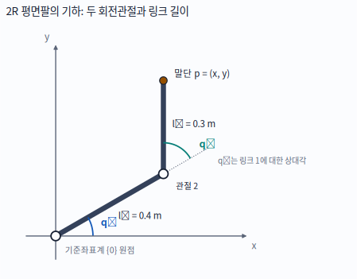
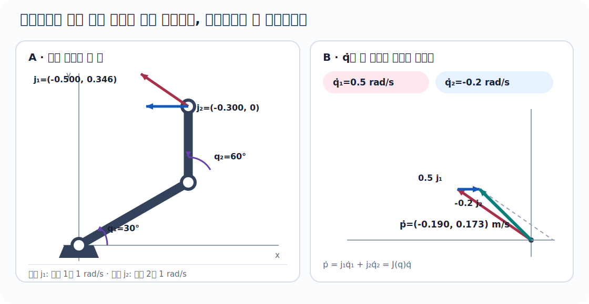
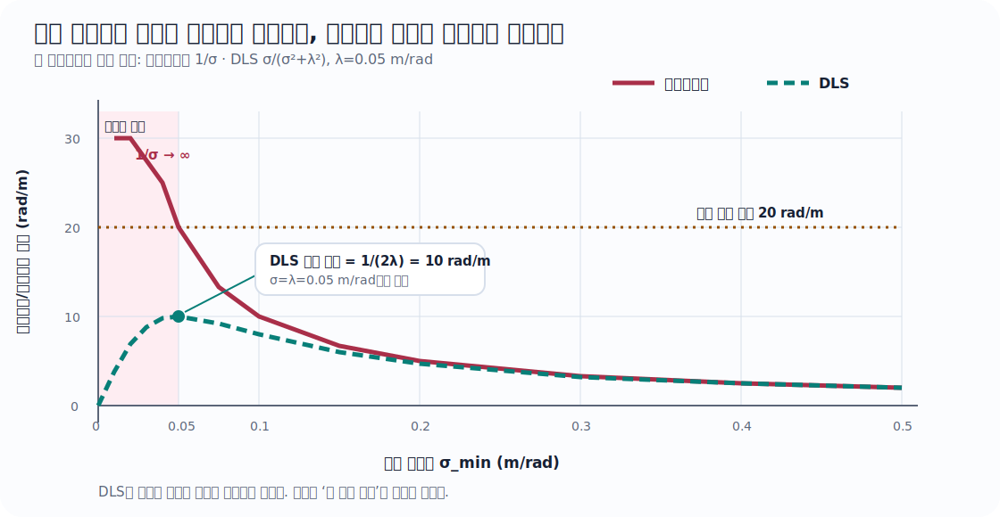
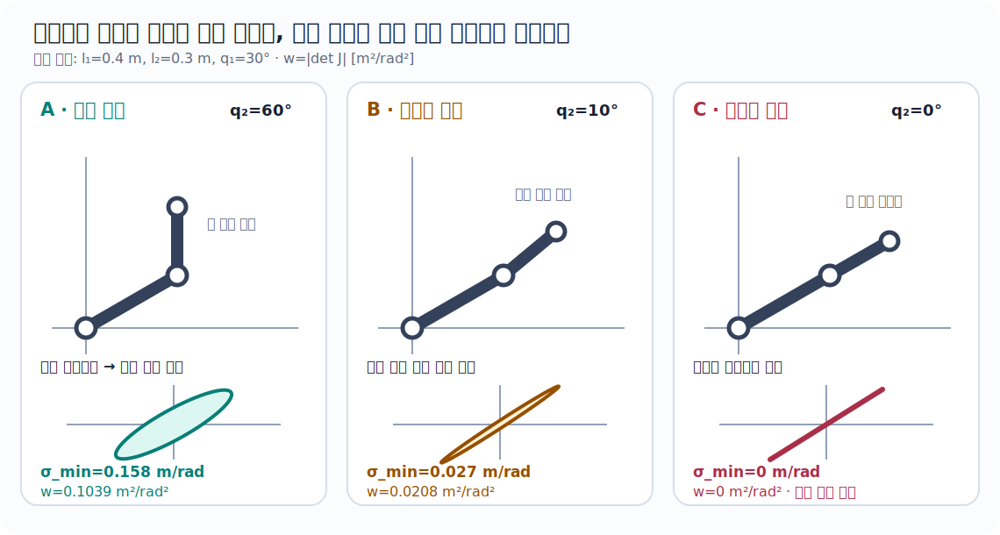
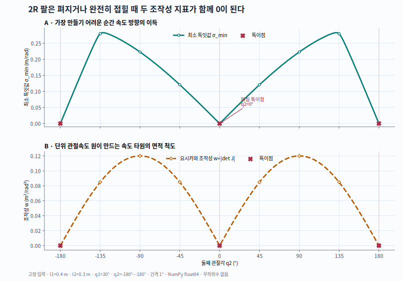

::: {.concept-hero}
## 30초 핵심

로봇의 전진기구학을 $x=f(q)$라 하자. 현재 관절각 $q$ 근처에서는 복잡한 비선형 관계도

$$
\begin{aligned}
\boxed{\Delta x\approx J(q)\Delta q}\qquad&\text{작은 변화}\\[7pt]
\boxed{\dot x=J(q)\dot q}\qquad&\text{순간 속도}
\end{aligned}
$$

라는 하나의 행렬로 거의 선형처럼 보인다. 이 행렬이 **자코비안 행렬**(*Jacobian matrix*)이다.

$$
J_{ij}(q)=\frac{\partial f_i}{\partial q_j}
$$

- **열 $j$**: 관절 $j$만 움직일 때 말단이 순간적으로 움직이는 방향
- **행 $i$**: 모든 관절이 작업공간 성분 $i$에 미치는 민감도
- **전치 $J^\top$**: 말단 힘·모멘트를 관절 토크로 변환
- **행렬의 계수(rank)가 줄어드는 자세**: 어떤 말단 방향을 순간적으로 만들 수 없는 특이점

따라서 자코비안은 역기구학, 속도제어, 힘제어, 임피던스 제어, 조작성 분석, 로봇 보정의 공통 연결부다.
:::

::: {.key-takeaway}
## 이 장에서 끝까지 남겨야 할 문장

**자코비안은 로봇 전체 궤적을 한 번에 맞히는 공식이 아니라, “바로 지금 이 자세에서 아주 조금 움직이면 무엇이 얼마나 변하는가”를 나타내는 국소 지도다.** 같은 로봇이라도 자세·좌표계·선택한 출력에 따라 자코비안이 달라진다.
:::

::: {.annotation-note}
## 학습 지표

| 지표 | 수준 | 읽는 법 |
|---|---:|---|
| 로봇공학 중요도 | ★★★★★ 핵심 | 기구학·제어·역학을 계속 공부한다면 반드시 반복 사용한다. |
| 실무 사용 빈도 | ★★★★★ 상시 | 동작·힘 제어에서는 제어 주기마다, 보정·추정에서는 모델을 선형화할 때 사용한다. |
| 현재 난이도 | ★★★☆☆ 중간 | 2R 계산은 삼각함수 편미분만으로 가능하다. 3차원 자세와 리 군(Lie group)에서는 더 깊어진다. |
| 직관 진입 | 12분 | $\Delta x\approx J\Delta q$와 열의 의미만 잡는다. |
| 계산 목표 | 95분 | 2R 유도, 속도, 힘, 특이점, 수치 검증까지 수행한다. |
| 완전 학습 | 230분 | 미분의 정의, 특이값 분해(*singular value decomposition*, <abbr title="Singular Value Decomposition">SVD</abbr>), 의사역행렬, 구현 조건까지 확인한다. |

**분야별 사용 빈도**: 역기구학·동작제어·힘/임피던스 제어 `필수`, 동역학·보정 `매우 높음`, 확장 칼만 필터(*Extended Kalman Filter*, EKF)·비선형 최적화·인공지능의 자동미분 `높음`.
:::

::: {.learning-objectives}
## 이 장을 마치면

- 자코비안을 “편미분 표”와 “국소 선형 지도”의 두 언어로 설명한다.
- 2R 평면 로봇팔의 자코비안을 한 항씩 유도하고 행렬 모양(shape)·단위·좌표계를 점검한다.
- 관절속도에서 말단속도를 계산하고, 원하는 말단속도에서 안정적인 관절속도를 구한다.
- 가상일에서 $\tau=J^\top F$를 유도하고 속도–힘 쌍대성을 설명한다.
- 특이점을 계수·특이값·영공간·조작성 타원으로 진단한다.
- 해석 자코비안을 중앙차분·자동미분·시뮬레이터 결과와 교차 검증한다.
:::

:::: {.depth-intuition}
## 1. 먼저 떠올릴 이미지: 구부러진 지도를 아주 가까이 확대하기

지구는 둥글지만 동네 지도는 평면처럼 쓸 수 있다. 충분히 작은 영역만 확대하면 곡면이 접평면처럼 보이기 때문이다. 로봇의 전진기구학도 전체적으로는 사인(sin)과 코사인(cos)이 얽힌 비선형 함수지만, **현재 자세의 아주 가까운 곳**에서는 행렬 하나로 근사할 수 있다.

```text
전체 비선형 관계                    현재 자세 q₀를 확대

       x=f(q)                           Δx
      ╭──────╮                           ↑
   ╭──╯      ╰──╮          확대          │   Δx ≈ J(q₀)Δq
───╯              ╰───       ───▶       └────────────▶ Δq
```

$J(q_0)$는 이 확대 지도에서의 눈금과 방향이다. 자세 $q_0$를 바꾸면 확대 지도의 방향도 바뀌므로 $J$도 바뀐다.

::: {.term-card}
## 용어 카드: 자코비안(Jacobian)은 무엇인가?

[**자코비안 행렬**]{.atlas-term data-en="Jacobian matrix" data-definition="벡터값 함수의 일차 편미분을 모은 행렬로, 작은 입력 변화가 출력 변화로 어떻게 전달되는지 국소 선형화한다."}(*Jacobian matrix*)은 벡터값 함수의 일차 도함수다. 이 장에서는 짧게 **자코비안**이라 부른다.

- **전진기구학**(*forward kinematics*): 관절 좌표 $q$에서 말단 위치·자세 $x$를 계산하는 함수 $x=f(q)$
- **미분기구학**(*differential kinematics*): 관절의 작은 변화·속도와 말단의 작은 변화·속도 사이의 관계
- **작업공간**(*task space* 또는 *operational space*): 말단 위치·자세처럼 작업이 정의되는 공간
- **관절공간**(*joint space*): 관절각·관절변위로 로봇 구성을 나타내는 공간
:::

## 2. 자코비안의 열은 “관절 하나의 순간 효과”다

$n$개 관절에서 $m$개 출력 성분을 본다면

$$
J(q)=
\begin{bmatrix}
\vert & \vert & & \vert\\
j_1 & j_2 & \cdots & j_n\\
\vert & \vert & & \vert
\end{bmatrix}
\in\mathbb R^{m\times n}.
$$

관절 $j$만 단위 속도로 움직이는 $\dot q=e_j$를 넣으면

$$
\dot x=Je_j=j_j
$$

가 된다. 즉 **$j$번째 열 자체가 관절 $j$만 움직였을 때의 말단 속도**다. 여러 관절을 함께 움직이면 이 열들을 관절속도로 가중하여 더한다.

$$
\dot x=j_1\dot q_1+j_2\dot q_2+\cdots+j_n\dot q_n.
$$

이 한 문장이 열벡터, 선형결합, 속도기구학을 동시에 묶는다.

## 3. 2R 평면팔을 눈으로 보기

두 회전관절을 가진 평면 로봇팔을 **2R 팔**이라 부른다. 여기서 R는 회전관절(*revolute joint*)을 뜻한다.

{#fig-jacobian-2r-geometry fig-alt="기준좌표계 0의 원점에서 길이 0.4미터인 링크 1이 x축과 30도를 이루며 관절 2에 닿고, 길이 0.3미터인 링크 2가 링크 1의 연장선과 60도를 이루며 말단 p에 닿는다. q1은 x축에서, q2는 링크 1의 연장선에서 잰 각이다."}

링크 길이는 $l_1,l_2\;[\mathrm{m}]$, 관절각은 $q_1,q_2\;[\mathrm{rad}]$로 둔다. 두 번째 링크가 기준축과 이루는 절대각은 $q_1+q_2$다.

::: {.engineering-meaning}
## 물리적 의미

팔을 완전히 편 상태에서는 두 관절을 아주 조금 돌려도 말단이 주로 팔에 수직인 방향으로 움직인다. 팔의 길이 방향으로는 순간 속도를 거의 만들 수 없다. “모터가 약해서”가 아니라, 현재 기하가 그 방향의 운동을 만들지 못하는 것이다. 이것이 특이점의 첫 이미지다.
:::

## 4. 지금 필요한 선수지식

- [ ] $\sin q$, $\cos q$를 미분할 수 있다.
- [ ] $\sin(q_1+q_2)$에 연쇄법칙을 적용할 수 있다.
- [ ] $(m,n)$ 행렬과 $(n,)$ 벡터의 곱 결과가 $(m,)$임을 안다.
- [ ] 행렬의 열을 입력 하나의 효과로 읽을 수 있다.

부족하면 [변화와 누적](../foundations/change-and-accumulation.qmd) 또는 [선형 시스템](../linalg/linear-systems.qmd)을 잠깐 보고 돌아온다. 직관과 2R 계산에는 확률과정, 리 군(Lie group), 동역학이 필요하지 않다.

::: {.history-card}
## 숨 고르기: 왜 야코비(Jacobi)의 이름이 붙었을까? {#sec-jacobian-history}

자코비안이라는 이름은 19세기 수학자 **카를 구스타프 야코프 야코비**(*Carl Gustav Jacob Jacobi*, 1804–1851)에서 왔다. 다변수 변수변환에 나타나는 행렬식과 관련한 그의 연구를 기려 이름이 정착했다. 오늘날 로봇공학에서는 행렬식만이 아니라 편미분 행렬 자체를 자코비안이라 부른다. 짧은 전기는 [MacTutor의 Jacobi 전기](https://mathshistory.st-andrews.ac.uk/Biographies/Jacobi/)에서 확인할 수 있다.
:::
::::

:::: {.depth-application}
## 5. 작동하는 정의 {#sec-jacobian-definition}

함수

$$
f:\mathbb R^n\to\mathbb R^m,
\qquad
x=f(q)
$$

에서 자코비안은

$$
\boxed{
J_f(q)=\frac{\partial f}{\partial q}
=
\begin{bmatrix}
\dfrac{\partial f_1}{\partial q_1} & \cdots & \dfrac{\partial f_1}{\partial q_n}\\[6pt]
\vdots & \ddots & \vdots\\[4pt]
\dfrac{\partial f_m}{\partial q_1} & \cdots & \dfrac{\partial f_m}{\partial q_n}
\end{bmatrix}
\in\mathbb R^{m\times n}
}
$$

이다. 이 교재는 **분자 배치 관례**(*numerator-layout convention*)를 사용한다. 즉 출력 성분이 행, 입력 성분이 열이다.

::: {.callout-warning title="전치된 정의를 쓰는 자료도 있다"}
행렬미적분 책과 소프트웨어마다 자코비안 배치 관례가 다를 수 있다. 공식을 외우기 전에 반드시 $\Delta x=J\Delta q$의 행렬 모양(shape)을 확인한다. 이 장에서 $q:(n,)$, $x:(m,)$이면 $J:(m,n)$이다.
:::

### 연쇄법칙: 성분합이 행렬곱이 되는 순간 {#sec-jacobian-chain-rule}

직렬 로봇에서는 관절좌표가 곧바로 말단 위치가 되지 않는다. 먼저 중간 기하량을 만들고, 그 기하량으로 말단 출력을 만든다. 이를

$$
q\in\mathbb R^n
\xrightarrow{\ g\ }
z=g(q)\in\mathbb R^r
\xrightarrow{\ h\ }
x=h(z)\in\mathbb R^m
$$

로 쓰자. 합성함수는 $f=h\circ g$다. 출력 성분 $x_i=h_i(z_1,\ldots,z_r)$를 입력 성분 $q_j$로 미분하면 스칼라 연쇄법칙을 중간 성분마다 적용해

$$
\boxed{
\frac{\partial x_i}{\partial q_j}
=\sum_{k=1}^{r}
\frac{\partial h_i}{\partial z_k}
\frac{\partial g_k}{\partial q_j}}
$$

를 얻는다. 이 합은 두 행렬을 곱했을 때의 $(i,j)$ 성분과 정확히 같다.

$$
\underbrace{J_f(q)}_{m\times n}
=
\underbrace{J_h(g(q))}_{m\times r}
\underbrace{J_g(q)}_{r\times n}.
$$

안쪽 차원 $r$은 “중간 변수 $z_k$가 전달하는 모든 경로를 더한다”는 뜻으로 소거되고, 최종 모양은 출력 수 × 입력 수인 $m\times n$이다. 곱의 순서를 $J_gJ_h$로 바꾸면 일반적으로 모양부터 맞지 않으며, 맞더라도 다른 선형지도를 뜻한다.

#### 2R 직렬 연결에 적용

2R 팔에서는 첫 관절 뒤 링크의 절대각과 둘째 링크의 절대각을

$$
u=g(q)=
\begin{bmatrix}u_1\\u_2\end{bmatrix}
=
\begin{bmatrix}q_1\\q_1+q_2\end{bmatrix},
\qquad
p=h(u)=
\begin{bmatrix}
l_1\cos u_1+l_2\cos u_2\\
l_1\sin u_1+l_2\sin u_2
\end{bmatrix}
$$

로 나눌 수 있다. 첫 단계는 **직렬 관절각 누적**, 둘째 단계는 **각 링크 벡터의 끝점 합**이다. 두 단계의 자코비안은

$$
J_g=
\begin{bmatrix}1&0\\1&1\end{bmatrix},
\qquad
J_h=
\begin{bmatrix}
-l_1\sin u_1&-l_2\sin u_2\\
\phantom{-}l_1\cos u_1&\phantom{-}l_2\cos u_2
\end{bmatrix}
$$

이므로

$$
\begin{aligned}
J_p(q)=J_hJ_g
&=
\begin{bmatrix}
-l_1\sin u_1-l_2\sin u_2&-l_2\sin u_2\\
l_1\cos u_1+l_2\cos u_2&l_2\cos u_2
\end{bmatrix}\\[3pt]
&=
\begin{bmatrix}
-l_1\sin q_1-l_2\sin(q_1+q_2)&-l_2\sin(q_1+q_2)\\
l_1\cos q_1+l_2\cos(q_1+q_2)&l_2\cos(q_1+q_2)
\end{bmatrix}.
\end{aligned}
$$

직렬 연결에서 앞 관절 $q_1$은 두 절대각 $u_1,u_2$에 모두 전달되지만, 뒤 관절 $q_2$는 $u_2$에만 전달된다. 그래서 첫째 열에는 두 링크의 기여가, 둘째 열에는 둘째 링크의 기여만 남는다.

::: {.derivation-step}
#### 검산 1 · 기저방향으로 열을 확인한다

$q_2$만 단위속도로 움직이는 $\dot q=e_2=[0,1]^\top$를 넣으면

$$
J_p e_2=
\begin{bmatrix}-l_2\sin(q_1+q_2)\\l_2\cos(q_1+q_2)\end{bmatrix}
$$

가 된다. 이는 둘째 링크 벡터를 $90^\circ$ 회전한 접선방향이고 크기는 $l_2$다. 성분 미분, 행렬의 둘째 열, 회전관절의 물리적 속도 방향이 서로 일치한다.
:::

::: {.derivation-step}
#### 검산 2 · 유한한 작은 변화와 비교한다

$l=(0.4,0.3)$ m, $q=(30^\circ,60^\circ)$, $\Delta q=(10^{-4},-2\times10^{-4})$ rad에서 직접 전진기구학을 두 번 계산하면

$$
f(q+\Delta q)-f(q)
=
\begin{bmatrix}
9.9982679\times10^{-6}\\
3.4638516\times10^{-5}
\end{bmatrix}\ \mathrm m.
$$

연쇄법칙으로 만든 자코비안의 예측은

$$
J(q)\Delta q
=
\begin{bmatrix}
1.0000000\times10^{-5}\\
3.4641016\times10^{-5}
\end{bmatrix}\ \mathrm m
$$

이고 차이의 2-노름은 $3.04\times10^{-9}$ m다. $\Delta q$를 절반으로 줄였을 때 이 오차가 대략 1/4로 줄어드는지도 함께 확인하면, 우연한 한 점 일치와 올바른 일차 선형화를 구분할 수 있다.
:::

## 6. 2R 전진기구학

말단 위치를 $p=[x,y]^\top$라 하면

$$
\boxed{
\begin{aligned}
x(q_1,q_2)&=l_1\cos q_1+l_2\cos(q_1+q_2),\\
y(q_1,q_2)&=l_1\sin q_1+l_2\sin(q_1+q_2).
\end{aligned}}
$$

말단 방향각까지 출력에 넣으면

$$
\phi=q_1+q_2,
\qquad
x_{\text{task}}=
\begin{bmatrix}x&y&\phi\end{bmatrix}^{\!\top}.
$$

위치만 보면 $f:\mathbb R^2\to\mathbb R^2$라서 $J_p:(2,2)$이고, 위치와 방향을 모두 보면 $f:\mathbb R^2\to\mathbb R^3$라서 $J:(3,2)$다. **로봇은 같아도 출력 정의가 바뀌면 자코비안 행렬 모양이 바뀐다.**

## 7. 2R 자코비안 최종식

위치 자코비안은

$$
\boxed{
J_p(q)=
\begin{bmatrix}
-l_1\sin q_1-l_2\sin(q_1+q_2) & -l_2\sin(q_1+q_2)\\
\phantom{-}l_1\cos q_1+l_2\cos(q_1+q_2) & \phantom{-}l_2\cos(q_1+q_2)
\end{bmatrix}}
$$

이고, 평면 방향각을 포함한 자코비안은

$$
\boxed{
J(q)=
\begin{bmatrix}
-l_1\sin q_1-l_2\sin(q_1+q_2) & -l_2\sin(q_1+q_2)\\
\phantom{-}l_1\cos q_1+l_2\cos(q_1+q_2) & \phantom{-}l_2\cos(q_1+q_2)\\
1&1
\end{bmatrix}.}
$$

유도는 [한 항도 생략하지 않는 2R 유도](#sec-jacobian-2r-derivation)에서 진행한다.

## 8. 행렬 모양(shape)·좌표계·단위 장부 {#sec-jacobian-ledger}

| 기호 | 뜻 | 모양(shape) | 단위 | 표현 좌표계 |
|---|---|---:|---|---|
| $q=[q_1,q_2]^\top$ | 회전관절 좌표 | `(2,)` | rad | 관절 정의 |
| $\dot q$ | 관절속도 | `(2,)` | rad/s | 관절 정의 |
| $p=[x,y]^\top$ | 말단 위치 | `(2,)` | m | 기준좌표계 `{0}` |
| $\dot p=[v_x,v_y]^\top$ | 말단 선속도 | `(2,)` | m/s | 기준좌표계 `{0}` |
| $J_p$ | 위치 자코비안 | `(2,2)` | 각 열 m/rad | 기준좌표계 `{0}` |
| $x_{\text{task}}=[x,y,\phi]^\top$ | 위치·방향 | `(3,)` | m, m, rad | 기준좌표계 `{0}` |
| $F=[F_x,F_y]^\top$ | 말단 힘 | `(2,)` | N | $J_p$와 같은 좌표계 |
| $W=[F_x,F_y,M_z]^\top$ | 평면 렌치(*wrench*) | `(3,)` | N, N, N·m | $J$와 같은 좌표계 |
| $\tau$ | 관절 토크 | `(2,)` | N·m | 관절 정의 |

라디안은 **국제단위계**(*International System of Units*, <abbr title="International System of Units">SI</abbr>)에서 무차원으로 취급되지만, 공학 장부에는 `rad`를 남겨 각도와 길이의 혼동을 막는다. 회전관절 열의 선속도 부분은 사실상 `[m/rad]`, 각속도 부분은 `[rad/rad]`다.

::: {.mistake-card}
## 가장 흔한 오류: 서로 다른 좌표계의 벡터를 그대로 곱하기

$J$의 선속도 행이 기준좌표계에서 표현되어 있는데 힘 $F$는 도구좌표계에서 표현되었다면 $\tau=J^\top F$를 바로 계산할 수 없다. 먼저 회전 또는 수반(*Adjoint*) 변환으로 같은 좌표계와 같은 기준점에 맞춘다. 숫자의 행렬 모양이 맞아도 물리적으로 틀릴 수 있다.
:::

### 주요 공식별 실행 계약 {#sec-jacobian-formula-contracts}

공식은 기호만 외우면 쉽게 오용된다. 아래 여덟 항목을 한 묶음으로 읽는다. **지표**는 이 교재의 `중요도/현재 난이도`이며, 별점의 이유까지 적는다.

::: {.formula-card}
#### 계약 A · $J=\partial f/\partial q$

- **모양:** $f:\mathbb R^n\to\mathbb R^m$이면 $J:(m,n)$; 출력이 행, 입력이 열이다.
- **단위:** $J_{ij}$는 `출력 i의 단위 / 입력 j의 단위`; 위치–자세를 함께 쓰면 행마다 단위가 다르다.
- **좌표계:** 출력 $f_i$를 표현한 좌표계와 기준점을 그대로 따른다.
- **가정:** 관심점에서 $f$가 미분가능하고 입력·출력 좌표 관례가 고정되어 있다.
- **최소 예:** $x=l\sin q$이면 $J=l\cos q$ `[m/rad]`이다.
- **실패:** 접촉 전환·클리핑처럼 불연속인 연산, 전치 배치 관례 혼동, 각도 되감기에서 미분값을 그대로 믿는다.
- **다음 연결:** 연쇄법칙, 자동미분, 확장 칼만 필터의 측정 자코비안.
- **지표 이유:** `★★★★★/★★☆☆☆`; 모든 후속 식의 출발점이지만 스칼라 미분을 알면 정의 자체는 단순하다.
:::

::: {.formula-card}
#### 계약 B · $\dot x=J(q)\dot q$

- **모양:** `(m,n) @ (n,) -> (m,)`.
- **단위:** 회전관절이면 각 열의 병진 부분 `[m/rad]` × `[rad/s]` = `[m/s]`; 회전 부분은 `[rad/s]`로 읽는다.
- **좌표계:** $J$와 $\dot x$의 표현 프레임·기준점이 같아야 하며 $\dot q$의 열 순서는 모델 관절 순서와 같아야 한다.
- **가정:** $q(t)$가 미분가능하고 $J$와 $\dot q$가 같은 자세·기록 시각에 대응한다.
- **최소 예:** $J=[2]$ m/rad, $\dot q=[0.1]$ rad/s이면 $\dot x=[0.2]$ m/s다.
- **실패:** 오래된 $J(q_{k-1})$에 새 $\dot q_k$를 곱하거나, 베이스 자코비안과 도구 프레임 속도를 비교한다.
- **다음 연결:** $\ddot x=J\ddot q+\dot J\dot q$, 시각서보, 작업공간 속도제어.
- **지표 이유:** `★★★★★/★★☆☆☆`; 제어주기마다 쓰이지만 계산은 행렬–벡터 곱 한 번이다.
:::

::: {.formula-card}
#### 계약 C · $\dot q=J^+\dot x_d$

- **모양:** $J^+:(n,m)$이므로 `(n,m) @ (m,) -> (n,)`.
- **단위:** 작업 성분이 같은 물리 단위와 척도를 가질 때만 단순한 역단위로 읽을 수 있다. 위치와 자세를 섞으면 먼저 작업공간 척도 또는 가중행렬을 선언한다.
- **좌표계:** 목표 $\dot x_d$는 $J$가 출력하는 바로 그 프레임·기준점에 있어야 한다.
- **가정:** 무어–펜로즈 의사역행렬과 유클리드 2-노름을 사용하며, 관절한계·충돌·속도 제한은 아직 넣지 않는다.
- **최소 예:** $J=[2]$ m/rad, $\dot x_d=[0.2]$ m/s이면 최소노름 해는 $\dot q=[0.1]$ rad/s다.
- **실패:** $\sigma_{\min}\to0$에서 속도가 폭주하고, 도달 불가능한 목표에는 잔차가 남으며, 무제약 해가 하드웨어 한계를 넘을 수 있다.
- **다음 연결:** 특이값 분해(SVD), 영공간 최적화, 제약 **이차계획법**(*quadratic programming*, <abbr title="Quadratic Programming">QP</abbr>).
- **지표 이유:** `★★★★★/★★★☆☆`; 역속도 문제의 기준해지만 계수·특이값·최소노름 해석이 필요하다.
:::

::: {.formula-card}
#### 계약 D · $\dot q=J^\top(JJ^\top+\lambda^2I)^{-1}\dot x_d$

- **모양:** $J:(m,n)$이면 $JJ^\top+\lambda^2I:(m,m)$이고 최종 출력은 `(n,)`이다.
- **단위:** $\lambda$는 스케일된 $J$의 특이값과 같은 단위를 가져야 한다. 병진·회전 행을 섞을 때는 무차원화 또는 작업 가중치를 먼저 정의한다.
- **좌표계:** $J$와 $\dot x_d$의 프레임·기준점이 같아야 한다.
- **가정:** $\lambda>0$, 2-노름 속도오차와 관절속도 벌점을 사용하고 선형계는 안정적으로 푼다.
- **최소 예:** $J=[0.01]$ m/rad, $\dot x_d=[0.01]$ m/s, $\lambda=0.02$ m/rad이면 의사역행렬 해 $1.0$ rad/s 대신 감쇠 해 $0.2$ rad/s를 얻는다.
- **실패:** 단위와 무관한 고정 마법상수 $\lambda$, 감쇠 뒤 목표를 정확히 달성한다고 가정, 클리핑을 제약 최적화와 동일시한다.
- **다음 연결:** 적응 감쇠, 가중 최소제곱, 관절·충돌 제약을 포함한 QP.
- **지표 이유:** `★★★★★/★★★☆☆`; 준특이 자세의 기본 안전장치지만 추종–속도 절충을 해석해야 한다.
:::

::: {.formula-card}
#### 계약 E · $\tau=J^\top F$

- **모양:** `J.T:(n,m) @ F:(m,) -> tau:(n,)`.
- **단위:** 병진 행은 `[m/rad]·[N]`, 회전 행은 `[rad/rad]·[N·m]`이므로 회전관절 일반화힘은 `[N·m]`가 된다.
- **좌표계:** 렌치 $F$와 $J$는 같은 표현 프레임·같은 작용점·같은 부호 관례를 사용해야 한다.
- **가정:** 허용 가상변위에서 순간 가상일 또는 동력이 보존된다. 이 관계만으로 전체 동역학 평형을 가정하지는 않는다.
- **최소 예:** 회전축에서 0.2 m 떨어진 점에 접선력 10 N이 작용하면 $\tau=2$ N·m다.
- **실패:** 센서 원점 렌치를 **도구중심점**(*tool center point*, <abbr title="Tool Center Point">TCP</abbr>) 렌치처럼 사용하거나, 중력·편향·모멘트팔을 빠뜨린다.
- **다음 연결:** 힘·임피던스 제어, 작업공간 동역학, 접촉 제약.
- **지표 이유:** `★★★★★/★★★☆☆`; 식은 짧지만 렌치의 프레임·기준점 변환이 실무 정확도를 좌우한다.
:::

::: {.formula-card}
#### 계약 F · $J_g=T(\eta)J_a$, $J_a=T(\eta)^{-1}J_g$

- **모양:** 위치 3성분과 자세 3성분이면 $T,J_g,J_a:(6,6),(6,n),(6,n)$이다.
- **단위:** $T$는 자세 매개변수 변화율 `[rad/s]`을 물리 각속도 `[rad/s]`로 바꾸며, 병진 블록은 항등행렬이다.
- **좌표계:** 위치속도, 각속도, 자세 매개변수가 모두 같은 기준 프레임과 같은 말단점에 대응해야 한다.
- **가정:** 선택한 자세 좌표 $\eta$가 국소적으로 유효하고 $T(\eta)$가 가역이다.
- **최소 예:** 자세를 고정하고 위치만 출력하면 $T=I_3$이어서 기하·해석 위치 자코비안이 같다.
- **실패:** 오일러각 특이점에서 $T^{-1}$가 발산하거나, 몸체 각속도용 $T$를 공간 각속도에 적용한다.
- **다음 연결:** 특수직교군(*special orthogonal group*, $SO(3)$)·특수유클리드군(*special Euclidean group*, $SE(3)$), 수반변환, 표현 특이점 없는 국소 오차.
- **지표 이유:** `★★★★☆/★★★★☆`; 3차원 자세제어에 중요하고 회전 관례·표현 특이점을 함께 다뤄야 한다.
:::

## 9. 수치 예제: 관절속도에서 말단속도로 {#sec-jacobian-forward-velocity}

다음을 사용한다.

$$
l_1=0.4\ \mathrm m,\qquad
l_2=0.3\ \mathrm m,\qquad
q_1=30^\circ,\qquad q_2=60^\circ.
$$

$q_1+q_2=90^\circ$이므로

$$
J_p=
\begin{bmatrix}
-0.5000&-0.3000\\
\phantom{-}0.3464&\phantom{-}0
\end{bmatrix}\ \mathrm{m/rad}.
$$

관절속도가

$$
\dot q=
\begin{bmatrix}0.5\\-0.2\end{bmatrix}\ \mathrm{rad/s}
$$

이면

$$
\dot p=J_p\dot q
=
\begin{bmatrix}
-0.5000&-0.3000\\
0.3464&0
\end{bmatrix}
\begin{bmatrix}0.5\\-0.2\end{bmatrix}
=
\boxed{
\begin{bmatrix}-0.1900\\0.1732\end{bmatrix}\ \mathrm{m/s}}.
$$

방향각 속도는

$$
\dot\phi=\dot q_1+\dot q_2=0.3\ \mathrm{rad/s}
$$

다. $\dot p$의 첫 성분이 음수이므로 말단은 왼쪽으로, 둘째 성분이 양수이므로 위로 움직인다.

{#fig-jacobian-2r-velocity fig-alt="왼쪽에는 30도와 60도로 굽힌 2R 로봇팔과 말단에서 시작하는 자코비안 두 열이 표시되어 있다. 오른쪽에는 0.5 곱하기 첫째 열과 마이너스 0.2 곱하기 둘째 열을 더해 왼쪽 위를 향하는 말단속도 벡터를 만드는 평행사변형이 있다."}

위 그림에서 각 열은 관절 하나를 단위속도로 움직였을 때의 말단속도이고, 실제 $\dot p$는 그 열들을 $\dot q_1,\dot q_2$만큼 가중해 더한 결과다.

::: {.algorithm-card}
### 알고리즘 1 · 순방향 속도 계산(Forward-Velocity)

**입력:** 관절좌표 $q:(n,)$, 같은 시각의 관절속도 $\dot q:(n,)$, 자코비안 계산기 $J(q)$, 관절 이름 순서, 출력 프레임·기준점  
**출력:** 작업속도 $\dot x:(m,)$, 사용한 $J:(m,n)$, 자료 유효성 표지, 기록용 문맥  
**가정:** $q,\dot q$의 단위·관절 순서·시각이 일치하고, $J$는 선언한 출력 프레임과 기준점에서 미분가능하다.

```text
01  q와 관절속도가 유한수이고 길이가 n인지 확인
02  메시지 관절 이름을 모델 열 순서로 재배열
03  |t_q - t_qdot|가 허용 시각차 이내인지 확인
04  J ← 자코비안(q, 출력 프레임, 기준점)
05  J의 모양이 (m,n)이고 모든 성분이 유한수인지 확인
06  작업속도 ← J × 관절속도
07  (작업속도, J, q, 관절 순서, 단위, 프레임, 기준점, 시각)을 반환
```

**병목:** 일반 직렬 로봇에서는 전진기구학과 $J(q)$ 갱신이 행렬–벡터 곱보다 비싸므로, 같은 자세에서 중복 계산하지 않되 오래된 캐시를 재사용하지 않는다.  
**실패 조건:** 관절 열 순서 불일치, 도–라디안 혼동, 오래된 $J$, 프레임·기준점 혼합, `nq`와 `nv` 혼동, 누락·비유한 센서값. 이 알고리즘은 충돌이나 속도 안전성을 보장하지 않는다.
:::

## 10. 원하는 말단속도에서 관절속도 찾기 {#sec-jacobian-inverse-velocity}

이 계산은 속도 수준의 **역기구학**(*inverse kinematics*, <abbr title="Inverse Kinematics">IK</abbr>)이다.

정방이고 최대 계수(*full rank*)인 $J$에서는

$$
\dot q=J^{-1}\dot x
$$

로 쓸 수 있다. 그러나 실제 로봇에서는 비정방, 여유자유도, 특이점이 흔하다. 기본 문제는

$$
\dot q^*
=\arg\min_{\dot q}\|J\dot q-\dot x_d\|_2^2
$$

이고 최소노름 해는

$$
\boxed{\dot q^*=J^+\dot x_d}
$$

다. $J^+$는 **무어–펜로즈 의사역행렬**(*Moore–Penrose pseudoinverse*)이다.

준특이 자세에서는 뒤에서 유도할 **감쇠 최소제곱**(*damped least squares*, <abbr title="Damped Least Squares">DLS</abbr>)으로 작은 특이값의 역수를 억제한다.

::: {.algorithm-card}
### 알고리즘 2 · 의사역행렬 최소노름 역속도(Pseudoinverse-Inverse-Velocity)

**입력:** $J:(m,n)$, 목표 작업속도 $\dot x_d:(m,)$, 상대 특이값 허용오차 $r_{\mathrm{tol}}$, 선택적 작업공간 척도  
**출력:** 최소노름 관절속도 $\dot q:(n,)$, 달성속도 $J\dot q$, 잔차, 특이값, 수치 계수  
**가정:** 선언한 척도에서 유클리드 최소제곱·최소노름을 원하며 관절·충돌·가속도 제약은 별도로 처리한다.

```text
01  J와 목표속도의 모양·단위·프레임·기준점을 확인
02  필요하면 병진/회전 출력을 선언한 척도로 무차원화
03  J = U Σ Vᵀ의 얇은 특이값 분해를 계산
04  tol ← r_tol × max(m,n) × σ_max
05  σ_i > tol인 성분만 1/σ_i로 바꾸어 Σ⁺ 구성
06  관절속도 ← V Σ⁺ Uᵀ 목표속도
07  달성속도 ← J × 관절속도
08  잔차 ← 목표속도 - 달성속도
09  관절속도 제한을 넘으면 실행하지 말고 DLS 또는 제약 QP로 전달
10  관절속도, 달성속도, 잔차, 특이값, 계수, tol을 반환
```

**병목:** $m\times n$ 특이값 분해와 반복 제어주기에서의 메모리 할당. 작은 로봇에서는 보통 계산량보다 단위·프레임 검사가 더 중요하지만 실제 주기는 측정한다.  
**실패 조건:** 작은 특이값 역수로 인한 속도 폭주, 허용오차를 기록하지 않은 계수 판정, 혼합단위 행의 무척도 SVD, 도달 불가능 목표의 잔차 무시, 제한을 넘은 해를 사후 클리핑하고 같은 최적해라고 부르는 것.
:::

특이점 근처에서는 작은 말단 명령이나 측정오차가 매우 큰 관절속도로 증폭될 수 있다. 실무에서는 이 DLS를 자주 사용한다.

$$
\boxed{
\dot q
=J^\top(JJ^\top+\lambda^2I)^{-1}\dot x_d
}
$$

$\lambda>0$가 크면 관절속도 폭주를 더 억제하지만 원하는 말단속도를 덜 정확히 따른다. 여기서 $\lambda$는 스케일된 $J$의 특이값과 같은 단위를 가지며, $\lambda^2$는 관절속도 벌점의 **가중치**(*weight*)다.

{#fig-jacobian-pseudoinverse-dls fig-alt="가로축은 최소 특이값이며 단위는 미터 매 라디안, 세로축은 관절속도를 말단속도로 나눈 이득이며 단위는 라디안 매 미터이다. 붉은 실선인 의사역행렬의 1 나누기 시그마 이득은 시그마가 0으로 갈수록 위로 발산한다. 청록색 파선인 감쇠 최소제곱 이득은 람다 0.05미터 매 라디안일 때 시그마 0.05미터 매 라디안에서 최대 10라디안 매 미터를 가진 뒤 시그마 0에서 0으로 내려간다."}

위 비교 곡선은 한 특이방향에서 의사역행렬 이득 $1/\sigma$와 DLS 이득 $\sigma/(\sigma^2+\lambda^2)$을 비교한다. 이 2R 위치 예제에서 가로축은 m/rad, 세로축은 rad/m다. DLS는 속도 폭주를 막는 대신 작은 특이값 방향의 목표속도를 일부 포기한다.

::: {.algorithm-card}
### 알고리즘 3 · 감쇠 자코비안 역속도 한 단계(DLS-Inverse-Velocity)

**입력:** 관절좌표 $q:(n,)$, 목표 $x_d$ 또는 목표속도 $\dot x_d:(m,)$, $f,J$, 단계 이득 $\alpha$, 감쇠 $\lambda>0$, 속도·관절 제한  
**출력:** 실행 후보 $\Delta q$ 또는 $\dot q$, 달성 작업변화, 잔차, 사용한 $\lambda$와 특이값  
**가정:** 작업오차가 선언한 국소좌표에서 유효하고, 행들이 일관되게 스케일되며, $\lambda$의 단위가 스케일된 자코비안 특이값과 호환된다.

```text
알고리즘: 감쇠 자코비안 역기구학 한 단계(Damped-Jacobian-IK-Step)
01  x ← f(q)
02  e ← task_error(x_d, x) 또는 e ← 목표속도   # 좌표·자세 오차 관례 고정
03  Jq ← J(q); 모양·단위·프레임·기준점 확인
04  특이값과 현재 속도·관절 여유로 λ를 선택하고 기록
05  m ≤ n이면 A ← Jq Jqᵀ + λ² I_m; A y = e를 풂
06      Δq ← Jqᵀ y
07  m > n이면 B ← Jqᵀ Jq + λ² I_n; B Δq = Jqᵀ e를 풂
08  달성변화 ← Jq Δq; 잔차 ← e - 달성변화
09  제한을 넘으면 단순 클리핑 결과를 최적해로 부르지 말고 제약 QP로 전달
10  반복 위치 IK라면 q ← 관절한계에 맞춰 q + α Δq를 갱신
11  Δq 또는 q, 달성변화, 잔차, λ, 특이값을 반환
```

**병목:** $m\times m$ 또는 $n\times n$ 대칭 양의 정부호 선형계 풀이와 매 주기 감쇠 선택. 역행렬은 만들지 않는다.  
**실패 조건:** $\lambda=0$으로 돌아가 준특이 폭주가 재발하는 경우, 과도한 $\lambda$로 작업속도가 거의 0이 되는 경우, 혼합단위 무척도화, 자세오차의 가지 절단(*branch cut*), 관절·충돌 제약을 사후 클리핑만으로 처리하는 경우.
:::

## 11. 속도와 힘의 쌍대성 {#sec-jacobian-duality}

자코비안은 관절속도를 말단속도로 보낸다.

$$
\dot x=J\dot q.
$$

반대 방향의 힘 변환에는 역행렬이 아니라 **전치**가 나타난다.

$$
\boxed{\tau=J^\top F.}
$$

왜 그런지는 가상일 또는 순간 동력 보존으로 가장 분명해진다.

$$
\underbrace{\tau^\top\dot q}_{\text{관절 동력 [W]}}
=
\underbrace{F^\top\dot x}_{\text{작업공간 동력 [W]}}
=F^\top J\dot q
=(J^\top F)^\top\dot q.
$$

모든 가능한 $\dot q$에 대해 성립해야 하므로

$$
\boxed{\tau=J^\top F}
$$

다. 이것이 속도와 힘의 **쌍대성**(*duality*)이다.

| 흐름 | 입력 | 지도 | 출력 |
|---|---|---|---|
| 운동학 | 관절속도 $\dot q$ | $J$ | 말단속도 $\dot x$ |
| 정역학 | 말단 힘/렌치 $F$ | $J^\top$ | 관절토크 $\tau$ |

::: {.callout-important title="전치는 단순한 행렬 모양 맞추기가 아니다"}
$J^\top$은 동력이라는 스칼라 짝짓기 $F^\top\dot x$를 보존하기 때문에 나온다. 따라서 기준점·좌표계·렌치 순서가 바뀌면 자코비안과 힘 표현을 함께 바꿔야 한다.
:::

### 힘 계산 예

앞의 자세에서 기준좌표계 힘이

$$
F=\begin{bmatrix}10\\5\end{bmatrix}\ \mathrm N
$$

이라면

$$
\tau=J_p^\top F
=
\begin{bmatrix}
-0.5000&0.3464\\
-0.3000&0
\end{bmatrix}
\begin{bmatrix}10\\5\end{bmatrix}
=
\boxed{\begin{bmatrix}-3.268\\-3.000\end{bmatrix}\ \mathrm{N\,m}}.
$$

부호는 정의한 양의 관절방향에 대해 이 힘을 버티거나 만들어 내는 토크 방향을 나타낸다.

## 12. 특이점: “역행렬이 안 된다”보다 더 물리적으로 보기 {#sec-jacobian-singularity}

[**특이점**]{.atlas-term data-en="singularity" data-definition="로봇 자코비안의 계수(rank)가 줄어 순간적으로 만들 수 있는 작업공간 운동 방향이 감소하는 자세 또는 구성이다."}(*singularity*)은 자코비안의 계수가 평소보다 줄어드는 자세다.

2R 위치 자코비안의 행렬식은

$$
\det J_p=l_1l_2\sin q_2.
$$

따라서 $q_2=0$ 또는 $q_2=\pi$이면 두 링크가 일직선이 되고 $\det J_p=0$이다.

```text
보통 자세: 두 순간 방향이 독립          특이 자세: 두 순간 방향이 나란함

        ↖ j₂                                      ↑ j₁, j₂
      ●                                             ●────●────●
     ╱ ↖ j₁
●───●
```

정방행렬이 아닐 때는 행렬식을 쓸 수 없다. 일반 정의는

$$
\operatorname{rank}J<\min(m,n)
$$

또는 해당 로봇이 정상적으로 가지던 최대 계수보다 감소하는 것이다.

### 특이값 분해(SVD)로 보는 특이점

**특이값 분해**(*singular value decomposition*, <abbr title="Singular Value Decomposition">SVD</abbr>)를 적용하면

$$
J=U\Sigma V^\top,
\qquad
\Sigma=\operatorname{diag}(\sigma_1,\ldots,\sigma_r),
\quad \sigma_1\ge\cdots\ge\sigma_r\ge0.
$$

- 작은 특이값 $\sigma_{\min}$: 어떤 작업공간 방향의 속도를 만들기 어렵다.
- 큰 조건수 $\kappa=\sigma_{\max}/\sigma_{\min}$: 오차와 명령이 크게 증폭된다.
- $\sigma_{\min}=0$: 적어도 한 방향을 순간적으로 만들 수 없다.
- $J$의 영공간: 말단의 일차 변화 없이 가능한 관절운동.
- $J^\top$의 영공간: 관절토크를 만들지 않는 작업공간 힘 방향.

::: {.engineering-meaning}
## 조작성 타원

단위 관절속도 공 $\|\dot q\|\le1$을 $J$로 보내면 작업공간에서 타원 또는 타원체가 된다. 긴 축은 쉽게 속도를 내는 방향, 짧은 축은 어려운 방향이다. 특이점에서는 한 축 길이가 0이 되어 타원이 선분처럼 납작해진다.
:::

### 2R 수치 확인

$l_1=0.4$ m, $l_2=0.3$ m, $q_2=60^\circ$에서는

$$
|\det J_p|=l_1l_2|\sin q_2|
=0.4\times0.3\times\frac{\sqrt3}{2}
\approx0.1039\ \mathrm{m^2/rad^2}.
$$

$q_2\to0$이면 이 값은 0으로 수렴한다. 다만 서로 다른 단위가 섞인 6차원 위치–자세 자코비안에서는 행렬식(*determinant*)이나 조건수(*condition number*)를 단위 정규화 없이 비교하면 해석이 왜곡될 수 있다.

{#fig-jacobian-singularity-progression fig-alt="세 패널이 2R 팔의 둘째 관절각 60도, 10도, 0도를 비교한다. 각도가 줄수록 두 링크가 일직선에 가까워지고 속도 타원의 짧은 축과 최소 특이값, 행렬식 절댓값이 작아진다. 최소 특이값의 단위는 미터 매 라디안이고 행렬식 절댓값의 단위는 제곱미터 매 제곱라디안이다. 0도에서는 타원이 선분이 되고 두 수치가 각 단위에서 0이다."}

위 세 자세 비교처럼 **정확한 특이점에 도착하기 전부터** 짧은 축과 $\sigma_{\min}$은 이미 작아진다. 그래서 실무 제어기는 계수 감소만 기다리지 않고 $\sigma_{\min}$, 속도 제한, 추종오차를 연속적으로 감시한다.

{#fig-jacobian-singular-value-manipulability fig-alt="링크 길이 0.4미터와 0.3미터, 첫째 관절각 30도인 2R 팔에서 둘째 관절각을 마이너스 180도부터 180도까지 바꾼 두 패널 곡선이다. 위 패널은 최소 특잇값을 청록색 실선과 원형 마커로 표시하고 세 특이점 마이너스 180도, 0도, 180도에서 빨간 X와 함께 0미터 매 라디안이 된다. 아래 패널은 요시카와 조작성 절댓값을 주황색 점선과 마름모 마커로 표시하며 같은 세 각도에서 0제곱미터 매 제곱라디안이 된다. 고정 입력과 1도 표본 간격이 그림 아래에 적혀 있다."}

연속 스캔은 완전히 편 $q_2=0^\circ$뿐 아니라 완전히 접힌 $q_2=\pm180^\circ$에서도 두 지표가 0이 됨을 보여 준다. $q_2=\pm90^\circ$에서는 $w=|l_1l_2\sin q_2|=0.12\ \mathrm{m^2/rad^2}$로 최대이고, 앞의 $q_2=60^\circ$ 표본에서는 $\sigma_{\min}=0.15753461\ \mathrm{m/rad}$로 세 자세 그림의 반올림값과 일치한다.

두 세로축의 숫자 크기를 직접 비교하지는 않는다. 2×2 위치 자코비안에서 요시카와 조작성은

$$
w=|\det J|=\sigma_1\sigma_2
$$

로 **두 특잇값의 곱**, $\sigma_{\min}$은 **가장 불리한 한 방향의 이득**이다. 그래서 $\sigma_{\min}$은 속도 폭주 위험에 더 직접적이고, $w$는 속도 타원의 전체 면적 변화를 요약한다. 위치와 자세처럼 단위가 다른 행을 섞은 자코비안에서는 두 지표 모두 작업공간 척도를 먼저 선언해야 한다. 그림은 `scripts/generate_jacobian_singularity_curve.py`가 고정 입력과 `float64`로 생성한다.

## 13. 현실적인 로봇 데이터 흐름 {#sec-jacobian-data-flow}

아래 흐름에서는 **통합 로봇 서술 형식**(*Unified Robot Description Format*, <abbr title="Unified Robot Description Format">URDF</abbr>)과 **확장성 마크업 언어**(*Extensible Markup Language*, <abbr title="Extensible Markup Language">XML</abbr>)로 쓰는 **MuJoCo 모형 형식**(*MuJoCo XML model format*, <abbr title="MuJoCo XML model format">MJCF</abbr>)을 사용한다.

```text
관절 엔코더(encoder)
      │  관절좌표 q [rad], 관절속도 [rad/s], 기록 시각(timestamp)
      ▼
로봇 서술 모형
(통합 로봇 서술 형식 URDF / MuJoCo XML 모형 형식 MJCF + 보정 파라미터)
      │  전진기구학, J(q)
      ├──────────────▶ 말단 속도 추정: J × 관절속도
      │
목표 말단 속도 ─▶ 감쇠 최소제곱(DLS) / 이차계획법(QP) ─▶ 관절속도 명령
      │
힘·토크 센서 렌치(wrench) ───────▶ 관절 토크 τ = JᵀF
```

**로봇 운영체제 2**(*Robot Operating System 2*, <abbr title="Robot Operating System 2">ROS 2</abbr>)의 공식 [`sensor_msgs/msg/JointState`](https://docs.ros.org/en/ros2_packages/rolling/api/sensor_msgs/msg/JointState.html)는 관절별 위치, 속도, 힘/토크 성분을 배열로 전달하며 회전관절 위치·속도의 단위를 각각 rad, rad/s로 정의한다. 같은 메시지 안의 관절값은 같은 시각에 기록되어야 하고, 배열 길이는 같거나 비어 있어야 한다. 실무에서는 다음을 함께 검증한다.

- `name` 순서와 모델 관절 순서
- 하드웨어 시각과 제어 시각의 차이
- 회전관절 rad와 직선관절 m의 혼합
- 감속기 뒤 출력축 기준인지 모터축 기준인지
- 엔코더 영점 편향(*bias*)과 기구 보정값
- 속도가 직접 측정인지 위치 차분인지
- 통신 누락·충격 이상치(*outlier*)를 어떻게 표시하고 제외하는지

::: {.mistake-card}
## 실무 실패: 관절 이름 대신 배열 인덱스를 믿는다

메시지의 관절 순서와 내부 모델의 열 순서가 다르면 $J$ 자체가 정확해도 $J\dot q$는 틀린다. `이름(name) → 모델 관절 인덱스(model joint index)` 대응표를 한 번 만든 뒤, 누락·중복·순서 변경을 실행 중에 검사한다.
:::

## 14. 공식 자료로 보는 협동로봇 사례 {#sec-jacobian-product-case}

Universal Robots의 공식 [UR5e 기술 사양](https://www.universal-robots.com/manuals/EN/HTML/SW10_9/Content/prod-usr-man/complianceUR5e/H_g5_sections/appendix_g5/tech_spec_sheet.htm)은 UR5e를 회전관절 6개, 도달거리 850 mm, 최대 가반하중 5 kg, **국제표준화기구**(*International Organization for Standardization*, <abbr title="International Organization for Standardization">ISO</abbr>) 9283 기준 자세 반복정밀도 ±0.03 mm로 제시한다. 같은 페이지에는 힘·토크 센서 정확도 4 N과 시스템 갱신 주기 500 Hz도 명시되어 있다. 이 수치는 “자코비안 정확도”가 아니라 제품 수준의 기계·센서·시스템 사양이다.

| 항목 | 공식 공개 정보 | 자코비안과의 연결 |
|---|---:|---|
| 자유도 | 6 회전관절 | 보통 $\dot q:(6,)$, 공간 속도 자코비안은 `(6,6)` |
| 도달거리 | 850 mm | 링크 기하와 작업영역 규모에 영향 |
| 최대 가반하중 | 5 kg | 자코비안만으로 안전 하중·토크를 결정할 수 없음 |
| 자세 반복정밀도 | ±0.03 mm | 반복정밀도와 절대 위치정확도는 구분해야 함 |
| 힘·토크 센서 정확도 | 4 N | 센서 렌치를 $J^\top$으로 옮기기 전에 편향·중력·좌표계를 처리 |
| 시스템 갱신 주기 | 500 Hz | 제어 계산의 상한을 보장하는 값이 아니며 통신·응용 주기는 별도 측정 |
| 공개 가격 | 인용한 기술 사양에 고정 판매가 없음 | 국가·통합 범위·옵션을 포함한 공식 견적 필요 |

::: {.case-card}
## 공식 응용 프로그래밍 인터페이스(*Application Programming Interface*, API) 사례: Franka `libfranka::Model`

Franka 제어 인터페이스(Franka Control Interface, <abbr title="Franka Control Interface">FCI</abbr>)의 공식 [`libfranka` 개요](https://frankarobotics.github.io/docs/doc/libfranka/docs/overview.html)는 사용자가 1 kHz 실시간 제어 루프를 실행하고 1 kHz로 로봇 상태의 센서 자료를 읽을 수 있다고 설명한다. 공식 [`franka::Model` API](https://frankarobotics.github.io/libfranka/0.15.3/classfranka_1_1Model.html)는 다음 두 함수를 직접 제공한다.

- `bodyJacobian`: 선택한 프레임에 대해 **그 프레임 기준**으로 표현한 6×7 자코비안
- `zeroJacobian`: 선택한 관절 프레임에 대해 **베이스 프레임 기준**으로 표현한 6×7 자코비안

두 반환값은 모두 `std::array<double, 42>`인 열 우선(*column-major*) 배열이다. 따라서 42개 숫자를 무조건 `(6, 7)`로만 바꾸는 데서 끝내지 말고, **표현 좌표계, 대상 프레임, 열 우선 저장 순서**를 함께 확인해야 한다.

이 문서들이 공개적으로 확인해 주는 것은 FCI의 자료율과 공개 API 계약이다. 로봇 내부의 전체 제어 구조·필터·보정 알고리즘을 이 API만으로 추론할 수는 없다. 또한 인용한 공식 문서에는 고정 공개 판매가가 없으므로 가격은 공식 견적 대상이다.

### 한 장 재현 카드: 실제 제품 API 계약 + 합성 숫자

| 필드 | 고정한 내용 |
|---|---|
| **1. 장착** | 베이스를 고정 테이블에 체결하고 플랜지–말단–강성 프레임 변환을 모두 항등행렬로 둔다. **교육용 장착 가정**이며 제조사의 표준 장착값이 아니다. |
| **2. 프레임·기준점** | `franka::Frame::kEndEffector`의 원점 선속도와 각속도를 베이스 프레임에서 표현한다. 교육 계산의 행 순서는 $[v_x,v_y,v_z,\omega_x,\omega_y,\omega_z]$로 선언한다. |
| **3. 인터페이스** | `libfranka` 0.15.3의 `zeroJacobian(frame, q, F_T_EE, EE_T_K)` 반환값을 사용한다는 계약이다. 공식 문서는 6×7, `std::array<double,42>`, 열 우선 저장을 명시한다. |
| **4. 원시 숫자** | 아래 `q_raw`, `dq_raw`, `J_raw`를 그대로 사용한다. 모두 합성값이며 실제 로봇에서 수집한 원격측정이 아니다. |
| **5. 전처리** | 유한수·길이·기록 시각·관절 순서를 확인하고, `J_raw`를 열 우선 `order="F"`로 `(6,7)` 재배열한다. 필터링·보간은 하지 않는다. |
| **6. 계산** | $V_0^E=J_0^E\dot q$ 한 번만 계산한다. 병진 3행과 회전 3행을 섞은 특이값·조건수는 길이 척도를 정하기 전에는 보고하지 않는다. |
| **7. 결과** | $V_0^E=[0.0885,\ 0.0486,\ -0.0884,\ 0,\ -0.28,\ 0.10]^\top$이며 앞 3성분은 m/s, 뒤 3성분은 rad/s다. |
| **8. 공식 근거** | 공식 FCI 개요가 1 kHz 상태 읽기·제어 루프와 모형 접근을, `franka::Model` API가 `zeroJacobian`의 크기·표현 프레임·저장 순서를 뒷받침한다. |
| **9. 합성 경계** | 장착, $q,\dot q,J$와 계산 결과는 API 사용법을 재현하기 위한 교육용 합성 예다. Franka의 실제 기구 파라미터·보정·내부 제어기·안전 성능을 나타내지 않으며 하드웨어 명령으로 사용하지 않는다. |

```python
import numpy as np

q_raw = [0.00, -0.50, 0.10, -1.80, 0.20, 1.30, 0.70]       # rad, 합성
dq_raw = [0.10, -0.20, 0.05, 0.10, -0.05, 0.02, 0.00]      # rad/s, 합성

# 열 하나의 6개 성분을 차례로 이어 붙인 42개 합성 원소
J_raw = [
     0.00, 0.40, 0.00, 0.00,  0.00, 1.00,
    -0.30, 0.00, 0.35, 0.00,  1.00, 0.00,
     0.02, 0.28, 0.00, 1.00,  0.00, 0.00,
     0.25, 0.01,-0.20, 0.00, -1.00, 0.00,
    -0.01, 0.12, 0.00, 1.00,  0.00, 0.00,
     0.10,-0.02, 0.08, 0.00,  1.00, 0.00,
     0.00, 0.05, 0.00, 1.00,  0.00, 0.00,
]
J = np.asarray(J_raw, dtype=np.float64).reshape((6, 7), order="F")
V = J @ np.asarray(dq_raw, dtype=np.float64)
np.testing.assert_allclose(V, [0.0885, 0.0486, -0.0884, 0.0, -0.28, 0.10])
```
:::

현실적인 계산에서는 제조사/URDF의 **명목 기구학**(*nominal kinematics*)만 믿지 않고 해당 장비의 보정 파라미터, 도구중심점(*tool center point*, <abbr title="Tool Center Point">TCP</abbr>), 베이스 설치 자세를 사용한다. 2R 예제의 수치는 학습용이며 UR5e 모델 수치가 아니다.

힘·토크 센서값을 사용하는 일반적인 흐름은 다음과 같다. 센서 원시 렌치 $W_s^{\mathrm{raw}}$에서 영점 편향 $b_s$와 도구 중력 성분 $W_s^{g}$를 빼고, 기준점 이동까지 포함한 렌치 변환으로 자코비안과 같은 기준좌표계에 맞춘다.

$$
W_0=\operatorname{Ad}_{T_{0s}}^{-\top}
\left(W_s^{\mathrm{raw}}-b_s-W_s^g\right),
\qquad
\tau_{\mathrm{ext}}=J_0(q)^\top W_0.
$$

공식 기술 사양은 센서 정확도를 제공하지만 원시 표본의 필드·필터·전송 지연까지 정의하지는 않는다. 실제 장비에서는 사용 중인 제어 인터페이스 설명서와 기록 데이터를 확인해야 한다.

::: {.annotation-note}
## 제품 언급의 경계

위 표는 2026-07-16에 확인한 제조사 공식 사양 페이지에 한정한다. 실제 구매·안전·성능 판단은 최신 제조사 매뉴얼과 공급사 견적을 다시 확인해야 한다. 자코비안은 기구학적 순간 관계이며, 충돌 안전·열 제한·관절 토크 제한·제어 주기·하중 동역학을 대신하지 않는다.
:::

## 15. 분야별로 어디에 쓰이는가

| 분야 | 자코비안의 역할 | 중요도 |
|---|---|---:|
| 속도 역기구학 | 원하는 말단속도를 관절속도로 변환 | ★★★★★ |
| 힘·임피던스 제어 | 말단 렌치와 관절토크를 $J^\top$으로 연결 | ★★★★★ |
| 조작성·특이점 회피 | 특이값·계수·타원으로 방향별 능력 평가 | ★★★★★ |
| 로봇 동역학 | 작업공간 관성, 코리올리 항, 접촉 제약 구성 | ★★★★☆ |
| 보정·최대우도추정 | 파라미터 변화가 예측 위치에 주는 민감도 | ★★★★☆ |
| 확장 칼만 필터(EKF)·센서융합 | 비선형 동역학/측정 함수를 현재 추정 근처에서 선형화 | ★★★★☆ |
| 로봇학습·인공지능 | 자동미분, 정책 민감도, 미분 가능한 시뮬레이션 | ★★★★☆ |
| 시각서보 | 영상 특징 변화와 카메라/로봇 속도 연결 | ★★★★★ |

최대우도추정에서는 잔차(*residual*)의 모수 자코비안이 최적화 방향을 정하고, 확장 칼만 필터에서는 측정 함수의 자코비안이 공분산을 관측공간으로 보낸다. **기호 $J$는 같지만 입력·출력·단위는 문제마다 다르다.**

## 16. 정적 시뮬레이션과 재현 계약 {#sec-jacobian-static-sim}

::: {.simulation-placeholder}
## 상호작용 시뮬레이션 — 후속 구현 자리

웹 배포판에서는 아래 슬라이더를 움직여 2R 팔, 자코비안 두 열, 조작성 타원을 동시에 갱신할 예정이다. 현재 문서 단계에서는 의도적으로 비활성화된 정적 UI다.

<div class="simulation-placeholder__controls" aria-label="비활성화된 2R 자코비안 시뮬레이션 조작부">
  <label><span>관절 1: <strong>30°</strong></span><input type="range" min="-180" max="180" value="30" aria-label="관절 1 각도, 현재 30도" disabled="disabled" /></label>
  <label><span>관절 2: <strong>60°</strong></span><input type="range" min="-180" max="180" value="60" aria-label="관절 2 각도, 현재 60도" disabled="disabled" /></label>
  <button type="button" disabled="disabled">시뮬레이션 실행 — 준비 중</button>
</div>

**현재 정적 결과**: $p=(0.3464,0.5000)$ m, $|\det J_p|=0.1039$ m²/rad², 특이점 아님.

### 고정 입력·단위·자료구조

무작위수와 브라우저 상태를 사용하지 않는다. 아래 레코드가 정적 그림과 수치의 유일한 입력이다.

```python
sample = {
    "schema_version": "jacobian-2r-static-v1",
    "dtype": "float64",
    "frame": "base_0",
    "point": "end_effector",
    "joint_order": ["q1", "q2"],
    "lengths_m": [0.4, 0.3],
    "q_rad": [0.5235987755982988, 1.0471975511965976],
    "qdot_rad_s": [0.5, -0.2],
    "rank_tol": 1.0e-9,
}
```

| 입력 필드 | 모양·자료형 | 단위 | 고정 조건 |
|---|---|---|---|
| `lengths_m` | `(2,)`, `float64` | m | 양수, 순서 `[l1,l2]` |
| `q_rad` | `(2,)`, `float64` | rad | 순서 `[q1,q2]`, 도(degree) 입력 금지 |
| `qdot_rad_s` | `(2,)`, `float64` | rad/s | `q_rad`와 같은 시각·관절 순서 |
| `frame` / `point` | 문자열 | — | 베이스 `{0}` 표현, 말단점 |
| `rank_tol` | 스칼라 `float64` | m/rad | 이 2R 위치 자코비안의 특이값 판정에만 사용 |

### 출력 계약과 기준값

| 출력 키 | 모양 | 단위 | 기준값 |
|---|---:|---|---|
| `position_m` | `(2,)` | m | `[0.34641016, 0.50000000]` |
| `jacobian_m_per_rad` | `(2,2)` | m/rad | `[[-0.50000000,-0.30000000],[0.34641016,0.00000000]]` |
| `velocity_m_s` | `(2,)` | m/s | `[-0.19000000,0.17320508]` |
| `singular_values_m_per_rad` | `(2,)` | m/rad | `[0.65968390,0.15753461]`, 내림차순 |
| `determinant_m2_per_rad2` | 스칼라 | m²/rad² | `0.1039230485` |
| `condition_number` | 스칼라 | 무차원 | `4.18754888` |
| `rank` / `is_singular` | 정수 / 불리언 | — | `2 / false` |

검증은 `float64`에서 `rtol=1e-8, atol=1e-9`로 수행한다. 이 기준값이 바뀌면 슬라이더 UI보다 먼저 `schema_version`과 고정 입력을 갱신한다. 상호작용판이 추가되어도 동일 입력을 넣었을 때 이 정적 출력 계약을 통과해야 한다.
:::
::::

:::: {.depth-application .depth-implementation}
## 17. 해석 자코비안 파이썬(Python) {#sec-jacobian-implementation}

```python
import numpy as np


def fk_2r(q, lengths=(0.4, 0.3)):
    q1, q2 = np.asarray(q, dtype=float)
    l1, l2 = lengths
    return np.array([
        l1 * np.cos(q1) + l2 * np.cos(q1 + q2),
        l1 * np.sin(q1) + l2 * np.sin(q1 + q2),
    ])


def jacobian_2r(q, lengths=(0.4, 0.3)):
    q1, q2 = np.asarray(q, dtype=float)
    l1, l2 = lengths
    s1, c1 = np.sin(q1), np.cos(q1)
    s12, c12 = np.sin(q1 + q2), np.cos(q1 + q2)
    return np.array([
        [-l1 * s1 - l2 * s12, -l2 * s12],
        [ l1 * c1 + l2 * c12,  l2 * c12],
    ])


q = np.deg2rad([30.0, 60.0])
qdot = np.array([0.5, -0.2])
J = jacobian_2r(q)
pdot = J @ qdot
```

## 18. 중앙차분으로 수치 자코비안

```python
import numpy as np


def numerical_jacobian(f, q, h=None):
    q = np.asarray(q, dtype=float)
    y = np.asarray(f(q), dtype=float)
    J = np.empty((y.size, q.size), dtype=float)
    if h is None:
        h = np.cbrt(np.finfo(float).eps) * np.maximum(1.0, np.abs(q))
    h = np.broadcast_to(np.asarray(h, dtype=float), q.shape)
    for j in range(q.size):
        step = np.zeros_like(q)
        step[j] = h[j]
        J[:, j] = (np.asarray(f(q + step)) - np.asarray(f(q - step))) / (2.0 * h[j])
    return J


J_analytic = jacobian_2r(q)
J_numeric = numerical_jacobian(fk_2r, q)
np.testing.assert_allclose(J_analytic, J_numeric, rtol=1e-8, atol=1e-9)
```

## 19. JAX 자동미분

```python
import jax
import jax.numpy as jnp


def fk_2r_jax(q, lengths=jnp.array([0.4, 0.3])):
    q1, q2 = q
    l1, l2 = lengths
    return jnp.array([
        l1 * jnp.cos(q1) + l2 * jnp.cos(q1 + q2),
        l1 * jnp.sin(q1) + l2 * jnp.sin(q1 + q2),
    ])


q_jax = jnp.deg2rad(jnp.array([30.0, 60.0]))
J_forward = jax.jacfwd(fk_2r_jax)(q_jax)
J_reverse = jax.jacrev(fk_2r_jax)(q_jax)
```

JAX 공식 문서에서 [`jax.jacfwd`](https://docs.jax.dev/en/latest/_autosummary/jax.jacfwd.html)는 전진형 자동미분으로 열 단위 자코비안을, [`jax.jacrev`](https://docs.jax.dev/en/latest/_autosummary/jax.jacrev.html)는 역전파형 자동미분으로 자코비안을 계산한다. 일반적으로 입력 차원 $n$이 작으면 전진형, 출력 차원 $m$이 작으면 역전파형이 유리할 가능성이 크지만 실제 연산 그래프와 배치 크기로 측정한다.

## 20. 특이점에 안전한 속도 명령

```python
import numpy as np


def damped_least_squares(J, xdot, damping=1e-2):
    J = np.asarray(J, dtype=float)
    xdot = np.asarray(xdot, dtype=float)
    A = J @ J.T + damping**2 * np.eye(J.shape[0])
    return J.T @ np.linalg.solve(A, xdot)


def jacobian_diagnostics(J, tol=None):
    singular_values = np.linalg.svd(J, compute_uv=False)
    if tol is None:
        tol = max(J.shape) * np.finfo(float).eps * singular_values[0]
    rank = int(np.sum(singular_values > tol))
    condition = np.inf if singular_values[-1] <= tol else singular_values[0] / singular_values[-1]
    return {"rank": rank, "singular_values": singular_values, "condition": condition}
```

## 21. 구현 검증 알고리즘

```text
알고리즘: 자코비안 검증(Validate-Robot-Jacobian)
입력: 전진 모형 f, 해석 자코비안 J, 시험 자세 집합 Q
출력: 전체 통과 여부, 자세·열별 오차, 최악 자세와 열, 특이값, 단위·프레임·버전 보고서
가정: f와 J는 같은 관절 순서·출력 좌표·프레임·기준점·접공간 관례를 쓰며 Q 근처에서 미분가능하다

1  Q의 각 q에 대해 반복:
2      관절 순서, 좌표계, 단위, 출력 관례를 확인
3      Ja ← J(q)
4      Jn ← 중앙차분(f, q, 크기를 반영한 차분 간격)
5      열별 상대·절대 허용오차로 Ja와 Jn을 비교
6      고정 기저 또는 기록한 시드로 작은 δq를 정해 f(q+δq)-f(q)와 Ja δq를 비교
7      ||δq||를 줄이며 선형화 오차가 대략 제곱으로 감소하는지 확인
8      특이값을 계산하고 준특이 표본을 따로 표시
9      시뮬레이터가 있으면 같은 좌표계·접공간 관례에서 결과를 비교
10 최악의 열, q, 오차, 특이값, 좌표계, 단위, 버전을 보고
```

**병목:** 중앙차분은 관절 열마다 전진 모형을 두 번 평가하므로 자세 하나당 최소 $2n$회의 모형 호출이 필요하다. 시뮬레이터 교차 검증까지 포함하면 좌표 변환과 상태 갱신 비용이 더 커지므로, 같은 고정 시험 집합을 배치로 실행하고 시간·버전을 함께 기록한다.  
**실패 조건:** 불연속 접촉·각도 되감기·클리핑 구간을 매끄러운 미분처럼 비교하는 경우, 차분 간격이 너무 크거나 작아 절단·반올림오차가 지배하는 경우, 고정 시드 없이 무작위 섭동만 써 재현할 수 없는 경우, 프레임·기준점·관절 순서·`nq`/`nv`를 섞는 경우, 상대오차만 사용해 0에 가까운 열을 오판하는 경우다.

## 22. MuJoCo에서 특히 확인할 것

MuJoCo 공식 [Jacobian 문서](https://mujoco.readthedocs.io/en/stable/programming/simulation.html#jacobians)는 `mj_jac`이 점에 부착된 공간 프레임의 병진·회전 자코비안을 계산하며, 자코비안이 관절속도를 말단속도로, 그 전치가 말단 힘을 관절 힘으로 보낸다고 설명한다.

::: {.callout-important title="`nq`와 `nv`는 항상 같지 않다"}
쿼터니언 관절이 있으면 구성 좌표 `qpos`의 차원 `nq`와 접공간 속도 `qvel`의 차원 `nv`가 다를 수 있다. MuJoCo 공간 자코비안의 열 수는 `nq`가 아니라 `nv`다. 유클리드 좌표처럼 `qpos + ε qvel`을 직접 계산하지 말고 시뮬레이터의 적분/차분 함수를 사용한다.
:::

| 구현 경로 | 장점 | 위험 | 권장 검증 |
|---|---|---|---|
| 손으로 유도한 해석식 | 빠르고 구조가 보임 | 부호·프레임·관절순서 오류 | 중앙차분 + 무작위 자세 |
| 중앙차분 | 독립적인 기준 구현 | 차분 간격·각도 되감기(*wrapping*)·수치상쇄 | 여러 $h$에서 오차 곡선 |
| 자동미분 | 복잡한 코드의 정확한 연쇄법칙 | 비미분 연산·상태 변경·형상 표현 | 해석식 또는 중앙차분 |
| 로봇 라이브러리/시뮬레이터 | 공간 기구학에 효율적 | 국소/세계/물체 좌표계 관례 차이 | 문서·단위·기준점 고정 후 비교 |
::::

:::: {.depth-derivation}
## 23. 일반 자코비안 유도: 작은 변화에서 시작하기 {#sec-jacobian-local-linearization}

$q$에서 작은 변화 $\Delta q$를 주면 다변수 **테일러 전개**(*Taylor expansion*)는

$$
f(q+\Delta q)
=f(q)+J(q)\Delta q+r(\Delta q)
$$

다. 여기서 나머지항은 $\Delta q$보다 더 빠르게 작아진다.

$$
\frac{\|r(\Delta q)\|}{\|\Delta q\|}\to0
\qquad(\Delta q\to0).
$$

양변에서 $f(q)$를 빼면

::: {.derivation-step}
#### 변화 1 — 기준값을 제거한다

$$
\underbrace{f(q+\Delta q)-f(q)}_{\Delta x}
=J(q)\Delta q+r(\Delta q).
$$

**근거**: 같은 $f(q)$를 양변에서 뺀 대수 변형이다.
:::

작은 변화에서 고차 나머지항을 분리하면

::: {.derivation-step}
#### 변화 2 — 일차항만 남긴 국소 근사를 얻는다

$$
\boxed{\Delta x\approx J(q)\Delta q}.
$$

**근거**: $\|r(\Delta q)\|/\|\Delta q\|\to0$이므로 충분히 작은 $\Delta q$에서는 나머지항이 일차항보다 작다. “항상 같다”가 아니라 **국소 근사**다.
:::

$q=q(t)$가 시간에 따라 변할 때 $\Delta q=\dot q\Delta t+o(\Delta t)$를 넣고 $\Delta t$로 나눈 뒤 극한을 취한다.

::: {.derivation-step}
#### 변화 3 — 작은 변화를 순간 속도로 바꾼다

$$
\frac{\Delta x}{\Delta t}
=J(q)\frac{\Delta q}{\Delta t}+\frac{r(\Delta q)}{\Delta t}
\quad\xrightarrow[\Delta t\to0]{}\quad
\boxed{\dot x=J(q)\dot q}.
$$

**근거**: 다변수 연쇄법칙과 미분가능성이다. 이 속도식은 같은 순간 $q(t)$에서 평가한 정확한 미분 관계다.
:::

## 24. 한 항도 생략하지 않는 2R 유도 {#sec-jacobian-2r-derivation}

### 24.1 $x$ 좌표를 $q_1$로 편미분

출발식은

$$
x=l_1\cos q_1+l_2\cos(q_1+q_2)
$$

이다. $q_2$는 고정하고 $q_1$만 움직인다.

::: {.derivation-step}
#### ① 합의 미분법칙을 적용한다

$$
\begin{gathered}
\frac{\partial x}{\partial q_1}\\[3pt]
=l_1\frac{\partial}{\partial q_1}\cos q_1\\[4pt]
\quad+l_2\frac{\partial}{\partial q_1}\cos(q_1+q_2).
\end{gathered}
$$

**바뀐 부분**: 두 항에 편미분 연산자가 각각 들어갔다.  
**근거**: 미분의 선형성; $l_1,l_2$는 관절각과 무관한 상수다.
:::

::: {.derivation-step}
#### ② 코사인(cos) 미분과 연쇄법칙을 적용한다

$$
\begin{gathered}
\frac{\partial x}{\partial q_1}\\[3pt]
=l_1(-\sin q_1)
\underbrace{\frac{\partial q_1}{\partial q_1}}_{1}\\[5pt]
\quad+l_2[-\sin(q_1+q_2)]\\[-1pt]
\qquad\cdot
\underbrace{\frac{\partial(q_1+q_2)}{\partial q_1}}_{1}.
\end{gathered}
$$

**바뀐 부분**: $\cos u$가 $-\sin u$로 바뀌고 안쪽 함수의 미분이 곱해졌다.  
**근거**: $d(\cos u)/du=-\sin u$와 연쇄법칙.
:::

따라서

$$
\boxed{
\frac{\partial x}{\partial q_1}
=-l_1\sin q_1-l_2\sin(q_1+q_2)}.
$$

### 24.2 $x$ 좌표를 $q_2$로 편미분

이번에는 $q_1$을 고정한다.

$$
\begin{gathered}
\frac{\partial x}{\partial q_2}\\[3pt]
=l_1(-\sin q_1)
\underbrace{\frac{\partial q_1}{\partial q_2}}_{0}\\[5pt]
\quad+l_2[-\sin(q_1+q_2)]\\[-1pt]
\qquad\cdot
\underbrace{\frac{\partial(q_1+q_2)}{\partial q_2}}_{1}\\[5pt]
=\boxed{-l_2\sin(q_1+q_2)}.
\end{gathered}
$$

첫 링크 항이 사라지는 이유는 **$q_2$를 움직여도 첫 링크 끝점은 움직이지 않기 때문**이다. 대수적으로는 $\partial q_1/\partial q_2=0$이다.

### 24.3 $y$ 좌표를 $q_1$로 편미분

$$
y=l_1\sin q_1+l_2\sin(q_1+q_2).
$$

::: {.derivation-step}
#### 사인(sin)은 코사인(cos)으로 바뀌고 안쪽 미분을 곱한다

$$
\begin{gathered}
\frac{\partial y}{\partial q_1}\\[3pt]
=l_1(\cos q_1)
\underbrace{\frac{\partial q_1}{\partial q_1}}_{1}\\[5pt]
\quad+l_2[\cos(q_1+q_2)]\\[-1pt]
\qquad\cdot
\underbrace{\frac{\partial(q_1+q_2)}{\partial q_1}}_{1}\\[5pt]
=\boxed{l_1\cos q_1+l_2\cos(q_1+q_2)}.
\end{gathered}
$$

**근거**: $d(\sin u)/du=\cos u$와 연쇄법칙.
:::

### 24.4 $y$ 좌표를 $q_2$로 편미분

$$
\begin{gathered}
\frac{\partial y}{\partial q_2}\\[3pt]
=l_1(\cos q_1)
\underbrace{\frac{\partial q_1}{\partial q_2}}_{0}\\[5pt]
\quad+l_2[\cos(q_1+q_2)]\\[-1pt]
\qquad\cdot
\underbrace{\frac{\partial(q_1+q_2)}{\partial q_2}}_{1}\\[5pt]
=\boxed{l_2\cos(q_1+q_2)}.
\end{gathered}
$$

### 24.5 네 편미분을 위치에 맞게 조립

출력 순서를 $(x,y)$, 입력 순서를 $(q_1,q_2)$로 정했으므로

$$
J_p=
\begin{bmatrix}
\dfrac{\partial x}{\partial q_1} & \dfrac{\partial x}{\partial q_2}\\[7pt]
\dfrac{\partial y}{\partial q_1} & \dfrac{\partial y}{\partial q_2}
\end{bmatrix}.
$$

네 결과를 넣으면

$$
\boxed{
J_p=
\begin{bmatrix}
-l_1\sin q_1-l_2\sin(q_1+q_2) & -l_2\sin(q_1+q_2)\\
l_1\cos q_1+l_2\cos(q_1+q_2) & l_2\cos(q_1+q_2)
\end{bmatrix}.}
$$

### 24.6 방향각 행 추가

$\phi=q_1+q_2$이므로

$$
\frac{\partial\phi}{\partial q_1}=1,
\qquad
\frac{\partial\phi}{\partial q_2}=1.
$$

따라서 마지막 행 $[1\;1]$을 붙인다. 이 행의 단위와 위치 행의 단위는 다르다.

## 25. 기하학으로 같은 열을 다시 유도

평면에서 회전축 $z$ 주위로 관절 $j$가 회전하면 말단 선속도 기여는

$$
j_{v,j}=\hat z\times(p_e-p_j)
$$

다. $p_j$는 관절축 위의 점, $p_e$는 말단점이다. 각속도 기여는 $j_{\omega,j}=\hat z$다. 따라서 공간의 회전관절 열은 보통

$$
\boxed{
j_j=
\begin{bmatrix}
\hat z_j\times(p_e-p_j)\\
\hat z_j
\end{bmatrix}}
$$

형태다. 직선관절(*prismatic joint*)이면

$$
j_j=
\begin{bmatrix}
\hat z_j\\0
\end{bmatrix}.
$$

이 식은 각 열을 “관절축이 현재 말단에 만드는 순간 운동”으로 바로 계산하게 해 준다. 단, 모든 $\hat z_j,p_e,p_j$를 같은 좌표계로 표현해야 한다.

## 26. 행렬식 $l_1l_2\sin q_2$ 유도

2×2 행렬식 정의를 적용한다.

$$
\begin{aligned}
\det J_p
={}&[-l_1\sin q_1-l_2\sin(q_1+q_2)]
[l_2\cos(q_1+q_2)]\\
&-[-l_2\sin(q_1+q_2)]
[l_1\cos q_1+l_2\cos(q_1+q_2)].
\end{aligned}
$$

$l_2^2$ 항은 서로 소거된다.

$$
\det J_p
=l_1l_2[\sin(q_1+q_2)\cos q_1-\sin q_1\cos(q_1+q_2)].
$$

삼각함수 항등식 $\sin A\cos B-\cos A\sin B=\sin(A-B)$에 $A=q_1+q_2$, $B=q_1$을 넣으면

$$
\boxed{\det J_p=l_1l_2\sin q_2}.
$$

따라서 특이점은 기준축에 대한 $q_1$이 아니라 **두 링크 사이 상대각 $q_2$**로 결정된다.

::: {.derivation-step}
#### 검산 1 · 모양과 단위

$J_p$는 `(2,2)`이고 각 성분의 단위는 m/rad이므로 $\det J_p$의 단위는 m²/rad²이다. 우변 $l_1l_2\sin q_2$도 `m × m × 무차원`이며, 공학 장부에 rad를 남기면 같은 m²/rad²가 된다.
:::

::: {.derivation-step}
#### 검산 2 · 특수값과 직접 수치 계산

$q_2=0,\pi$를 넣으면 우변이 0이 되어 두 열이 종속인 자세와 일치한다. 또 $l_1=0.4$ m, $l_2=0.3$ m, $q_2=60^\circ$에서는 $l_1l_2\sin q_2=0.1039230485$ m²/rad²이고, 앞의 수치 $J_p$에 2×2 행렬식 정의를 직접 적용한 값과 일치한다.
:::

## 27. 감쇠 최소제곱 유도 {#sec-jacobian-dls-derivation}

특이점 근처의 큰 관절속도를 억제하려고 다음 목적함수를 최소화한다. 여기서는 작업속도 성분을 같은 단위와 척도로 맞췄다고 가정한다. 병진·회전처럼 단위가 다른 행을 함께 쓰면 먼저 작업공간 가중치로 스케일해야 한다.

$$
\mathcal L(\dot q)
=\frac12\|J\dot q-\dot x_d\|_2^2
+\frac{\lambda^2}{2}\|\dot q\|_2^2.
$$

첫 항은 말단속도 오차, 둘째 항은 큰 관절속도에 대한 벌점이다. 미분하면

$$
\nabla_{\dot q}\mathcal L
=J^\top(J\dot q-\dot x_d)+\lambda^2\dot q.
$$

정지 조건은

$$
(J^\top J+\lambda^2I)\dot q=J^\top\dot x_d.
$$

따라서 한 형태의 해는

$$
\boxed{
\dot q=(J^\top J+\lambda^2I)^{-1}J^\top\dot x_d.}
$$

$\lambda>0$이면 $J$가 계수 부족(*rank-deficient*)이어도 $J^\top J+\lambda^2I$는 양의 정부호다. 동치인 쌍대(*dual*) 형태

$$
\boxed{
\dot q=J^\top(JJ^\top+\lambda^2I)^{-1}\dot x_d}
$$

중 더 작은 선형 시스템을 푸는 쪽을 선택할 수 있다. 코드에서는 어느 형태든 역행렬을 만들지 않고 `solve`를 사용한다.

::: {.derivation-step}
#### 검산 1 · 모양과 단위

$J:(m,n)$이면 $J^\top J+\lambda^2I_n:(n,n)$이고 $J^\top\dot x_d:(n,)$이므로 해 $\dot q$는 `(n,)`이다. 위치 작업에서 $J$와 $\lambda$가 m/rad이면 정규방정식 양변의 단위는 모두 m²/(rad·s)이고, 결과는 rad/s가 된다.
:::

::: {.derivation-step}
#### 검산 2 · 특수값과 스칼라 수치

$\lambda\to0$이면 각 0이 아닌 특이방향의 감쇠 이득은 $1/\sigma$로 수렴하고 전체 해는 무어–펜로즈 의사역행렬 해 $J^+\dot x_d$로 수렴한다. 반대로 $\lambda>0$을 고정하면 $\sigma/(\sigma^2+\lambda^2)$은 $\sigma\to0$에서 0으로 가므로 발산하지 않는다. $J=0.01$ m/rad, $\dot x_d=0.01$ m/s, $\lambda=0.02$ m/rad를 넣으면

$$
\dot q=\frac{0.01}{0.01^2+0.02^2}(0.01)=0.2\ \mathrm{rad/s},
$$

이며 공식 카드의 최소 예와 일치한다.
:::

## 28. 말단 가속도에는 왜 $\dot J\dot q$가 생기는가

$$
\dot x=J(q)\dot q
$$

를 시간 미분한다. $J$도 $q(t)$에 따라 변하므로 곱의 미분법칙을 사용한다.

$$
\boxed{
\ddot x=J(q)\ddot q+\dot J(q,\dot q)\dot q.}
$$

$J\ddot q$만 쓰면 “현재 지도 자체가 움직이며 변하는 효과”를 빠뜨린다. $\dot J$를 전체 3차원 텐서로 명시적으로 만들기보다 $\dot J\dot q$를 직접 계산하는 라이브러리도 많다.
::::

:::: {.depth-proof}
## 29. 엄밀히 말하면: 자코비안은 최선의 일차 근사다

::: {.assumption-box}
## 가정과 정의역

- $q$는 열린 집합 $U\subset\mathbb R^n$의 점이다.
- $f:U\to\mathbb R^m$는 관심점 $q$에서 미분가능하다.
- 로봇 구성공간이 곡면이면 좌표 차트(*chart*) 또는 접공간 섭동(*perturbation*)을 명시한다.
- 위치와 자세를 단순히 한 벡터로 빼는 경우, 자세 표현의 국소성과 단위를 명시한다.
:::

$f$가 $q$에서 미분가능하다는 뜻은 어떤 선형지도 $A$가 존재하여

$$
\lim_{h\to0}
\frac{\|f(q+h)-f(q)-Ah\|}{\|h\|}=0
$$

인 것이다. 이 $A$는 유일하며 표준좌표에서의 행렬이 $J_f(q)$다.

### 왜 각 열이 편미분인가

$h=te_j$를 대입하면

$$
\frac{f(q+te_j)-f(q)}{t}
=Ae_j+o(1).
$$

$t\to0$ 극한에서 왼쪽은 $q_j$ 방향 편미분, 오른쪽은 $A$의 $j$번째 열이다. 따라서

$$
Ae_j=
\begin{bmatrix}
\partial f_1/\partial q_j\\
\vdots\\
\partial f_m/\partial q_j
\end{bmatrix}.
$$

모든 편미분이 존재하는 것만으로 항상 미분가능한 것은 아니다. 편미분들이 한 이웃에서 연속이면 미분가능하다는 충분조건을 자주 사용한다.

## 30. 특이점의 계수(rank) 해석 {#sec-jacobian-rank}

가능한 순간 작업공간 속도 집합은

$$
\mathcal V(q)=\{J(q)\dot q:\dot q\in\mathbb R^n\}
=\operatorname{col}J(q)
$$

다. 그 차원은 $\operatorname{rank}J(q)$다. 따라서 계수가 줄면 가능한 속도 방향의 차원도 줄어든다. 이 결론은 정방행렬이나 행렬식에 의존하지 않는다.

한편

$$
J\dot q=0
$$

을 만족하는 $\dot q\ne0$가 있으면 관절은 움직이지만 선택한 작업출력은 일차적으로 변하지 않는다. 이는 $\ker J$의 자기운동(*self-motion*)이다. 여유자유도 로봇에서는 이 영공간을 관절한계 회피나 자세 최적화에 사용할 수 있다.

## 31. 속도–힘 전치 관계의 가상일 증명

허용되는 가상 관절변위 $\delta q$에 대해

$$
\delta x=J\delta q.
$$

작업공간 힘 $F$와 관절토크 $\tau$가 만드는 가상일이 같다면

$$
F^\top\delta x=\tau^\top\delta q.
$$

$\delta x=J\delta q$를 대입한다.

$$
F^\top J\delta q=\tau^\top\delta q,
$$

$$
(J^\top F-\tau)^\top\delta q=0.
$$

모든 $\delta q$에 대해 성립하므로

$$
\boxed{\tau=J^\top F}.
$$

제약 때문에 허용되는 $\delta q$가 전체 공간이 아니라면, 위 차이는 허용변위 공간에 직교하는 제약반력 성분을 가질 수 있다. 이때는 제약 자코비안과 라그랑주 승수를 함께 다룬다.

## 32. 좌표와 기준점이 바뀌면 무엇이 달라지는가 {#sec-jacobian-frame-change}

같은 물리적 말단운동도 공간좌표계(*space frame*)와 물체좌표계(*body frame*)에서 숫자가 다르다. 3차원 강체 속도에서는

$$
V_s=J_s(q)\dot q,
\qquad
V_b=J_b(q)\dot q
$$

이며 두 **트위스트**(*twist*) 표현은 $SE(3)$의 수반(*Adjoint*)으로 연결된다.

$$
V_s=\operatorname{Ad}_{T_{sb}}V_b,
\qquad
J_s=\operatorname{Ad}_{T_{sb}}J_b.
$$

힘/렌치는 동력을 보존하도록 역전치 관계로 변환된다. 이 장에서는 2R 평면팔로 직관을 고정하고, 수반과 왼쪽/오른쪽 섭동(*left/right perturbation*)의 완전한 유도는 $SO(3)$·$SE(3)$ 장에서 확장한다.

### 기하 자코비안과 해석 자코비안 {#sec-jacobian-geometric-analytic}

두 자코비안은 **같은 관절속도를 서로 다른 출력속도 좌표로 보낸다.** 먼저 말단점 $E$의 선속도와 물리적 각속도를 베이스 좌표계 $\{0\}$에서 쌓은 트위스트를

$$
\nu_g^0=
\begin{bmatrix}v_E^0\\\omega^0\end{bmatrix}
=J_g^0(q)\dot q
$$

로 정의한다. 이것이 **기하 자코비안**(*geometric Jacobian*)이다. 위첨자 $0$은 표현 좌표계, 아래첨자 $E$는 선속도의 기준점을 고정한다. 반면 위치와 선택한 자세 매개변수 $\eta$의 시간미분을

$$
\nu_a=
\begin{bmatrix}\dot p_E^0\\\dot\eta\end{bmatrix}
=J_a(q)\dot q
$$

로 보내는 행렬이 **해석 자코비안**(*analytic Jacobian*)이다. $\dot\eta$는 좌표의 변화율이지 일반적으로 물리적 각속도 $\omega$가 아니다.

구체적으로 $R_0^E=R_z(\psi)R_y(\theta)R_x(\phi)$인 ZYX **롤–피치–요**(*roll–pitch–yaw*, <abbr title="Roll–Pitch–Yaw">RPY</abbr>) 좌표 $\eta=[\phi,\theta,\psi]^\top$를 쓰고 각속도를 베이스 좌표계에서 표현하면

$$
\omega^0=E_s(\eta)\dot\eta,
\qquad
E_s(\eta)=
\begin{bmatrix}
\cos\psi\cos\theta&-\sin\psi&0\\
\sin\psi\cos\theta& \cos\psi&0\\
-\sin\theta&0&1
\end{bmatrix}.
$$

따라서 같은 말단점·같은 베이스 표현에서

$$
T(\eta)=
\begin{bmatrix}I_3&0\\0&E_s(\eta)\end{bmatrix},
\qquad
\boxed{\nu_g^0=T(\eta)\nu_a},
$$

$$
\boxed{J_g^0=T(\eta)J_a},
\qquad
\boxed{J_a=T(\eta)^{-1}J_g^0}
$$

다. 마지막 식은 $\det E_s=\cos\theta\ne0$일 때만 쓸 수 있다. $\theta=\pm\pi/2$에서는 ZYX 좌표 표현이 특이해져 $J_a$가 발산하거나 유일하지 않을 수 있지만, 로봇의 물리적 기하 자코비안 $J_g$는 유한하고 최대 계수일 수 있다.

| 비교 질문 | 기하 자코비안 $J_g$ | 해석 자코비안 $J_a$ |
|---|---|---|
| 정의한 출력 | 같은 점의 선속도 $v$와 물리 각속도 $\omega$ | 위치 변화율 $\dot p$와 자세좌표 변화율 $\dot\eta$ |
| 좌표계 계약 | 공간/몸체 프레임과 선속도 기준점을 명시 | 위치 프레임, 자세 매개변수 순서·회전 순서를 명시 |
| 변환 | $J_s=\operatorname{Ad}_{T_{sb}}J_b$ | $J_a=T(\eta)^{-1}J_g$; $T$가 가역일 때만 |
| 로봇 특이 조건 | $\operatorname{rank}J_g$가 정상 계수보다 감소 | $T$가 가역이면 $J_g$와 같은 물리 특이점 |
| 표현 특이 조건 | 트위스트 자체에는 오일러각 짐벌락이 없음 | ZYX에서는 $\cos\theta=0$일 때 표현 특이 |
| 대표 용도 | 속도·힘·임피던스 제어, 렌치 변환 | 오일러각 좌표로 정의한 궤적오차·역기구학 |
| 흔한 실패 | 몸체 자코비안에 공간 렌치를 바로 곱함 | $\dot\eta=\omega$로 두거나 다른 RPY 순서의 $T$를 사용 |

**두 검산**도 간단하다. $\eta=0$이면 $E_s=I_3$라서 같은 프레임에서 $J_g=J_a$다. 또 $T$가 가역인 임의 자세에서는 수치적으로 $\|J_g-TJ_a\|$와 $\|J_a-T^{-1}J_g\|$를 모두 확인한다. 한쪽만 확인하면 우연히 같은 잘못된 회전 관례를 공유하는 오류를 놓칠 수 있다.

::: {.mistake-card}
## 오일러각(Euler angle) 미분은 각속도와 같지 않다

롤–피치–요(*roll–pitch–yaw*) 변화율 $\dot\eta$와 물리적 각속도 $\omega$ 사이의 행렬은 회전 순서와 각속도 표현 프레임에 따라 달라진다. 몸체 각속도용 행렬을 공간 각속도에 쓰거나 ZYX 식을 XYZ 좌표에 쓰면 모양은 맞아도 틀린다. 라이브러리가 트위스트를 $[v;\omega]$로 쌓는지 $[\omega;v]$로 쌓는지도 확인한다.
:::

## 33. 수치미분 오차의 균형

중앙차분은 매끄러운 스칼라 성분에 대해

$$
\frac{f(q+he_j)-f(q-he_j)}{2h}
=\frac{\partial f}{\partial q_j}+O(h^2)
$$

의 절단오차를 갖는다. 그러나 $h$가 너무 작으면 두 비슷한 부동소수점 수의 뺄셈에서 반올림오차가 커진다. 총 오차는 대략

$$
O(h^2)+O(\epsilon_{\mathrm{mach}}/h)
$$

의 경쟁이다. 그러므로 “가능한 가장 작은 $h$”가 최선이 아니다. 각 입력의 크기와 단위를 반영한 차분 간격을 쓰고, 여러 $h$에서 안정 구간을 확인한다.

## 34. 선형화가 유효한 범위

이차 미분이 근방에서 제한된다면 테일러 정리에 의해

$$
\|f(q+\Delta q)-f(q)-J(q)\Delta q\|
\le C\|\Delta q\|^2
$$

형태의 국소 경계를 얻는다. 따라서 검증에서 $\|\Delta q\|$를 절반으로 줄이면 선형화 나머지가 대략 1/4로 줄어드는지 볼 수 있다. 그렇지 않으면 차분 간격(*step size*)이 너무 크거나, 구현이 불연속이거나, 수치오차가 지배하거나, 자코비안이 잘못되었을 수 있다.
::::

:::: {.depth-application}
## 35. 실무에서 자주 하는 실수 열네 가지

:::: {.glossary-grid}
::: {.mistake-card}
### 1. 도(degree)를 라디안(rad)으로 착각

삼각함수와 관절속도 단위가 달라 열 전체가 약 57.3배 어긋난다.
:::

::: {.mistake-card}
### 2. 관절 순서 불일치

`JointState.name`, URDF, 제어 벡터, $J$ 열 순서를 하나의 대응표로 검증하지 않는다.
:::

::: {.mistake-card}
### 3. 기준좌표계 혼합

세계좌표계 자코비안과 도구좌표계 힘을 바로 곱한다.
:::

::: {.mistake-card}
### 4. 기준점 혼합

플랜지 원점의 자코비안을 TCP 자코비안으로 사용해 모멘트팔 효과를 빠뜨린다.
:::

::: {.mistake-card}
### 5. 위치 자코비안과 공간 자코비안 혼동

`(3,n)` 병진 자코비안을 `(6,n)` 트위스트 자코비안처럼 사용한다.
:::

::: {.mistake-card}
### 6. 오일러각 변화율(Euler rate)을 각속도로 간주

자세 표현 변환 행렬과 표현 특이점을 생략한다.
:::

::: {.mistake-card}
### 7. 특이점을 행렬식만으로 판단

비정방 행렬, 단위 혼합, 준특이(*near-singular*) 상태를 놓친다.
:::

::: {.mistake-card}
### 8. 명시적 역행렬 사용

`inv(J) @ v` 또는 `inv(J.T @ J)`로 민감도와 수치오차를 키운다.
:::

::: {.mistake-card}
### 9. 감쇠값을 고정 마법상수로 사용

로봇 단위, 특이값, 속도 제한과 무관한 $\lambda$를 모든 자세에 적용한다.
:::

::: {.mistake-card}
### 10. 관절한계·속도·가속도 제한 생략

수학적 최소제곱 해가 하드웨어에서 실행 불가능하거나 위험하다.
:::

::: {.mistake-card}
### 11. `nq`와 `nv` 혼동

쿼터니언 구성 좌표에 유클리드 차분을 적용하고 자코비안 열을 잘못 배치한다.
:::

::: {.mistake-card}
### 12. 수치차분 간격 하나만 신뢰

절단오차와 반올림오차를 구분하지 않고 우연히 맞는 결과를 통과시킨다.
:::

::: {.mistake-card}
### 13. 한 자세에서만 검증

대칭 자세에서 상쇄된 부호 오류를 놓친다. 무작위·경계·특이점 근처 자세를 나눈다.
:::

::: {.mistake-card}
### 14. 기구학을 안전 보증으로 오해

자코비안만으로 충돌, 하중, 관절토크, 열, 지연, 접촉 안정성을 보장한다고 판단한다.
:::
::::

## 36. 실패 사례와 성공 패턴

| 상황 | 실패하는 접근 | 성공 패턴 |
|---|---|---|
| TCP를 바꿈 | 플랜지 자코비안을 계속 사용 | 도구 변환을 모델에 반영하고 새 기준점 자코비안 검증 |
| 팔이 펴지는 경로 | $J^{-1}$로 속도 명령 | 최소 특이값 감시 + DLS/QP + 속도 제한 + 경로 재계획 |
| 센서 힘을 토크로 변환 | 좌표계 확인 없이 $J^\top F$ | 렌치와 $J$의 좌표계·기준점·부호·단위 일치 |
| 새 로봇 모델 배포 | 시각적으로만 확인 | 해석식–자동미분–중앙차분–시뮬레이터 교차 검증 |
| 실기와 시뮬레이션 차이 | 이득(*gain*)만 조정 | 관절 영점·링크 파라미터·TCP·베이스 보정과 기록 시각 검사 |
| 여유자유도 | 의사역행렬 해만 사용 | 영공간에 관절한계·충돌여유·조작성 목적 추가 |

::: {.failure-mode}
## 9필드 재현 실패 카드: 특이점 근처 속도 폭주 {#sec-jacobian-singularity-failure}

| 필드 | 재현 기록 |
|---|---|
| **1. 환경** | NumPy `float64`, 무작위수 없음, 2R 위치 자코비안, 베이스 프레임, 말단점, 관절 순서 `[q1,q2]`. |
| **2. 증상** | 말단에는 0.01 m/s의 느린 $+x$ 속도를 명령했지만 둘째 관절 명령이 $-6.68$ rad/s까지 폭주한다. |
| **3. 고정 입력** | $l=(0.4,0.3)$ m, $q=(0^\circ,0.5^\circ)$, $\dot p_d=(0.01,0)$ m/s, 관절속도 운용 한계의 예를 $|\dot q_j|\le1$ rad/s로 둔다. 이 한계는 제품 사양이 아닌 재현용 경계다. |
| **4. 기대** | 목표를 정확히 추종하면서 모든 관절속도가 예시 운용 한계 안에 있을 것이라고 기대한다. 준특이 자세에서는 두 조건을 동시에 만족하지 못할 수 있다는 점이 이 실패의 핵심이다. |
| **5. 최소 재현** | 아래 고정 행렬에 `np.linalg.pinv(J) @ pdot_d`를 한 번 계산한다. 필터·적분·제어기는 포함하지 않는다. |
| **6. 관측 숫자** | $\sigma=[0.761570,\ 0.001375]$ m/rad, 조건수 $553.86$, $\dot q^+=[2.864716,-6.684483]$ rad/s, $J\dot q^+=[0.01,0]$ m/s다. 추종은 맞지만 속도 한계를 크게 위반한다. |
| **7. 근본 원인** | 목표가 최소 특이벡터 방향에 강하게 걸려 $J^+$가 그 성분을 $1/\sigma_{\min}$만큼 증폭한다. 역행렬 함수나 부동소수점 자체가 원인이 아니다. |
| **8. 완화** | $\sigma_{\min}$ 감시, 단위가 기록된 적응 감쇠, 속도·가속도·관절한계를 포함한 QP, 작업방향 완화와 경로 재계획을 함께 사용한다. $\lambda=0.02$ DLS는 $\dot q=[0.013423,-0.031471]$ rad/s로 폭주를 막지만 달성속도는 $[4.72,-4.49]\times10^{-5}$ m/s라 목표 대부분을 포기한다. |
| **9. 재검증·한계** | 완화 뒤 최대 관절속도, 잔차, $\sigma_{\min}$, 감쇠값을 같은 시각축에 기록하고 정상·준특이·정확한 특이 자세를 모두 시험한다. 감쇠는 잃어버린 물리 운동방향을 복원하지 않으며 자코비안만으로 충돌 안전을 보장하지 않는다. |

```python
import numpy as np

J_fail = np.array([
    [-0.00261796065, -0.00261796065],
    [ 0.69998857692,  0.29998857692],
], dtype=np.float64)
pdot_d = np.array([0.01, 0.0], dtype=np.float64)
qdot_pinv = np.linalg.pinv(J_fail) @ pdot_d
qdot_dls = J_fail.T @ np.linalg.solve(
    J_fail @ J_fail.T + 0.02**2 * np.eye(2), pdot_d
)
np.testing.assert_allclose(qdot_pinv, [2.86471625, -6.68448337], rtol=1e-7)
np.testing.assert_allclose(qdot_dls, [0.01342303, -0.03147074], rtol=1e-7)
```
:::

::: {.key-takeaway}
## 실무 노하우: 자코비안을 숫자 행렬 하나로 저장하지 않는다

검증 로그에는 최소한 `(로봇 모델 버전, q, 관절 순서, 출력 기준점, 표현 좌표계, 단위, J, 특이값, 기록 시각)`을 함께 남긴다. 같은 숫자 배열도 이 문맥이 없으면 재현하거나 비교할 수 없다.
:::

## 37. 한 장짜리 구현 점검표

- [ ] 입력 $q$와 출력 $x$를 한 문장으로 정의했다.
- [ ] $J$의 행렬 모양과 행·열 순서를 문서화했다.
- [ ] 관절·출력 각 성분의 단위를 기록했다.
- [ ] 기준좌표계와 말단 기준점을 기록했다.
- [ ] 해석/자동미분 결과를 중앙차분과 비교했다.
- [ ] 임의의 작은 $\Delta q$에서 $\Delta x\approx J\Delta q$를 확인했다.
- [ ] 무작위 자세, 관절한계, 특이점 근처를 별도로 시험했다.
- [ ] 특이값 분해(SVD)의 특이값과 계수 판정 허용오차(*rank tolerance*)를 기록했다.
- [ ] 역행렬을 직접 만들지 않는다.
- [ ] 속도·가속도·관절한계·충돌 제약을 별도 처리한다.
- [ ] 힘 변환에서 렌치의 좌표계·기준점·부호를 확인했다.
- [ ] 실제 하드웨어에서는 보정모델·TCP·기록 시각을 확인했다.

## 38. 장별 참고문헌·공식 자료 {#sec-jacobian-references}

아래는 빠른 복습용 요약이다. 제품 사양, 수학 문헌, 코드 문서, 사실과 교육적 추론의 경계를 분리한 전체 목록은 [자코비안 장 전용 근거·참고문헌 페이지](../../references/jacobian-references.qmd)에서 확인한다.

### 바로 읽을 공식·공개 자료

1. Kevin M. Lynch and Frank C. Park, *Modern Robotics*, “Velocity Kinematics and Statics.” [Northwestern 공개 강의: Space Jacobian](https://modernrobotics.northwestern.edu/nu-gm-book-resource/5-1-1-space-jacobian/). 공간/물체 자코비안과 나사축(screw axis) 관점의 다음 단계.
2. MuJoCo, [Simulation Programming Guide — Jacobians](https://mujoco.readthedocs.io/en/stable/programming/simulation.html#jacobians). `mj_jac`, `nq`/`nv`, 속도–힘 전치 관계의 공식 구현 문서.
3. ROS 2 `sensor_msgs`, [`JointState` 메시지 정의](https://docs.ros.org/en/ros2_packages/rolling/api/sensor_msgs/msg/JointState.html). 관절 위치·속도·`effort`(관절 작용력)의 단위와 배열 계약.
4. JAX, [`jax.jacfwd`](https://docs.jax.dev/en/latest/_autosummary/jax.jacfwd.html)와 [`jax.jacrev`](https://docs.jax.dev/en/latest/_autosummary/jax.jacrev.html). 전진형·역전파형 자동미분 API.
5. Universal Robots, [UR5e Technical Specifications](https://www.universal-robots.com/manuals/EN/HTML/SW10_9/Content/prod-usr-man/complianceUR5e/H_g5_sections/appendix_g5/tech_spec_sheet.htm). 제품 사례에 인용한 제조사 공식 사양.
6. Franka Robotics, [`libfranka` 개요](https://frankarobotics.github.io/docs/doc/libfranka/docs/overview.html)와 [`franka::Model` API](https://frankarobotics.github.io/libfranka/0.15.3/classfranka_1_1Model.html). 1 kHz 공개 인터페이스와 6×7 몸체/기준 자코비안(body/zero Jacobian) API의 공식 문서.

### 교과서와 심화 문헌

1. Bruno Siciliano, Lorenzo Sciavicco, Luigi Villani, Giuseppe Oriolo, [*Robotics: Modelling, Planning and Control*](https://doi.org/10.1007/978-1-84628-642-1), Springer, 2009. 미분기구학, 특이점, 역기구학.
2. John J. Craig, *Introduction to Robotics: Mechanics and Control*, Pearson. 관절속도와 데카르트(Cartesian) 속도, 특이점, 정역학.
3. Oussama Khatib, [“A Unified Approach for Motion and Force Control of Robot Manipulators: The Operational Space Formulation”](https://doi.org/10.1109/JRA.1987.1087068), *IEEE Journal on Robotics and Automation*, 1987. 작업공간 제어의 고전적 연결.
4. Yoshihiko Nakamura, *Advanced Robotics: Redundancy and Optimization*, Addison-Wesley, 1991. 여유자유도·영공간·특이점.
5. Tsuneo Yoshikawa, [“Manipulability of Robotic Mechanisms”](https://doi.org/10.1177/027836498500400201), *The International Journal of Robotics Research*, 1985. 조작성 지표의 고전적 출처.
6. Andreas Griewank and Andrea Walther, [*Evaluating Derivatives*](https://doi.org/10.1137/1.9780898717761), SIAM, 2nd ed., 2008. 자동미분의 이론과 계산 구조.

::: {.annotation-note}
## 레퍼런스 사용 원칙

제품 수치와 소프트웨어 API는 위 공식 링크에서 재확인하고, 이론 정의·유도는 교과서와 원 논문을 함께 본다. 블로그·영상은 직관 보조로 사용할 수 있지만 좌표계·부호·자코비안 배치 관례가 이 장과 같은지 먼저 확인한다.
:::

## 39. 연결과 다음 학습

### 지금 열 수 있는 기존 문서

- [변화와 누적](../foundations/change-and-accumulation.qmd): 미분과 국소 변화의 바탕
- [선형 시스템](../linalg/linear-systems.qmd): 열·계수·영공간·선형 풀이
- [최소제곱](../linalg/least-squares.qmd): 의사역행렬과 감쇠 문제의 최적화 관점
- [최대우도추정](../statistics/maximum-likelihood-estimation.qmd): 모델 민감도 자코비안이 쓰이는 추정 문제
- [칼만 필터(Kalman Filter)](../estimation/kalman-filter.qmd): 선형 상태추정; 비선형 확장에서는 동역학·측정 자코비안 사용

### 계획된 지식 지도(Atlas) 확장 노드

- 전진기구학과 $SE(3)$
- 역기구학과 여유자유도
- 조작성 타원과 특이점 회피
- 힘제어·임피던스 제어·작업공간 동역학
- 자동미분과 행렬미적분
- 확장 칼만필터의 동역학/측정 자코비안

## 회상 점검

1. $J:(m,n)$에서 행과 열이 각각 무엇을 뜻하는가?
2. 왜 $\Delta x\approx J\Delta q$는 근사인데 $\dot x=J\dot q$는 같은 순간의 정확한 미분식인가?
3. 2R 팔에서 $\partial x/\partial q_2$에 $l_1$ 항이 없는 이유를 대수와 물리로 각각 설명하라.
4. $l_1=0.4$ m, $l_2=0.3$ m, $q=(30^\circ,60^\circ)$에서 $J_p$를 계산하라.
5. $\tau=J^\top F$에서 왜 $J^{-1}$가 아니라 전치가 나타나는가?
6. 비정방 자코비안의 특이점을 행렬식 없이 어떻게 정의하는가?
7. 감쇠 $\lambda$를 키우면 말단 추종과 관절속도 사이의 절충이 어떻게 변하는가?
8. 중앙차분 간격을 지나치게 작게 잡으면 왜 오차가 다시 커지는가?
9. MuJoCo에서 `nq`와 `nv`가 다를 수 있는 이유와 자코비안 열 수를 말하라.
10. 실제 로봇에서 자코비안 검증 로그에 반드시 남길 문맥 다섯 가지를 쓰라.

::: {.key-takeaway}
## 마지막 10초 복기

$$
\boxed{
\begin{aligned}
\Delta x&\approx J\Delta q &&\text{작은 변화}\\[4pt]
\dot x&=J\dot q &&\text{순간 속도}\\[4pt]
\tau&=J^\top F &&\text{힘과 토크}
\end{aligned}
}
$$

**열은 관절 하나의 순간 운동, 계수는 가능한 운동 방향의 수, 작은 특이값은 위험 신호다.** 계산 전에는 언제나 입력·출력·행렬 모양·단위·좌표계·기준점을 먼저 적는다.
:::
::::
