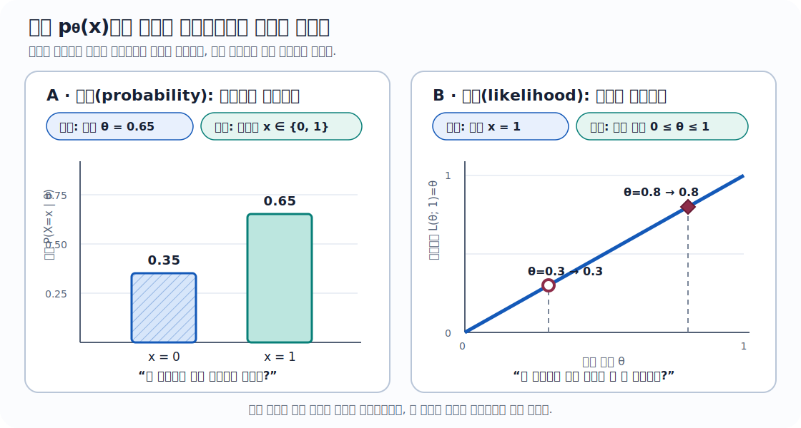
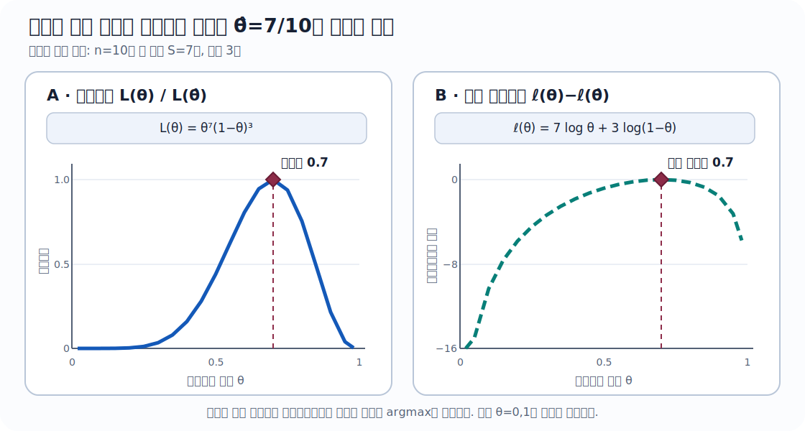
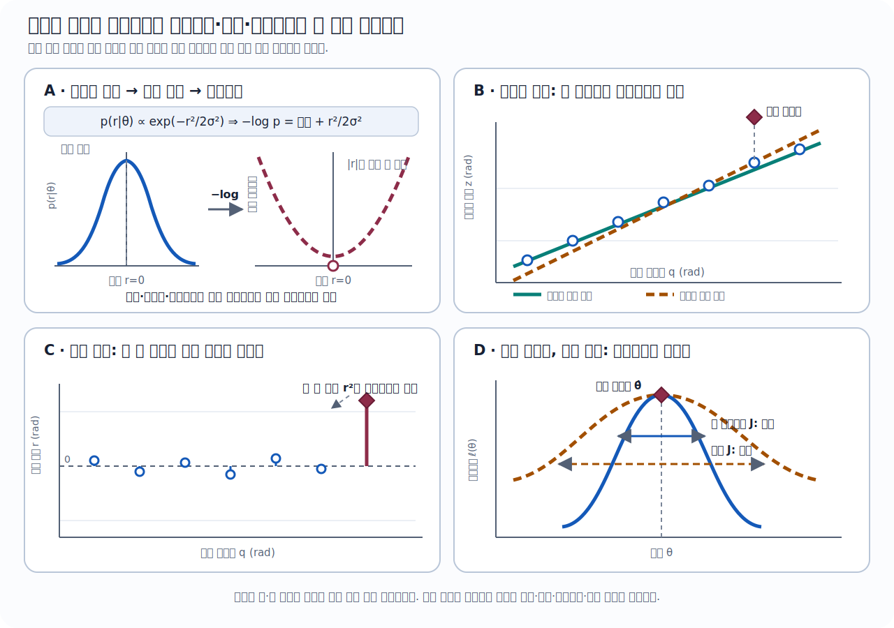

::: {.concept-hero .type-role-pilot}
## 30초 핵심

**최대우도추정**(*maximum likelihood estimation*, <abbr title="Maximum Likelihood Estimation">MLE</abbr>)은 이미 관측한 데이터 $x_{1:n}$을 고정하고, 그 데이터가 나타나는 정도를 가장 크게 만드는 [모수]{.atlas-term data-en="parameter" data-definition="확률모형이나 물리모형의 모양을 결정하지만 관측 데이터에서 추정해야 하는 값이다. 통계의 모수와 프로그램 함수에 전달하는 매개변수를 문맥으로 구분한다."}(*parameter*) $\theta$를 찾는다.

$$
\begin{aligned}
\hat\theta_{\mathrm{MLE}}
&\in\arg\max_{\theta\in\Theta}L(\theta),\\
L(\theta)&:=L(\theta;x_{1:n}),\\
L(\theta;x_{1:n})&=p_\theta(x_{1:n}).
\end{aligned}
$$

곱셈을 덧셈으로 바꾸고 수치적 **언더플로**(*underflow*)를 피하려고 실제로는 거의 항상 **로그우도**(*log-likelihood*)

$$
\ell(\theta)=\log L(\theta)
$$

를 최대화한다. **가우스**(*Gaussian*) 독립·동분산 잡음에서는 이 문제가 [잔차]{.atlas-term data-en="residual" data-definition="관측값과 모형이 예측한 값 사이의 관측 후 차이다. 참값을 알아야 정의할 수 있는 오차(error)와 구분한다."}(*residual*) 제곱합을 최소화하는 **최소제곱**(*least squares*)과 정확히 같아진다.
:::

::: {.key-takeaway}
## 이 장에서 끝까지 남겨야 할 문장

**MLE는 “가장 가능성 높은 모수”를 고르는 절차가 아니라, “각 모수 후보가 관측된 데이터를 얼마나 잘 설명하는지”를 비교하는 절차다.** 모수 자체의 확률을 말하려면 사전분포(prior)를 포함한 별도의 확률모형이 필요하다.
:::

::: {.learning-objectives}
## 이 장을 마치면

- 확률과 우도를 **무엇을 고정하고 무엇을 움직이는가**로 구분할 수 있다.
- 베르누이·가우스 로그우도를 세우고 최대우도추정량을 직접 유도할 수 있다.
- 점수함수, 헤시안, 관측정보, 피셔 정보의 역할과 성립 조건을 설명할 수 있다.
- 가우스 센서 모형에서 최대우도추정이 보통최소제곱·가중최소제곱으로 바뀌는 가정을 빠짐없이 말할 수 있다.
- 엔코더 척도·편향 보정을 구현하고 식별성·잔차·단위·이상치를 진단할 수 있다.
- 실제 제품 사양과 교재가 추가한 확률모형, 제조사가 공개하지 않은 내부 구현을 구분할 수 있다.
:::

::: {.concept-scorecard}
## 이 장의 위치

- **중요도 5/5** · 센서 보정, 최소제곱, 인공지능 학습, 칼만 필터의 잡음모형을 잇는 핵심 원리
- **난이도 3/5** · 평균·분산과 미분만으로 핵심 유도가 가능하며, 피셔 정보 증명은 선택 심화
- **실무 빈도 5/5** · 보정·식별·학습 코드에서 음의 로그우도나 그 특수형인 최소제곱으로 반복해서 등장
- **쓰임** · 로봇 센서 보정 · 컴퓨터 비전 · 상태추정 · 인공지능 · 실험 설계 · 품질 관리
- **빠른 읽기 15분** · 정의, 확률과 우도의 차이, 가우스 최대우도추정만 읽기
- **핵심 읽기 110분** · 최소제곱 연결과 세 가지 실제 센서 사례까지 계산하기
- **완전 학습 260분** · 점수함수·피셔 정보·정칙성 조건·실무 진단까지 확인하기
:::

::: {.annotation-note}
## 분야별 사용 빈도와 체감 중요도

| 분야 | 최대우도추정이 맡는 역할 | 중요도 |
|---|---|---:|
| 센서·로봇 보정 | 편향·척도·외부/내부 보정값 추정 | ★★★★★ |
| 컴퓨터 비전 | 카메라 재투영오차와 확률적 관측모형 연결 | ★★★★★ |
| 인공지능 | 음의 로그우도·교차엔트로피 학습목적의 근거 | ★★★★★ |
| 칼만 필터·센서융합 | 측정잡음·공정잡음 모수 추정과 모형 검증 | ★★★★☆ |
| 제어·시스템 식별 | 동역학·마찰·지연 모수 추정 | ★★★★☆ |
| 강화학습 | 확률정책·전이모형의 학습과 정책경사 해석 | ★★★☆☆ |
:::

```{mermaid}
%%| label: fig-mle-workflow
%%| fig-cap: "최대우도추정의 작업 흐름: 관측과 가정을 로그우도로 연결하고 추정 뒤 다시 검증한다."
%%| fig-alt: "왼쪽에서 오른쪽으로 이어지는 흐름도. 단위·시각·좌표계를 가진 관측 데이터가 확률모형과 가정을 거쳐 잔차 또는 사건확률, 로그우도, 최대화 또는 음의 로그우도 최소화, 모수 추정값, 잔차·불확실성·외부 검증으로 이동한다. 마지막 검증 노드에서 확률모형 노드로 모형 수정 화살표가 되돌아간다. 축과 수치 단위가 필요한 정량 그래프가 아니라 절차 관계를 나타낸다."
flowchart LR
  accTitle: 최대우도추정 작업 흐름
  accDescr: 관측 데이터에서 확률모형과 로그우도를 만들고 모수를 추정한 뒤 잔차와 외부 검증 결과로 모형을 다시 수정하는 순환 절차다.
  A[관측 데이터<br/>단위·시각·좌표계] --> B[확률모형<br/>가정 공개]
  B --> C[잔차 또는 사건확률]
  C --> D[로그우도]
  D --> E[최대화<br/>또는 음의 로그우도 최소화]
  E --> F[모수 추정값]
  F --> G[잔차·불확실성·외부 검증]
  G -. 모형 수정 .-> B
```

**읽는 방향:** 데이터가 모수를 자동으로 결정하는 것이 아니다. 먼저 관측과 잡음에 대한 모형을 선언하고, 그 모형 아래에서 우도를 만든 뒤, 마지막에 잔차와 외부 검증으로 처음의 가정을 되돌아본다.

:::: {.depth-intuition}
## 1. 먼저 떠올릴 이미지: 모델의 손잡이를 돌려 보기

로봇 팔의 관절 엔코더(encoder)에 영점 오차 $b$가 있다고 하자. 실제 각도가 $q_i$일 때 센서가

$$
z_i=q_i+b+\varepsilon_i
$$

를 출력한다고 생각한다. 이미 기록된 $(q_i,z_i)$는 바뀌지 않는다. 대신 가상의 편향 후보 $b=-0.2,-0.1,0,0.1,\ldots$를 모델 손잡이처럼 돌려 본다.

- $b=0.1$일 때 지금의 측정 묶음이 얼마나 자연스러운가?
- $b=-0.2$일 때는 얼마나 자연스러운가?
- 모든 후보 중 관측 데이터와 가장 잘 맞는 $b$는 무엇인가?

이 비교 점수가 [**우도**]{.atlas-term data-en="likelihood" data-definition="관측된 데이터를 고정하고, 어떤 모수값이 그 데이터를 얼마나 잘 설명하는지를 모수의 함수로 읽은 값이다. 확률과 같은 식을 쓸 수 있지만 무엇을 변수로 보는지가 다르다."}(*likelihood*)다. 우도를 가장 크게 만드는 손잡이 위치가 MLE다. 여기서 아직 관측할 수 없는 확률적 오차는 **잡음**(*noise*), 모수를 맞춘 뒤 실제로 계산한 오차는 **잔차**(*residual*)라고 구분한다.

::: {.engineering-meaning}
## 공학적 의미

MLE는 “잡음이 있는 측정으로부터 모형의 숨은 상수를 맞추는 법”이다. 센서 편향·척도, 카메라 내부 모수, 로봇 질량·마찰계수, 분류모형의 가중치를 추정하는 많은 문제가 이 형태를 가진다. 다만 **어떤 잡음모형을 가정했는지가 곧 어떤 오차를 크게 벌하는지**를 결정한다.
:::

## 2. 확률(probability)과 우도(likelihood): 같은 식을 다른 방향으로 읽는다

동전 던지기 $X\sim\operatorname{Bernoulli}(\theta)$에서

$$
p_\theta(x)=\theta^x(1-\theta)^{1-x},
\qquad x\in\{0,1\},\quad 0\le\theta\le1
$$

이다. 식은 하나지만 질문의 방향이 다르다.

| 읽는 방식 | 고정하는 것 | 움직이는 것 | 질문 |
|---|---|---|---|
| **확률**(*probability*) | 모수 $\theta$ | 가능한 데이터 $x$ | “이 모델에서 어떤 데이터가 나올까?” |
| **우도**(*likelihood*) | 관측 데이터 $x$ | 모수 후보 $\theta$ | “이 데이터를 어느 모수가 더 잘 설명할까?” |

예를 들어 $x=1$을 관측했다면 $L(\theta;1)=\theta$다. $\theta=0.8$이 $\theta=0.3$보다 관측 $x=1$에 더 높은 우도를 준다. 그러나 $L(\theta;1)$을 $\theta$에 대한 확률분포라고 부를 수는 없다.

{#fig-mle-probability-likelihood fig-alt="두 패널의 비교 그림. 왼쪽 가로축은 무차원 이산 결과 x=0,1, 세로축은 무차원 확률 P(X=x|세타)이며 세타 0.65에서 높이 0.35와 0.65인 막대를 표시한다. 오른쪽 가로축은 0부터 1까지의 무차원 모수 후보 세타, 세로축은 관측 x=1에 대한 무차원 비교점수 L(세타;1)=세타이며 세타 0.3과 0.8을 비교한다."}

@fig-mle-probability-likelihood 의 왼쪽에서는 두 막대가 **가능한 데이터 전체**이므로 높이의 합이 1이다. 오른쪽에서는 모수 후보를 비교할 뿐이므로 곡선 아래 넓이나 후보값의 합을 1로 맞출 이유가 없다. 이때 “$\theta=0.8$이 더 높다”는 말은 **현재 관측 $x=1$에 대한 상대적 지지가 더 크다**는 뜻이지, “$\theta=0.8$일 확률이 80%”라는 뜻이 아니다.

::: {.annotation-note}
## 어원 카드: 우도(likelihood)는 왜 이런 이름일까?

영어 *likely*는 “그럴듯한”이라는 뜻이다. 한국어 **우도(尤度)**도 모수 후보가 관측 결과를 설명하는 상대적 그럴듯함을 나타낸다. “가능도”라는 번역도 보이지만, 이 교재에서는 통계학의 표준 용례인 **우도**를 사용한다.
:::

## 3. 용어 지도: 추정값(estimate)과 추정량(estimator)도 다르다

:::: {.glossary-grid}
::: {.glossary-entry}
### 모수(parameter) · $\theta$

확률모형의 모양을 결정하지만 아직 모르는 값이다. 예: 센서 **편향**(*bias*) $b$, 가우스 평균 $\mu$, 분산 $\sigma^2$.
:::

::: {.glossary-entry}
### 표본(sample) · $x_{1:n}$

실제로 관측한 데이터. $x_{1:n}$은 $x_1,\ldots,x_n$을 짧게 쓴 표기다.
:::

::: {.glossary-entry}
### 추정량(estimator) · $\widehat\theta(X_{1:n})$

아직 관측 전인 **확률표본**(*random sample*)의 함수다. 따라서 추정량 자체도 **확률변수**(*random variable*)다.
:::

::: {.glossary-entry}
### 추정값(estimate) · $\widehat\theta(x_{1:n})$

실제 데이터를 추정량에 넣어 얻은 숫자다. 같은 공식이라도 표본이 달라지면 값이 달라진다.
:::

::: {.glossary-entry}
### 우도(likelihood) · $L(\theta;x)$

관측 $x$를 고정하고 모수 $\theta$의 함수로 읽은 결합 확률질량 또는 결합 확률밀도다.
:::

::: {.glossary-entry}
### 로그우도(log-likelihood) · $\ell(\theta)$

$\ell(\theta)=\log L(\theta)$다. 최대점은 같고 곱이 합으로 바뀐다.
:::
::::

::: {.term-card}
## 약어 카드: MLE는 무엇의 약자인가?

- **정식 명칭:** 최대우도추정(*Maximum Likelihood Estimation*)
- **방법/절차:** MLE를 사용한다.
- **그 결과인 추정량:** 최대우도추정량(*maximum likelihood estimator*)
- **잘못된 확장:** ~~최소우도추정(Minimum Likelihood Estimation)~~이 아니다. **최대(maximum)**는 우도를 최대화한다는 뜻이다.
:::

## 4. 지금 필요한 선수지식

- [ ] “관측값”과 “모델의 모수”를 구분한다.
- [ ] 곱셈과 로그의 기본 관계 $\log(ab)=\log a+\log b$를 안다.
- [ ] 평균과 분산을 중심과 잡음 크기로 읽을 수 있다.

여기까지는 행렬미분·확률과정·칼만 필터(*Kalman filter*)가 필요 없다. 평균과 분산이 낯설면 [평균과 공분산](../probability/mean-covariance.qmd)을 잠깐 보고 돌아오면 된다.

::: {.history-card}
## 숨 고르기: 피셔(Fisher)가 “확률”과 “우도”를 갈라놓은 이유

R. A. Fisher는 1912년 빈도곡선을 맞추는 “절대 기준(absolute criterion)”을 제안했고, 1922년 논문에서 우도를 이론적 통계학의 핵심 언어로 정교화했다. 중요한 변화는 **데이터에서 모수로 거꾸로 갈 때, 모수를 곧바로 확률변수처럼 취급하지 않고 관측 데이터가 제공하는 상대적 지지도를 비교하자**는 것이었다. 이 구분은 오늘날 센서 보정부터 신경망 학습까지 이어진다.

원문 서지: R. A. Fisher, [*On the Mathematical Foundations of Theoretical Statistics* (1922)](https://doi.org/10.1098/rsta.1922.0009).
:::
::::

:::: {.depth-application}
## 5. 작동하는 정의

관측 $X_1,\ldots,X_n$의 **결합 확률질량함수**(*joint probability mass function*) 또는 **결합 확률밀도함수**(*joint probability density function*)가 $p_\theta(x_{1:n})$이고, 가능한 모수들의 집합이 $\Theta$라고 하자. 관측값 $x_{1:n}$에 대한 우도는

$$
L(\theta;x_{1:n})=p_\theta(x_{1:n}),\qquad \theta\in\Theta
$$

이고, MLE는

$$
\widehat\theta_{\mathrm{MLE}}
\in \operatorname*{arg\,max}_{\theta\in\Theta}L(\theta;x_{1:n})
$$

이다. `max`가 아니라 `argmax`인 이유는 우리가 원하는 것이 최대 **우도값**이 아니라 그 최대를 만드는 **모수값**이기 때문이다.

::: {.formula-card data-importance="5" data-difficulty="2"}
## 공식 카드: 독립 표본이면 곱, 로그를 취하면 합

::: {.block-metrics}
`중요도 5/5`{.metric-badge .metric-badge--importance} `난이도 2/5`{.metric-badge .metric-badge--difficulty} `실무 빈도 5/5`{.metric-badge}
:::

**답하는 질문:** 여러 관측의 설명력을 하나의 안정적인 목적함수로 어떻게 합치는가?  
**중요도 5/5인 이유:** 베르누이·가우스·센서 보정·분류 학습의 모든 후속 우도가 이 곱과 로그합 구조에서 시작한다.  
**난이도 2/5인 이유:** 로그의 단조성과 독립성만 알면 되지만, 밀도·경계·지지집합을 확률처럼 오독하기 쉽다.  
**실무 빈도 5/5인 이유:** 독립 표본의 음의 로그우도는 보정·식별·학습 코드에서 배치 손실을 만들 때 반복해서 사용한다.

$X_i$가 모수 $\theta$ 아래에서 서로 독립이면

$$
L(\theta)=\prod_{i=1}^{n}p_\theta(x_i),
\qquad
\ell(\theta)=\log L(\theta)
=\sum_{i=1}^{n}\log p_\theta(x_i).
$$

$\log$는 **엄격히 증가**(*strictly increasing*)하므로

$$
\arg\max_\theta L(\theta)=\arg\max_\theta\ell(\theta).
$$

로그는 답을 바꾸지 않으면서 작은 확률들의 곱이 0으로 **언더플로**(*underflow*)되는 문제를 줄이고, 미분을 단순하게 만든다.

| 공식 사용 점검 | 내용 |
|---|---|
| **모양(shape)** | $\theta\in\mathbb R^d$, $x_i\in\mathbb R^m$일 수 있지만 $L(\theta)$와 $\ell(\theta)$은 스칼라다. |
| **단위·좌표계** | 이산 확률질량은 무차원이다. 연속 밀도와 우도는 데이터 단위의 역수를 가질 수 있다. 모든 $x_i$는 선언한 센서 좌표계와 단위를 따라야 한다. |
| **가정** | 곱 분해에는 모수가 주어졌을 때의 독립성이 필요하고, 로그에는 $L(\theta)>0$인 후보가 필요하다. 지지집합과 모수영역 $\Theta$도 먼저 선언한다. |
| **최소 예** | $x=(1,0,1)$인 베르누이 자료이면 $L(\theta)=\theta^2(1-\theta)$이고 $\widehat\theta=2/3$이다. |
| **실패 조건** | 밀도가 0인 후보, 모수와 함께 움직이는 지지집합, 시간상관, 경계에서만 접근하는 상한, 여러 국소 최대점을 확인하지 않으면 실패한다. |
| **다음 연결** | [베르누이 MLE](#sec-mle-bernoulli) → [가우스 MLE](#sec-mle-gaussian) → [최소제곱](#sec-mle-least-squares) 순으로 특수화한다. |
| **검산 1 · 순서 보존** | 같은 후보격자에서 `argmax(L)`와 `argmax(log(L))`가 같은지 확인한다. |
| **검산 2 · 직접 계산** | 작은 표본에서는 $\prod_i p_\theta(x_i)$와 $\exp(\sum_i\log p_\theta(x_i))$가 반올림오차 안에서 같은지 확인한다. |
:::

::: {.algorithm-card}
### 알고리즘 · 일반 로그우도 최대화

**입력:** 관측 $x_{1:n}$, 모수영역 $\Theta$, 로그밀도 함수 $\log p_\theta(x)$ 또는 결합 로그밀도, 초기 후보 집합  
**출력:** 최대우도 추정값 $\widehat\theta$, 최대 로그우도, 종료상태, 경계·잔차·기울기 진단  
**가정:** 단위·좌표계·지지집합이 선언되어 있고, 독립 표본이면 곱 분해가 타당하며, 탐색한 후보에서 로그우도와 필요한 미분이 유한하다.

```text
01  데이터의 단위, 좌표계, 누락값, 지지집합을 검사한다.
02  독립이면 ℓ(θ) ← Σᵢ log pθ(xᵢ), 아니면 결합 로그밀도를 쓴다.
03  Θ의 내부와 경계를 덮는 여러 초기 후보를 만든다.
04  각 후보에서 음의 로그우도 −ℓ(θ)를 제약조건과 함께 최소화한다.
05  유한한 목적함수값을 낸 해 중 ℓ(θ)가 가장 큰 후보를 고른다.
06  경계값, 점수함수, 헤시안 부호, 종료상태를 확인한다.
07  잔차와 쓰지 않은 검증자료로 처음의 분포 가정을 다시 검사한다.
```

**병목:** 표본별 로그밀도·기울기 계산은 보통 $O(nd)$이고, 조밀한 $d\times d$ 헤시안 분해는 $O(d^3)$이다. 비볼록 모형에서는 다중 초기값 탐색이 계산량을 지배할 수 있다.  
**실패 조건:** 로그 0, 정의역 밖 후보, 최대값이 달성되지 않는 경계, 특이 헤시안, 단일 국소해 과신, 상관·이상치·좌표계 오류를 숨긴 모형.
:::

## 6. MLE 문제를 푸는 여섯 단계

1. **데이터와 단위 선언:** 무엇을 몇 번 측정했는가?
2. **관측모델 선언:** $p_\theta(x)$ 또는 $x=h(\theta)+\varepsilon$를 쓴다.
3. **가정 공개:** 독립성, 분포, 분산, 지지집합을 적는다.
4. **로그우도 작성:** 상수항을 버릴 때 무엇이 $\theta$와 무관한지 표시한다.
5. **최적화와 경계 확인:** 점수함수가 0인 점뿐 아니라 모수 경계와 존재·유일성을 확인한다.
6. **진단:** 적합 잔차, 편향, 이상치, 시간상관, 식별 가능성을 확인한다.

## 7. 전제 장부

| 라벨 | 내용 | 깨지면 생기는 일 |
|---|---|---|
| 모형족 | 실제 데이터 분포가 $\{p_\theta:\theta\in\Theta\}$ 중 하나라고 가정 | MLE는 “가장 덜 틀린” 후보를 찾을 수 있으나 물리적 참값은 아님 |
| 독립성 | 곱 형태는 표본들이 조건부 독립일 때 사용 | 시계열 상관을 무시하면 불확실성이 지나치게 작아짐 |
| 동일분포 | 독립·동일분포(independent and identically distributed, i.i.d.) 예제에서는 모든 표본에 같은 분포 사용 | 온도·속도별 잡음이 다르면 표본별 모형 필요 |
| 지지집합 | 가능한 데이터 영역이 $\theta$에 따라 달라지는지 확인 | 표준 점수함수·피셔 공식의 미분 교환이 실패할 수 있음 |
| 식별 가능성 | 다른 $\theta$가 서로 다른 관측분포를 만든다고 기대 | 능선·평평한 우도, 여러 동등한 해 발생 |
| 최적화 | 전역 최대점을 찾았는지 확인 | 국소 최대점 또는 안장점을 MLE로 오인 |
| 센서 품질 | 시각·좌표계·단위·포화가 맞다고 가정 | 좋은 최적화기가 잘못된 데이터에 매우 잘 맞음 |

::: {.term-card}
## 용어 카드: 잡음(noise)과 잔차(residual)는 같은 값이 아니다

- **잡음**(*noise*) $\varepsilon_i$: 데이터 생성모형 안의 관측되지 않은 확률변수
- **잔차**(*residual*) $r_i=x_i-h_i(\widehat\theta)$: 적합된 모수로 데이터에서 실제 계산한 값

참 모수를 모르므로 보통 $\varepsilon_i$를 직접 볼 수 없다. 잔차는 잡음모형을 진단하는 대리물이지만, 적합 과정에서 제약을 받고 서로 상관될 수 있으므로 원래 잡음의 독립 표본과 완전히 같지는 않다.
:::

::: {.assumption-box}
## “데이터가 많다”가 모델 오류를 치료하지는 않는다

표본 수가 커지면 **표본변동**(*sampling variability*)은 줄어들 수 있지만, 고정된 편향·잘못된 잡음분포족·시간 동기화 오류·관측 불가능성은 자동으로 사라지지 않는다. MLE의 통계적 보장은 어떤 가정 아래의 보장인지 함께 적어야 한다.
:::

## 8. 예제 A — 베르누이(Bernoulli) 성공확률 MLE {#sec-mle-bernoulli}

::: {.block-metrics}
`중요도 4/5`{.metric-badge .metric-badge--importance} `난이도 2/5`{.metric-badge .metric-badge--difficulty} `이산자료·분류의 원형`{.metric-badge}
:::

$x_i\in\{0,1\}$이고

$$
X_i\overset{\mathrm{i.i.d.}}{\sim}\operatorname{Bernoulli}(\theta),
\qquad 0\le\theta\le1
$$

라 하자. 성공 횟수를 $S=\sum_i x_i$라 쓰면

$$
L(\theta)
=\prod_{i=1}^{n}\theta^{x_i}(1-\theta)^{1-x_i}
=\theta^S(1-\theta)^{n-S}.
$$

$0<\theta<1$에서 로그우도와 그 미분은

$$
\ell(\theta)=S\log\theta+(n-S)\log(1-\theta),
$$

$$
\ell'(\theta)=\frac{S}{\theta}-\frac{n-S}{1-\theta}.
$$

$\ell'(\theta)=0$을 풀면

$$
S(1-\theta)-(n-S)\theta=0
\quad\Longrightarrow\quad
\widehat\theta_{\mathrm{MLE}}=\frac{S}{n}=\bar x.
$$

즉 성공확률의 MLE는 관측된 성공 비율이다. $0<S<n$이면

$$
\ell''(\theta)=-\frac{S}{\theta^2}-\frac{n-S}{(1-\theta)^2}<0
$$

이므로 로그우도는 **엄격 오목**(*strictly concave*)하고 내부 해가 유일한 **전역 최대점**(*global maximum*)이다.

{#fig-mle-bernoulli-likelihood fig-alt="성공 7회와 실패 3회의 합성 관측을 사용한 두 곡선. 두 가로축은 0부터 1까지의 무차원 성공확률 후보 세타다. 왼쪽 세로축은 0부터 1까지의 무차원 상대우도이며 세타 0.7에서 1인 봉우리다. 오른쪽 세로축은 최대값과의 무차원 상대 로그우도 차이로 0부터 약 -16까지이며 같은 세타 0.7에서 0인 아래로 오목한 봉우리다."}

@fig-mle-bernoulli-likelihood 에서 로그를 취하기 전과 뒤의 세로축 값은 다르지만, 후보들의 순서와 최대점은 같다. 왼쪽의 우도 곱은 표본 수가 커질수록 컴퓨터가 표현하기 어려울 만큼 작아질 수 있다. 오른쪽의 로그우도는 곱을 합으로 바꾸므로 수치적으로 안정적이고 미분도 쉽다. 다만 $\theta=0,1$에서는 로그가 정의되지 않을 수 있으므로 경계해는 원래 우도로 따로 확인한다.

### 유도 읽기표

| 단계 | 무엇이 바뀌었나 | 왜 가능한가 | 확인할 조건 |
|---|---|---|---|
| 표본별 질량함수 → 곱 | $n$개 관측을 하나의 우도로 묶음 | 독립이면 결합확률이 곱으로 분해됨 | 독립·동일한 $\theta$ |
| 곱 → 로그합 | 지수의 합 $S=\sum x_i$만 남음 | 로그가 단조증가하여 최대점 보존 | $0<\theta<1$인 내부 계산 |
| 미분 → $S/n$ | 증가시키는 힘과 감소시키는 힘의 균형 | 내부 최대점의 일차조건 | 경계 $0,1$은 별도 확인 |
| 이차미분 음수 | 후보가 봉우리임을 확인 | 엄격 오목이면 전역해가 유일 | $0<S<n$ |

::: {.annotation-note}
## 경계도 답이다

모든 관측이 0이면 $S=0$이고 최대점은 $\widehat\theta=0$, 모두 1이면 $S=n$이고 최대점은 $\widehat\theta=1$이다. 이 경우 내부에서 미분을 0으로 만드는 점이 없다. “미분=0만 풀기”가 MLE 절차의 전부가 아닌 이유다.
:::

## 9. 예제 B — 가우스(Gaussian) 평균과 분산 MLE {#sec-mle-gaussian}

::: {.block-metrics}
`중요도 5/5`{.metric-badge .metric-badge--importance} `난이도 3/5`{.metric-badge .metric-badge--difficulty} `센서 잡음·최소제곱의 출발점`{.metric-badge}
:::

스칼라 센서 측정이

$$
X_i\overset{\mathrm{i.i.d.}}{\sim}\mathcal N(\mu,\sigma^2),
\qquad \mu\in\mathbb R,\quad \sigma^2>0
$$

를 따른다고 하자. 우도는

$$
L(\mu,\sigma^2)
=\prod_{i=1}^{n}
\frac{1}{\sqrt{2\pi\sigma^2}}
\exp\!\left[-\frac{(x_i-\mu)^2}{2\sigma^2}\right].
$$

로그를 취하면

$$
\ell(\mu,\sigma^2)
=-\frac n2\log(2\pi)
-\frac n2\log\sigma^2
-\frac{1}{2\sigma^2}\sum_{i=1}^{n}(x_i-\mu)^2.
$$

$\mu$에 대해 미분하면

$$
\frac{\partial\ell}{\partial\mu}
=\frac{1}{\sigma^2}\sum_{i=1}^{n}(x_i-\mu)=0
\quad\Longrightarrow\quad
\widehat\mu_{\mathrm{MLE}}=\bar x.
$$

$v=\sigma^2$라고 놓고 미분하면

$$
\frac{\partial\ell}{\partial v}
=-\frac{n}{2v}
+\frac{1}{2v^2}\sum_{i=1}^{n}(x_i-\mu)^2=0,
$$

따라서 $\mu=\widehat\mu$를 대입한 분산 MLE는

$$
\widehat\sigma^2_{\mathrm{MLE}}
=\frac1n\sum_{i=1}^{n}(x_i-\bar x)^2
$$

이다.

::: {.formula-card data-importance="5" data-difficulty="3"}
### 공식 사용 카드 · 가우스 평균과 분산 MLE

::: {.block-metrics}
`중요도 5/5`{.metric-badge .metric-badge--importance} `난이도 3/5`{.metric-badge .metric-badge--difficulty} `실무 빈도 5/5`{.metric-badge}
:::

**답하는 질문:** 같은 가우스 분포에서 나온 반복 측정의 중심과 잡음 크기를 어떤 값으로 추정하는가?  
**중요도 5/5인 이유:** 평균·분산 MLE는 센서 편향과 잡음 추정, 최소제곱 연결의 가장 작은 완결 예다.  
**난이도 3/5인 이유:** 두 모수를 함께 미분하고 분산의 양의 경계와 분모 $n$의 의미까지 구분해야 한다.  
**실무 빈도 5/5인 이유:** 정지센서 통계, 잔차 분산, 가우스 관측모형의 초기값을 계산할 때 일상적으로 등장한다.

| 공식 사용 점검 | 내용 |
|---|---|
| **모양** | $x\in\mathbb R^n$, $\widehat\mu\in\mathbb R$, $\widehat\sigma^2\in\mathbb R_{\ge0}$이다. |
| **단위·좌표계** | $x_i$와 $\widehat\mu$는 같은 센서 단위, $\widehat\sigma^2$는 그 단위의 제곱이다. 한 축·한 좌표계의 측정만 섞는다. |
| **가정** | 같은 $\mu,\sigma^2$를 공유하는 독립 가우스 표본이며 $\sigma^2>0$인 모수영역을 사용한다. |
| **최소 예** | $x=(-1,0,1)$이면 $\widehat\mu=0$, $\widehat\sigma^2=(1+0+1)/3=2/3$이다. |
| **실패 조건** | 모든 표본이 같으면 열린 영역 $\sigma^2>0$ 안에 분산 MLE가 없다. 이상치·드리프트·시간상관은 평균과 불확실성을 왜곡한다. |
| **다음 연결** | 평균을 $h_i(\theta)$로 바꾸면 [가우스 MLE와 최소제곱](#sec-mle-least-squares)이 된다. |
| **검산 1 · 균형** | $\widehat\mu$에서 잔차합 $\sum_i(x_i-\widehat\mu)=0$인지 확인한다. |
| **검산 2 · 단위·부호** | $\widehat\sigma^2\ge0$이고 단위가 $[x]^2$인지, 이를 로그우도 미분식에 넣었을 때 0이 되는지 확인한다. |
:::

### 유도 읽기표

| 단계 | 무엇이 바뀌었나 | 이유 | 조건·주의 |
|---|---|---|---|
| 가우스 밀도 곱 → 로그합 | 정규화항과 잔차 제곱합을 분리 | 곱을 안정적으로 계산하고 미분하기 쉬움 | 독립 표본 |
| $\mu$ 미분 | $\sum_i(x_i-\mu)=0$ | 평균을 좌우로 미는 잔차의 합이 0인 균형점 | $\sigma^2>0$ |
| $v=\sigma^2$ 치환 | 양의 분산을 한 변수로 미분 | $\sigma$보다 $\sigma^2$가 식에 직접 나타남 | $v>0$ 경계 확인 |
| $\widehat\mu$ 대입 | 분산은 추정된 평균 주위 잔차로 계산 | 두 모수의 연립 일차조건을 함께 만족 | 모든 표본이 같으면 퇴화 가능 |

여기서 <abbr title="independent and identically distributed">i.i.d.</abbr>는 **독립·동일분포**(*independent and identically distributed*)의 약자다. “각 측정의 분포가 같다”와 “측정들 사이에 상관이 없다”라는 두 가정을 함께 포함한다.

::: {.callout-important title="왜 분모가 $n-1$이 아니라 $n$인가?"}
분모 $n$은 가우스 우도를 최대화한 결과다. 분모 $n-1$은 유한 표본에서 모집단 분산에 대해 **불편**(*unbiased*)이 되도록 보정한 표본분산이다. **최대우도추정량과 불편추정량은 서로 다른 최적화 기준**이며 항상 같은 답을 주지 않는다.
:::

::: {.annotation-note}
## 엄밀한 경계: 모든 표본이 같으면 분산 MLE가 존재하지 않을 수 있다

모수공간을 $\sigma^2>0$으로 두었는데 모든 $x_i$가 같다면 잔차 제곱합이 0이다. 이때 $\sigma^2\downarrow0$으로 갈수록 우도가 무한히 커져, 열린 모수공간 안에서는 최대값이 달성되지 않는다. 위의 분산 공식이 양의 MLE가 되려면 $\sum_i(x_i-\bar x)^2>0$ 같은 비퇴화 조건이 필요하다.
:::

::: {.failure-mode}
## 재현 실패 카드 · 이상치 하나가 가우스 MLE를 끌어간다

1. **증상:** 정지 자이로스코프의 편향 추정값이 거의 0이어야 하는데 $0.100\;\mathrm{rad/s}$로 튀고, 추정 표준편차도 $0.224\;\mathrm{rad/s}$까지 커진다.
2. **환경:** 같은 축, 같은 단위, 짧은 등온 정지구간이라고 가정한 교육용 합성 실험이다. 실제 제품 로그나 성능 측정값이 아니다.
3. **최소 입력:** $x=(-0.02,-0.01,0,0.01,0.02,\mathbf{0.60})\;\mathrm{rad/s}$. 마지막 굵은 값이 의도적으로 주입한 이상치다.
4. **관측:** 가우스 MLE는 $\widehat\mu=0.100$, $\widehat\sigma^2=0.05017\;(\mathrm{rad/s})^2$를 낸다. 이상치가 없으면 각각 $0$과 $0.00020\;(\mathrm{rad/s})^2$다.
5. **잘못된 가설:** 여섯 값이 모두 하나의 독립·동일분산 가우스 분포에서 나온 정상 측정이며, 큰 값도 단순한 가우스 잡음이라고 단정한다.
6. **진단:** 표본별 잔차 제곱 기여도, 시간순서, 센서 상태비트, 포화범위, 중앙값·중앙절대편차를 함께 본다. 마지막 한 점이 제곱합 대부분을 차지하는지 확인한다.
7. **근본 원인:** 오염된 한 점까지 가우스 꼬리로 설명하려는 모형 불일치와, 큰 잔차를 제곱하는 목적함수의 높은 민감도다. 통신 오류·충격·동기화 실패 중 무엇인지는 원시 로그 없이 단정하지 않는다.
8. **수정:** 하드웨어 상태·동기화 근거로 무효 표본을 먼저 분리한다. 유효하지만 두꺼운 꼬리라면 스튜던트 $t$ 우도나 명시적 오염 혼합모형을 사용하고, 제외 규칙과 임계값을 보고서에 남긴다.
9. **재검증:** 독립 근거로 마지막 점이 무효임을 확인해 제외하면 $\widehat\mu\approx0$, $\widehat\sigma\approx0.0141\;\mathrm{rad/s}$가 복원된다. 같은 위치에 이상치를 다시 주입해 강건 모형의 추정값과 정상자료 검증오차가 안정적인지도 반복 확인한다.
:::

## 10. 가우스 MLE와 최소제곱의 정확한 연결 {#sec-mle-least-squares}

::: {.block-metrics}
`중요도 5/5`{.metric-badge .metric-badge--importance} `난이도 3/5`{.metric-badge .metric-badge--difficulty} `이 장의 핵심 다리`{.metric-badge}
:::

로봇 관측모델을

$$
y_i=h_i(\theta)+\varepsilon_i,
\qquad
\varepsilon_i\overset{\mathrm{i.i.d.}}{\sim}\mathcal N(0,\sigma^2)
$$

로 두자. $\sigma^2$가 $\theta$와 무관하면

$$
\ell(\theta)
=C-\frac{1}{2\sigma^2}\sum_{i=1}^{n}
\bigl(y_i-h_i(\theta)\bigr)^2,
$$

여기서 $C$는 $\theta$와 무관한 상수다. 따라서

$$
\arg\max_\theta\ell(\theta)
=\arg\min_\theta\sum_i r_i(\theta)^2,
\qquad r_i(\theta)=y_i-h_i(\theta).
$$

::: {.formula-card data-importance="5" data-difficulty="3"}
### 공식 사용 카드 · 가우스 MLE가 최소제곱이 되는 조건

::: {.block-metrics}
`중요도 5/5`{.metric-badge .metric-badge--importance} `난이도 3/5`{.metric-badge .metric-badge--difficulty} `실무 빈도 5/5`{.metric-badge}
:::

**답하는 질문:** 잔차 제곱합 최소화가 언제 임의의 요령이 아니라 최대우도추정과 같은 문제가 되는가?  
**중요도 5/5인 이유:** 확률모형과 선형대수의 최소제곱을 연결하는 이 장의 핵심 다리다.  
**난이도 3/5인 이유:** 유도는 짧지만 독립성·가우스성·공분산의 모수 의존성을 모두 추적해야 한다.  
**실무 빈도 5/5인 이유:** 카메라·엔코더·깊이센서 보정과 시스템 식별에서 가장 흔한 목적함수 근거다.

| 공식 사용 점검 | 내용 |
|---|---|
| **모양** | 선형모형이면 $A\in\mathbb R^{n\times d}$, $\theta\in\mathbb R^d$, $y,r\in\mathbb R^n$이며 목적함수 $r^\top r$은 스칼라다. |
| **단위·좌표계** | 각 잔차는 같은 물리 단위와 같은 좌표계여야 그대로 제곱해 더할 수 있다. 단위·분산이 다르면 $R^{-1}$로 흰색화한 가중잔차를 쓴다. |
| **가정** | 조건부 독립, 평균 0, 가우스, 공통 분산이며 $\sigma^2$가 $\theta$와 무관하다. 선형해의 유일성에는 $\operatorname{rank}(A)=d$도 필요하다. |
| **최소 예** | $A=\begin{bmatrix}0&1\\1&1\end{bmatrix}$, $y=(1,3)^\top$이면 $\widehat\theta=(2,1)^\top$이고 잔차 제곱합은 0이다. |
| **실패 조건** | 계수 부족, 이상치, 시간상관, 서로 다른 단위의 잔차, 모수 의존 공분산에서 $\log\det R$을 버리는 경우다. |
| **다음 연결** | [엔코더 척도·편향](#sec-mle-encoder-calibration)에서는 $A=[q\;\mathbf1]$로 구체화하고, 거리별 분산에서는 가중최소제곱으로 확장한다. |
| **검산 1 · 모양·단위** | $A\theta$, $y$, $r$의 모양과 단위가 모두 일치하는지 확인한다. |
| **검산 2 · 직교성** | 선형 최소제곱해에서 $A^\top r\approx0$인지 QR/SVD 계산 뒤 직접 확인한다. |
:::

### 왜 ‘가우스’가 ‘잔차 제곱합’으로 바뀌는가

::: {.derivation-step}
#### 1단계 · 물리적 관측식에서 한 표본의 밀도를 쓴다

$$
y_i=h_i(\theta)+\varepsilon_i,
\quad \varepsilon_i\sim\mathcal N(0,\sigma^2)
\quad\Longrightarrow\quad
p(y_i\mid\theta)
=\frac{1}{\sqrt{2\pi\sigma^2}}
\exp\!\left[-\frac{r_i(\theta)^2}{2\sigma^2}\right].
$$

**변경:** 관측식의 잡음 변수 $\varepsilon_i$를 계산 가능한 잔차 $r_i(\theta)=y_i-h_i(\theta)$로 치환했다.  
**이유:** 모수 후보가 정해지면 관측값과 예측값의 차이가 그 후보 아래에서 발생한 잡음값이기 때문이다.  
**조건:** 가우스 평균이 0이고, 표준편차 $\sigma$의 단위가 잔차와 같아야 한다.
:::

::: {.derivation-step}
#### 2단계 · 독립성으로 결합우도를 곱으로 만든다

$$
L(\theta)
=\prod_{i=1}^{n}p(y_i\mid\theta)
=(2\pi\sigma^2)^{-n/2}
\exp\!\left[-\frac{1}{2\sigma^2}\sum_i r_i(\theta)^2\right].
$$

**변경:** 표본별 밀도를 곱해 전체 데이터의 우도를 만들었다.  
**이유:** 모든 관측을 동시에 설명하는 정도가 필요하기 때문이다.  
**조건:** $y_i$들이 $\theta$가 주어졌을 때 서로 독립이어야 한다. 시간상관이 있으면 공분산을 포함한 결합밀도를 써야 한다.
:::

::: {.derivation-step}
#### 3단계 · 로그를 취해 곱과 지수를 합으로 푼다

$$
\ell(\theta)
=\underbrace{-\frac n2\log(2\pi\sigma^2)}_{\theta\text{와 무관}}
-\frac{1}{2\sigma^2}\sum_i r_i(\theta)^2.
$$

**변경:** 양의 우도에 단조증가 함수 $\log$를 적용했다.  
**이유:** 최대점을 보존하면서 곱을 합으로 바꾸고 수치적 언더플로를 줄인다.  
**조건:** 여기서는 $\sigma^2$가 알려져 있거나 적어도 $\theta$와 무관하다. $\sigma^2=\sigma^2(\theta)$라면 밑줄 친 항도 버릴 수 없다.
:::

::: {.derivation-step}
#### 4단계 · 음의 상수배를 제거하며 최대화를 최소화로 뒤집는다

$$
\arg\max_\theta
\left[-\frac{1}{2\sigma^2}\sum_i r_i^2\right]
=
\arg\min_\theta\sum_i r_i^2.
$$

**변경:** $\theta$와 무관한 항을 없애고, 음의 부호 때문에 최대화를 최소화로 바꿨다.  
**이유:** $1/(2\sigma^2)>0$은 후보들의 순서를 바꾸지 않으며, 앞의 음수는 순서만 반대로 만든다.  
**결론:** 최소제곱은 임의의 계산 요령이 아니라, 이 가우스·독립·동분산 가정에서 도출된 최대우도 목적함수다.
:::

$h(\theta)=A\theta$이면 **보통최소제곱**(*ordinary least squares*, <abbr title="Ordinary Least Squares">OLS</abbr>), $h$가 비선형이면 **비선형 최소제곱**(*nonlinear least squares*)이 된다.

오차 **공분산**(*covariance*)이 $R\succ0$인 다변량 가우스 모형이면

$$
y\mid\theta\sim\mathcal N(h(\theta),R)
$$

이고 **음의 로그우도**(*negative log-likelihood*, <abbr title="Negative Log-Likelihood">NLL</abbr>)는 상수를 제외하고

$$
-\ell(\theta)
=\frac12r(\theta)^\top R^{-1}r(\theta)
+\frac12\log\det R.
$$

$R$이 $\theta$와 무관할 때 첫 항만 최소화하면 **가중최소제곱**(*weighted least squares*, <abbr title="Weighted Least Squares">WLS</abbr>)이다. 반대로 $R=R(\theta)$이면 $\log\det R$을 버리면 안 된다.

::: {.mistake-card}
## 자주 생기는 오해: “최소제곱은 언제나 MLE다”

아니다. 최소제곱이 MLE가 되려면 적어도 잔차에 대해 지정한 가우스 모형과 공분산 가정이 필요하다.

- 라플라스 잡음이면 절댓값 오차의 합이 MLE와 연결된다.
- 계수자료에 푸아송 모형을 쓰면 다른 음의 로그우도가 나온다.
- 이상치가 많은 두꺼운 꼬리 잡음이면 가우스 제곱손실이 몇 개의 점에 지배될 수 있다.
- 서로 다른 단위·분산의 잔차를 그대로 제곱해 더하면 우도모형이 물리적으로 일관되지 않을 수 있다.
:::

## 11. 로봇 실무 — 엔코더 척도·편향 보정 {#sec-mle-encoder-calibration}

::: {.block-metrics}
`중요도 5/5`{.metric-badge .metric-badge--importance} `난이도 3/5`{.metric-badge .metric-badge--difficulty} `실험 설계·식별 가능성`{.metric-badge}
:::

정밀 기준기에서 얻은 관절각 $q_i$와 엔코더 출력 $z_i$가 있고

$$
z_i=sq_i+b+\varepsilon_i,
\qquad
\varepsilon_i\overset{\mathrm{i.i.d.}}{\sim}\mathcal N(0,\sigma^2)
$$

라고 하자. 미지 모수는 **척도**(*scale*) $s$와 **편향**(*bias*) $b$다. 행렬로 쓰면

$$
\underbrace{\begin{bmatrix}
q_1&1\\
\vdots&\vdots\\
q_n&1
\end{bmatrix}}_{A\in\mathbb R^{n\times2}}
\underbrace{\begin{bmatrix}s\\b\end{bmatrix}}_{\theta\in\mathbb R^2}
+\varepsilon
=
\underbrace{\begin{bmatrix}z_1\\\vdots\\z_n\end{bmatrix}}_{z\in\mathbb R^n}.
$$

가우스 MLE는

$$
\widehat\theta
=\arg\min_\theta\|z-A\theta\|_2^2
$$

이므로 [최소제곱](../linalg/least-squares.qmd)의 **직교–상삼각 분해**(*QR factorization*, <abbr title="QR factorization">QR</abbr>) 또는 **특잇값분해**(*singular value decomposition*, <abbr title="Singular Value Decomposition">SVD</abbr>) 풀이기로 계산한다. `inv(A.T @ A)`를 직접 만들지 않는다.

::: {.formula-card data-importance="5" data-difficulty="3"}
### 공식 사용 카드 · 엔코더 척도와 편향

::: {.block-metrics}
`중요도 5/5`{.metric-badge .metric-badge--importance} `난이도 3/5`{.metric-badge .metric-badge--difficulty} `실무 빈도 4/5`{.metric-badge}
:::

**답하는 질문:** 기준각과 엔코더 출력의 반복 측정에서 척도와 영점 편향을 어떻게 분리하는가?  
**중요도 5/5인 이유:** 식별 가능성, 단위, 동기화, 잔차 진단을 한 작은 선형 보정 문제에서 모두 연습할 수 있다.  
**난이도 3/5인 이유:** 계산은 2열 최소제곱이지만 입력 여기와 rank 부족을 실험 설계에서 판별해야 한다.  
**실무 빈도 4/5인 이유:** 생산·정비 보정에서 자주 쓰이지만 고분해능 엔코더는 온도·백래시까지 포함한 더 큰 모형이 필요할 수 있다.

| 공식 사용 점검 | 내용 |
|---|---|
| **모양** | $A=[q\;\mathbf1]\in\mathbb R^{n\times2}$, $\theta=(s,b)^\top\in\mathbb R^2$, $z,r\in\mathbb R^n$이다. |
| **단위·좌표계** | $q,z,b$는 같은 관절축의 라디안, $s$는 라디안/라디안의 무차원 척도다. 기준기와 엔코더의 양의 회전방향·영점을 맞춘다. |
| **가정** | 표본시각이 정렬되고 $q$가 충분히 변해 $\operatorname{rank}(A)=2$이며, 짧은 구간에서 척도·편향이 일정하고 잔차는 독립·등분산 가우스다. |
| **최소 예** | $q=(-1,0,1)$, $z=(-0.99,0.01,1.01)\;\mathrm{rad}$이면 $\widehat s=1$, $\widehat b=0.01\;\mathrm{rad}$이다. |
| **실패 조건** | 한 자세만 반복, 도와 라디안 혼용, 시각 지연, 백래시, 온도 드리프트, 이상치가 있으면 단순 직선모형이 실패한다. |
| **다음 연결** | 아래 알고리즘으로 계산한 뒤 잔차–시간·입력 그림과 쓰지 않은 자세에서 검증한다. |
| **검산 1 · 정상방정식** | $A^\top(z-A\widehat\theta)\approx0$인지 확인한다. |
| **검산 2 · 독립 수치법** | QR/SVD 해와 `numpy.linalg.lstsq` 결과 및 최소 예의 손계산이 반올림오차 안에서 같은지 확인한다. |
:::

::: {.algorithm-card}
### 알고리즘 · 선형 엔코더 최대우도 보정

**입력:** 동기화된 기준각 $q\in\mathbb R^n$과 엔코더 출력 $z\in\mathbb R^n$ [rad]  
**출력:** $\widehat s,\widehat b,\widehat\sigma^2$, 설계행렬 계수, 잔차와 검증오차  
**가정:** 같은 관절축·회전방향·단위, $n\ge2$, $\operatorname{rank}([q\;\mathbf1])=2$, 일정한 척도·편향, 독립·등분산 가우스 잔차.

```text
01  q와 z의 길이·유한값·단위·표본시각을 검사한다.
02  A ← [q  1]을 만들고 열계수 또는 최소 특잇값을 확인한다.
03  (ŝ, b̂) ← QR 또는 SVD로 solve_least_squares(A, z)한다.
04  r ← z − A(ŝ, b̂)ᵀ,  σ̂² ← rᵀr/n을 계산한다.
05  Aᵀr≈0, 계수, 특잇값, 잔차–입력·시간 패턴을 확인한다.
06  쓰지 않은 관절각·방향·온도에서 ẑ=ŝq+b̂의 오차를 평가한다.
```

**병목:** 두 모수의 선형계 자체는 작아 $O(n)$에 가깝고, 실제 병목은 동기화된 기준각 수집과 정·역방향·온도 범위 실험이다.  
**실패 조건:** 계수 2 미만, 지나치게 좁은 $q$ 범위, 단위·시각 불일치, 포화, 방향별 백래시, 이상치, 학습자료만으로 성능을 보고하는 경우.
:::

### 실무 체크리스트

- [ ] **단위:** $q$와 $z$가 라디안(rad)인지 도(degree)인지 확인했다.
- [ ] **입력 여기 범위(excitation):** 여러 $q_i$가 충분히 넓게 분포해 척도와 편향을 구분할 수 있다.
- [ ] **방향성:** 정·역방향을 모두 측정해 백래시(backlash)와 이력현상(hysteresis)을 확인했다.
- [ ] **시간:** 기준기와 엔코더의 표본시각을 정렬했다.
- [ ] **온도:** 예열(warm-up)과 온도에 따라 편향이 바뀌는지 확인했다.
- [ ] **포화·양자화:** 포화 구간과 엔코더 양자화를 확인했다.
- [ ] **잔차:** 평균, 분산, 입력에 따른 패턴, 시간상관, 이상치를 시각화했다.
- [ ] **검증 분리:** 적합에 쓰지 않은 자세·범위에서도 성능을 확인했다.

::: {.failure-mode}
## 실패 모드: 움직이지 않고 척도를 추정하려 한다

모든 $q_i$가 거의 같으면 $A$의 두 열이 척도와 편향을 구별할 충분한 정보를 주지 못한다. 데이터 개수 $n$만 늘려도 해결되지 않는다. 이 문제는 최적화기가 아니라 **식별 가능성**(*identifiability*)과 실험 설계의 문제다.
:::

### 가우스 가정이 맞는지 보는 최소 진단

적합 잔차 $r_i=z_i-(\widehat s q_i+\widehat b)$에 대해 다음을 그린다.

1. 표본번호–잔차: 드리프트, 예열, 시간상관 확인
2. 입력 $q_i$–잔차: 비선형성, 척도 변화, 백래시 확인
3. 히스토그램 또는 **분위수–분위수**(*quantile–quantile*, Q–Q) 그림: 왜도, 두꺼운 꼬리, 잘림 확인
4. 잔차 자기상관: 독립성 가정 확인

가우스 모양처럼 보이는지만 확인해서는 부족하다. 잔차가 입력·시간·방향과 **구조적으로 무관한지**가 더 중요한 경우가 많다.

{#fig-mle-gaussian-encoder-diagnostics fig-alt="네 패널의 합성 그림. A는 잔차 0에서 높은 가우스 우도와 낮은 음의 로그우도를 잇는다. B는 가로축 기준 관절각 q 라디안, 세로축 엔코더 출력 z 라디안에서 정상점·마름모 이상치와 두 적합선을 비교한다. C는 가로축 q 라디안, 세로축 적합 잔차 r 라디안에서 큰 이상치 하나를 표시한다. D는 가로축 모수 세타, 세로축 로그우도의 상대 높이에서 같은 최대점을 갖지만 폭이 다른 두 곡선을 비교하며 세타 단위와 로그우도의 기준 측도는 선택한 모형에 따른다."}

@fig-mle-gaussian-encoder-diagnostics 는 한 번의 보정 작업에서 확인할 네 연결을 압축한다.

1. **A:** 독립·동분산 가우스 잔차라는 조건을 선언하면 음의 로그우도의 합이 잔차 제곱합과 같은 최소점을 갖는다.
2. **B:** 원으로 표시한 정상 합성점만 맞춘 실선과 마름모 이상치를 포함한 점선이 달라진다. 제곱손실은 큰 잔차를 매우 강하게 벌하므로 한 점이 척도와 편향을 끌 수 있다.
3. **C:** 전체 목적함수만 보고 끝내지 않고 각 잔차를 입력·시간 순서로 그리면 어느 점과 어느 구간이 목적함수를 지배하는지 찾을 수 있다.
4. **D:** 최대점이 같아도 봉우리가 평평하면 모수가 넓은 범위에서 비슷한 우도를 낸다. 이 곡률과 불확실성의 정확한 연결은 [헤시안과 관측정보](#sec-mle-observed-information)에서 조건과 함께 다시 다룬다.
::::

:::: {.depth-application}
## 응용 사례 A — ZED X 스테레오 카메라 보정 {#sec-mle-zed-x}

::: {.block-metrics}
`중요도 5/5`{.metric-badge .metric-badge--importance} `난이도 4/5`{.metric-badge .metric-badge--difficulty} `컴퓨터 비전·로봇 인지`{.metric-badge}
:::

두 카메라가 같은 점을 보더라도 렌즈, 조립오차, 온도, 진동 때문에 픽셀 위치는 이상적인 핀홀 모형과 정확히 일치하지 않는다. 카메라 보정은 이 오차를 이용해 **내부 모수**(*intrinsic parameters*)와 **외부 모수**(*extrinsic parameters*)를 맞추는 대표적인 최대우도 문제다.

### 먼저 사실의 경계를 세운다

| 구분 | 이 장에서 사용하는 내용 | 말할 수 있는 범위 |
|---|---|---|
| **[공식 확인]** | ZED X는 120 mm 기준선, 전역셔터 2×1920×1200 최대 초당 60 프레임(*frames per second*, <abbr title="frames per second">fps</abbr>), 2×960×600 최대 120 fps, **2세대 기가비트 멀티미디어 직렬 링크**(*Gigabit Multimedia Serial Link 2*, <abbr title="Gigabit Multimedia Serial Link 2">GMSL2</abbr>), 관성측정장치를 제공한다. 표시 가격은 US$599부터다. | 제조사 제품·상점·개발문서가 직접 공개한 사양 |
| **[공식 확인]** | 보정파일은 $f_x,f_y,c_x,c_y$, 렌즈 왜곡계수, 좌우 카메라 사이 회전·이동을 담는다. **소프트웨어 개발 키트**(*Software Development Kit*, <abbr title="Software Development Kit">SDK</abbr>)는 기본적으로 카메라를 열 때 자체 보정을 수행한다. | 공개 **응용 프로그램 인터페이스**(*Application Programming Interface*, <abbr title="Application Programming Interface">API</abbr>)와 파일 구조 |
| **[교재 모형]** | 코너 검출 잔차를 독립·등분산 가우스 잡음으로 두고 재투영 제곱오차를 최소화한다. | 아래 유도를 위한 명시적 학습 가정 |
| **[공개되지 않음]** | 공장 보정과 자체 보정의 완전한 목적함수, 손실함수, 이상치 제거 규칙, 내부 최적화기의 세부 구현 | 제조사가 공개하지 않은 부분이므로 MLE를 실제 내부 알고리즘이라고 단정하지 않는다. |

> **가격 기준일:** 2026-07-16. 미국 공식 페이지 표시 가격이며 세금·배송·GMSL2 캡처보드·NVIDIA Jetson은 제외된다. ZED X는 **범용 직렬 버스**(*Universal Serial Bus*, <abbr title="Universal Serial Bus">USB</abbr>) 카메라가 아니므로 카메라 가격만으로 시스템이 완성되지 않는다. [ZED X 공식 제품 페이지](https://www.stereolabs.com/products/zed-x), [ZED X 연결 요구사항](https://docs.stereolabs.com/docs/products/cameras/zedx)

::: {.formula-card data-importance="5" data-difficulty="4"}
### 핵심 식 · 가우스 픽셀잔차를 가정한 재투영 최대우도추정

::: {.block-metrics}
`중요도 5/5`{.metric-badge .metric-badge--importance} `난이도 4/5`{.metric-badge .metric-badge--difficulty}
:::

**답하는 질문:** 여러 영상의 2차원 검출점과 3차원 표적점이 가장 잘 맞도록 카메라 내부·외부 모수를 어떻게 함께 추정하는가?  
**중요도 5/5인 이유:** 재투영오차는 카메라 보정·자세추정·다중시점 기하의 공통 관측모형이다.  
**난이도 4/5인 이유:** 비선형 투영, 회전 제약, 여러 좌표계와 국소최솟값을 동시에 다뤄야 한다.  
**실무 빈도 5/5인 이유:** 컴퓨터 비전과 로봇 인지에서 카메라 모델의 설치·재검증 때 반복해서 사용한다.

체커보드의 $j$번째 3차원 점을 $X_j$, $i$번째 영상에서 검출한 픽셀을 $u_{ij}$라 하자.

$$
\underbrace{u_{ij}}_{\text{관측 픽셀}}
=
\underbrace{\pi(K,D,R_i,t_i,X_j)}_{\text{카메라 모형의 예측 픽셀}}
+
\underbrace{\varepsilon_{ij}}_{\text{검출·영상 잡음}}.
$$

교재에서 $\varepsilon_{ij}\sim\mathcal N(0,\sigma^2I_2)$를 가정하면

$$
\boxed{
\widehat\theta_{\mathrm{MLE}}
=\arg\min_\theta
\sum_{i,j}\left\|u_{ij}-\pi(\theta,X_j)\right\|_2^2
},
\qquad \theta=(K,D,R_{1:m},t_{1:m}).
$$

| 공식 사용 점검 | 내용 |
|---|---|
| **모양** | $u_{ij},r_{ij}\in\mathbb R^2$, $X_j\in\mathbb R^3$이며 $\theta$는 내부·왜곡·영상별 자세 모수를 모은 벡터다. 목적함수는 스칼라다. |
| **단위·좌표계** | $u$와 $\pi$는 같은 해상도·같은 영상의 픽셀 좌표, $X$와 $t$는 같은 길이단위·기준좌표계여야 한다. 회전 $R_i$는 유효한 회전행렬이어야 한다. |
| **가정** | 검출잔차를 독립·등분산 2차원 가우스로 두며, 충분히 다양한 자세·화면 위치·깊이가 관측되어 모수를 식별할 수 있다고 가정한다. 이는 교재 모형이다. |
| **최소 예** | $u=(320.5,240.0)$, $\pi=(320.0,241.0)$ 픽셀이면 $r=(0.5,-1.0)$ 픽셀이고 $\|r\|^2=1.25$ 픽셀²이다. 한 점만으로 전체 보정모수는 식별할 수 없다. |
| **실패 조건** | 중앙에만 모인 점, 거의 같은 자세, 오검출, 단위·해상도 혼용, 회전 제약 위반, 국소최솟값, 온도·충격 변화다. |
| **다음 연결** | 아래 단계별 유도와 알고리즘 1을 거쳐, 사용하지 않은 자세·온도에서 재투영잔차를 검증한다. |
| **검산 1 · 모양·단위** | 모든 $r_{ij}$가 2차원 픽셀이고 목적함수 단위가 픽셀²인지 확인한다. |
| **검산 2 · 독립 예측** | 해석/자동미분 자코비안을 유한차분과 비교하고, 보정에 쓰지 않은 영상의 재투영잔차가 함께 줄었는지 확인한다. |
:::

### 수식 전개를 한 줄씩 납득하기

::: {.derivation-step}
#### 1단계 · 물리 모형에서 잔차를 분리한다

$$
r_{ij}(\theta)
:=u_{ij}-\pi(\theta,X_j).
$$

**변경:** 관측 픽셀에서 모형 예측 픽셀을 뺐다.  
**이유:** 후보 모수 $\theta$가 실제 관측을 얼마나 놓치는지 같은 픽셀 단위로 측정하기 위해서다.  
**사용 조건:** $u_{ij}$와 $\pi(\theta,X_j)$가 같은 영상, 같은 좌표계, 같은 해상도의 픽셀이어야 한다.
:::

::: {.derivation-step}
#### 2단계 · 잔차에 확률모형을 추가한다

$$
p(u_{ij}\mid\theta)
=\frac{1}{2\pi\sigma^2}
\exp\!\left(-\frac{\|r_{ij}(\theta)\|_2^2}{2\sigma^2}\right).
$$

**변경:** 결정론적 오차 $r_{ij}$를 가우스 밀도 안에 넣었다.  
**이유:** 작은 픽셀오차는 자주, 큰 픽셀오차는 드물다는 구체적인 비교규칙을 만들기 위해서다.  
**사용 조건:** 이 가우스·독립·등분산 가정은 **[교재 모형]**이며 ZED 내부 구현에 대한 공개 사실이 아니다.
:::

::: {.derivation-step}
#### 3단계 · 독립 가정으로 곱하고 로그로 합친다

$$
L(\theta)=\prod_{i,j}p(u_{ij}\mid\theta)
\quad\Longrightarrow\quad
\ell(\theta)
=C-\frac{1}{2\sigma^2}\sum_{i,j}\|r_{ij}(\theta)\|_2^2.
$$

**변경:** 확률밀도의 곱에 로그를 취해 제곱잔차의 합으로 바꿨다.  
**이유:** 로그는 단조증가하므로 최대점은 유지되고 계산은 안정적이다.  
**사용 조건:** 관측들이 모수에 조건부로 독립이고, $\sigma$가 $\theta$와 무관해야 $C$와 $1/(2\sigma^2)$를 최적화에서 무시할 수 있다.
:::

::: {.derivation-step}
#### 4단계 · 최대화 문제를 최소화 문제로 뒤집는다

$$
\arg\max_\theta\ell(\theta)
=
\arg\min_\theta\sum_{i,j}\|r_{ij}(\theta)\|_2^2.
$$

**변경:** 음의 제곱합을 최대화하는 문제를 양의 제곱합을 최소화하는 문제로 바꿨다.  
**이유:** 같은 후보들 사이에서 순서가 정확히 반대이기 때문이다.  
**사용 조건:** 회전의 유효성, 양의 초점거리, 관측 가능한 자세 같은 모수 제약과 국소최솟값을 별도로 확인해야 한다.
:::

### 실제 보정파일에서 만나는 값

Stereolabs의 [공식 카메라 보정 문서](https://docs.stereolabs.com/docs/development/zed-sdk/modules/camera/camera-calibration)는 다음 값을 공개한다.

| 한국어 이름 | 파일·API 이름 | 의미 | 단위 |
|---|---|---|---:|
| 초점거리 | `fx`, `fy` | 3차원 광선을 영상 눈금으로 바꾸는 비율 | 픽셀(pixel) |
| 주점 | `cx`, `cy` | 광축이 영상평면과 만나는 위치 | 픽셀 |
| 방사·접선 왜곡 | `k1...k6`, `p1,p2` | 렌즈 때문에 직선이 휘는 정도 | 모형에 따른 무차원값 |
| 스테레오 기준선 | `Baseline` | 좌우 광학 중심 사이 거리 | mm |
| 좌우 상대이동 | `TY`, `TZ` | 오른쪽 센서의 나머지 이동성분 | mm |
| 좌우 상대회전 | `RX`, `RY/CV`, `RZ` | 두 센서의 미세한 축 정렬오차 | 로드리게스(Rodrigues) 표현 |

::: {.engineering-meaning}
### 공학적 의미 · 보정은 숫자 맞추기가 아니라 좌표계 계약이다

잔차가 작아도 원본영상과 보정영상의 파라미터를 섞거나, 해상도를 바꾸고 $f_x,c_x$를 그대로 쓰거나, mm 기준선을 m로 해석하면 깊이는 틀린다. 보정 결과에는 `(카메라 일련번호, SDK 버전, 해상도, 원본/정렬 영상, 온도, 보정파일 해시)`를 함께 보관한다.
:::

### 성공 패턴과 실패 패턴

| 상황 | 실패하는 접근 | 성공 패턴 |
|---|---|---|
| 체커보드가 영상 중앙에만 있음 | 중앙 잔차만 작고 가장자리 왜곡은 식별되지 않음 | 거리·기울기·화면 위치를 넓게 바꾸어 촬영 |
| 반사·흐림·부분가림 | 모든 코너를 같은 신뢰도로 제곱 | 검출 품질을 검사하고 이상치 모형/강건 손실과 비교 |
| 카메라가 뜨거워짐 | 시작 때 받은 파라미터를 영구 상수로 취급 | 온도와 시간에 따른 잔차를 기록하고 필요 시 자체 보정 재실행 |
| 공장값과 API값이 다름 | 둘 중 하나가 오류라고 단정 | 원본/정렬 파라미터 및 자체 보정 활성화 여부 확인 |
| 학습영상에서만 평가 | 작은 학습 잔차를 정확도 보증으로 해석 | 쓰지 않은 거리·자세·온도에서 재투영·깊이오차 검증 |

Stereolabs는 공장 보정이 보통 사용자 보정보다 정확하다고 안내하며, 강한 충격·극한 온도·렌즈 앞 유리·수중 하우징 같은 특별한 조건에서 재보정을 권한다. 또한 [깊이 설정 문서의 “Depth Confidence Filtering” 절](https://docs.stereolabs.com/docs/development/zed-sdk/modules/depth-sensing/depth-settings)는 신뢰도값이 100에 가까운 픽셀을 덜 신뢰해야 한다고 설명한다. 이 값은 **공식 SDK의 품질지표**이지, 확률 $100\%$나 가우스 분산 그 자체는 아니다.

::: {.algorithm-card}
### 알고리즘 1 · 스테레오 보정 모수의 최대우도 실험

**입력:** 여러 자세의 체커보드 영상, 3차원 격자점 $X$, 초기 보정값  
**출력:** 보정 모수 $\theta$, 적합·검증 재투영잔차, 불확실성·적용 가능 범위, 보정파일과 진단표  
**가정:** 영상과 격자점의 대응·해상도·좌표계·단위가 맞고, 다양한 자세가 모수를 식별하며, 기본 목적함수에서는 검출잔차가 독립·등분산 2차원 가우스라고 둔다.

```text

1. 영상마다 코너 u와 검출 품질을 구한다.
2. 단위·해상도·원본/정렬 영상 종류를 고정한다.
3. θ로 예측 픽셀 π(θ, X)를 계산한다.
4. 잔차 r = u - π(θ, X)를 만든다.
5. 선언한 우도 또는 강건 우도의 음의 로그를 최소화한다.
6. 쓰지 않은 영상에서 위치·거리·온도별 잔차를 평가한다.
7. 가정, 제외한 점, 불확실성, 파일 버전을 함께 저장한다.
```

**병목:** 영상 수 $N$과 점 수 $M$에 따른 잔차·자코비안 계산, 큰 비선형 선형화계 풀이와 다중 초기값 검증이 계산량을 지배한다. 실제 수집에서는 화면 가장자리·깊이·자세를 넓게 덮는 데이터 확보가 더 큰 병목일 수 있다.  
**실패 조건:** 같은 자세만 반복, 잘못 연결한 코너, 픽셀 해상도·mm/m 혼용, 유효하지 않은 회전, 오검출을 모두 가우스로 처리, 단일 국소해 과신, 학습영상만으로 검증하는 경우.
:::

## 응용 사례 B — RealSense D455 깊이 척도·편향 추정 {#sec-mle-d455}

::: {.block-metrics}
`중요도 5/5`{.metric-badge .metric-badge--importance} `난이도 3/5`{.metric-badge .metric-badge--difficulty} `깊이센서·로봇 인지`{.metric-badge}
:::

깊이카메라는 픽셀마다 거리를 내보내지만, 그 숫자는 대상 거리·표면·빛·온도·영상영역에 따라 오차 구조가 달라진다. 여기서는 정밀 거리계를 참조로 두고 D455의 중앙 **관심영역**(*region of interest*, <abbr title="Region of Interest">ROI</abbr>) 깊이 척도와 편향을 추정한다.

### 제조사 공개 사양과 교재 모형

| 구분 | 내용 |
|---|---|
| **[공식 확인]** | D455는 전역셔터 스테레오 깊이카메라이고 공식 비교 페이지의 이상적 동작거리는 0.6–6 m, 깊이 시야각은 87°×58°다. 깊이출력의 최대 해상도는 1280×720에서 최대 30 fps이고, 848×480 이하에서는 최대 90 fps를 지원한다. |
| **[공식 확인]** | D450/D455 계열 데이터시트 시험조건에서 4 m 이내 깊이 정확도 ±2%, 공간 **제곱평균제곱근**(*root mean square*, <abbr title="Root Mean Square">RMS</abbr>) 오차 ≤2%, 시간잡음 ≤1%가 제시된다. 이 수치는 모든 환경·모든 픽셀의 절대 보증이 아니다. |
| **[공식 확인]** | 현행 BMI085 구성의 관성측정장치는 가속도계 100/200 Hz, 자이로스코프 200/400 Hz를 지원한다. 이전 BMI055 구성은 가속도계 62.5/250 Hz였고 단종되었으며, 데이터시트는 명목 자료율보다 각 표본시각을 사용하라고 권고한다. |
| **[교재 모형]** | 중앙 관심영역의 대표 깊이를 $z=s d+b+\varepsilon$로 두고 $s,b,\sigma^2$를 추정한다. |
| **[공개되지 않음]** | 펌웨어 내부 깊이추정의 전체 확률모형과 손실함수. 아래 MLE는 제품 내부 알고리즘에 대한 주장이 아니다. |

> **가격 기준일:** 2026-07-16. RealSense 공식 비교 페이지의 D455 표시 가격은 **US$419**이며 세금·배송·호스트 컴퓨터는 제외된다. 가격과 재고는 바뀔 수 있다. [공식 제품 비교·가격](https://www.realsenseai.com/compare-all-cameras/), [D400 계열 공식 데이터시트](https://dev.realsenseai.com/download/42003/)

::: {.formula-card data-importance="5" data-difficulty="3"}
### 핵심 식 · 깊이 척도와 편향

::: {.block-metrics}
`중요도 5/5`{.metric-badge .metric-badge--importance} `난이도 3/5`{.metric-badge .metric-badge--difficulty} `실무 빈도 4/5`{.metric-badge}
:::

**답하는 질문:** 알려진 거리와 카메라 대표 깊이 사이의 전역 척도오차와 상수 편향을 어떻게 분리해 보정하는가?  
**중요도 5/5인 이유:** 단위·무효값·광학축·검증자료를 포함한 깊이센서 보정의 최소 완결 모형이다.  
**난이도 3/5인 이유:** 선형 계산은 작지만 깊이와 유클리드 거리, 장치척도와 통계적 척도를 구분해야 한다.  
**실무 빈도 4/5인 이유:** 설치·온도·대상 범위가 바뀐 깊이센서 검증에서 자주 쓰지만 픽셀별·거리별 오차에는 더 큰 모형이 필요하다.

$$
\underbrace{z_{ij}}_{\text{카메라 대표 깊이}}
=
\underbrace{s d_j+b}_{\text{보정모형}}
+
\underbrace{\varepsilon_{ij}}_{\text{측정잡음}},
\qquad
\varepsilon_{ij}\sim\mathcal N(0,\sigma^2).
$$

거리 $d_j$마다 $m_j$개 프레임을 모으면

$$
\boxed{
(\widehat s,\widehat b)
=\arg\min_{s,b}\sum_j\sum_{i=1}^{m_j}
\left[z_{ij}-(s d_j+b)\right]^2
}.
$$

| 공식 사용 점검 | 내용 |
|---|---|
| **모양** | $d,z,r\in\mathbb R^n$, $A=[d\;\mathbf1]\in\mathbb R^{n\times2}$, $(s,b)\in\mathbb R^2$이다. |
| **단위·좌표계** | $d,z,b$는 미터, $s$는 무차원이다. 깊이는 카메라 광학좌표계의 $+z$ 성분이며 유클리드 거리와 구분한다. |
| **가정** | 같은 깊이 정의·관심영역·장치 설정을 사용하고, $d$ 범위가 넓으며, 기본식에서는 독립·등분산 가우스 잔차를 가정한다. |
| **최소 예** | $d=(1,2,4)$ m, 합성 $z=(1.015,2.023,4.039)$ m이면 $\widehat s=1.008$, $\widehat b=0.007$ m다. |
| **실패 조건** | 한 거리만 반복, 0인 무효 깊이 포함, 표면·햇빛·거리별 분산 무시, 깊이와 실제 거리 혼동, 장치별 깊이척도 미확인이다. |
| **다음 연결** | 거리별 분산이면 아래의 가중 로그우도로 확장하고, 새 거리·표면에서 보정 전후를 비교한다. |
| **검산 1 · 선형계** | $A^\top r\approx0$과 $\operatorname{rank}(A)=2$를 확인한다. |
| **검산 2 · 역보정** | 합성 최소 예에서 $(z-\widehat b)/\widehat s=(1,2,4)$ m가 복원되는지 직접 대입한다. |
:::

### 동분산에서 거리별 분산으로 확장하기

깊이오차가 거리에 따라 커진다면 모든 잔차에 같은 벌점을 주는 동분산 가정은 부적절하다. 거리 $d_j$의 분산을 $\sigma_j^2$로 두면

$$
-\ell(s,b)
=C+\frac12\sum_{j,i}
\left[
\frac{r_{ij}(s,b)^2}{\sigma_j^2}
+\log\sigma_j^2
\right].
$$

::: {.derivation-step}
#### 변화 · 왜 잔차 앞에 $1/\sigma_j^2$가 붙는가

$$
r_{ij}^2
\quad\longrightarrow\quad
\frac{r_{ij}^2}{\sigma_j^2}.
$$

**변경:** 같은 mm 오차를 그 거리에서 기대되는 표준편차로 나누었다.  
**이유:** 본래 잡음이 작은 구간의 10 mm 오차와 잡음이 큰 구간의 10 mm 오차는 같은 놀라움이 아니기 때문이다.  
**사용 조건:** $\sigma_j^2$는 독립 검증자료나 함께 선언한 분산모형으로 정해야 한다. 같은 학습잔차에서 임의로 만든 가중치는 과적합을 숨길 수 있다.  
**빠뜨리면 안 되는 항:** $\sigma_j^2$도 추정한다면 $\log\sigma_j^2$는 모수에 의존하므로 버릴 수 없다.
:::

### 현실적인 수집 절차

1. 평평하고 무광인 표적을 0.75, 1, 2, 3, 4 m에 둔다.
2. 각 거리에서 예열 뒤 300프레임을 기록한다.
3. 중앙 관심영역의 유효 픽셀 중앙값과 유효비율을 저장한다.
4. 0.75, 2, 4 m를 적합자료로, 1, 3 m를 검증자료로 분리한다.
5. 척도·편향·분산을 추정하고 잔차를 거리·시각·영상위치별로 그린다.
6. 검은 천, 반사판, 경사진 표면, 강한 햇빛을 별도 실패조건으로 시험한다.

```python
import numpy as np

# 독립 실행 가능한 교육용 합성자료: 거리별 4회 측정
d_ref = np.repeat(np.array([0.75, 2.00, 4.00]), 4)  # [m]
noise_m = np.tile(np.array([-0.004, 0.002, 0.003, -0.001]), 3)
z_cam = 1.008 * d_ref + 0.007 + noise_m  # 관심영역(ROI) 깊이 [m]

A = np.column_stack([d_ref, np.ones_like(d_ref)])
scale, bias = np.linalg.lstsq(A, z_cam, rcond=None)[0]
residual = z_cam - (scale * d_ref + bias)
sigma2_mle = residual @ residual / residual.size

z_corrected = (z_cam - bias) / scale
print(f"scale={scale:.3f}, bias={bias:.3f} m, sigma2={sigma2_mle:.7f} m^2")
```

### 정적 예시 결과 — 제품 성능 측정값이 아닌 합성자료

| 참조거리 | 보정 전 평균 | 보정 후 평균 | 남은 잔차에서 볼 것 |
|---:|---:|---:|---|
| 0.75 m | 0.762 m | 0.750 m | 근거리 최소거리 영향 |
| 1.00 m | 1.015 m | 1.001 m | 검증거리에서 일반화 |
| 2.00 m | 2.025 m | 1.999 m | 척도오차 누적 |
| 3.00 m | 3.041 m | 3.003 m | 거리별 분산 증가 |
| 4.00 m | 4.052 m | 4.000 m | 데이터시트 시험범위 경계 |

위 숫자는 **사용자 인터페이스**(*user interface*, <abbr title="User Interface">UI</abbr>)와 계산 흐름을 보여 주는 **합성 예시**다. D455 개별 장치의 측정결과나 성능 보증으로 인용하면 안 된다.

::: {.case-card}
### 실제 제품 통합 사례 · 이동로봇 전면 D455 깊이 보정

아래 사례는 **실제 상용 센서와 공식 자료**를 사용하지만, 특정 완성 로봇의 공개 로그를 흉내 내지 않는다. 장착치수·원시 숫자·보정 결과는 계산을 완주하기 위한 **교육용 합성 통합 예시**다.

| 필드 | 값·처리 | 근거 경계 |
|---|---|---|
| **시스템·작업** | RealSense D455가 전방 평면 표적의 깊이를 재고, 이동로봇이 충돌여유를 계산한다고 가정한다. | D455는 실제 제품이다. 로봇 작업은 교육용 구성이다. |
| **장착 위치** | 로봇 기준좌표계 $B$의 원점에서 카메라 광학중심을 $t_{BC}=(0.18,0,0.42)$ m에 두고 수평·정면으로 장착한다. | **[교육용 가정]** 특정 로봇 제조사 사양이 아니다. 실제 장비에서는 외부보정값을 측정해야 한다. |
| **좌표계** | 공식 카메라 좌표계 $C$는 $+x_C$ 오른쪽, $+y_C$ 아래, $+z_C$ 앞쪽이며 단위는 m다. 교육용 로봇축은 $+x_B$ 앞, $+y_B$ 왼쪽, $+z_B$ 위이므로 $p_B=(z_C,-x_C,-y_C)^\top+t_{BC}$를 쓴다. | 축 방향은 [RealSense 공식 투영 문서](https://dev.realsenseai.com/docs/projection-texture-mapping-and-occlusion-with-intel-realsense-depth-cameras/)로 확인했다. $B$축과 $t_{BC}$는 교육용이다. |
| **프로토콜·형식** | 호스트는 USB 3.1 Gen 1 영상형식으로 깊이 프레임을 받고, SDK의 `RS2_FORMAT_Z16`에서는 픽셀당 부호 없는 16비트 정수를 장치별 깊이척도로 m로 바꾼다. | USB 형식은 [D400 계열 공식 데이터시트](https://dev.realsenseai.com/download/42003/), Z16과 `get_depth_scale()` 관계는 [공식 librealsense 투영 문서](https://github.com/realsenseai/librealsense/wiki/Projection-in-RealSense-SDK-2.0)에 근거한다. |
| **원시 숫자** | `[합성 로그]` 참조거리 $d=(1,2,4)$ m에서 중앙 유효 관심영역의 Z16 중앙값을 $(1015,2023,4039)$ 계수로 둔다. 이 예에서 장치가 보고한 깊이척도를 $0.001$ m/계수로 두어 $z=(1.015,2.023,4.039)$ m로 바꾼다. | 숫자와 $0.001$ 설정은 **합성 입력**이다. 실제 코드는 매 장치에서 깊이척도를 질의해야 하며 모든 D455의 고정값으로 인용하면 안 된다. |
| **전처리** | 프레임 형식·해상도·시간표시를 기록하고, 값 0인 무효 깊이를 제외한 뒤 같은 깊이영상 ROI의 중앙값을 구한다. 깊이척도를 곱해 m로 바꾸고, 표면·조명·온도를 적합/검증 자료에 함께 기록한다. | 무효값 규칙과 필터 세부는 실제 로그·SDK 설정으로 확인해야 한다. 이 예는 정렬 전 깊이영상을 사용한다. |
| **MLE 계산** | $A=[d\;\mathbf1]$과 위 세 점을 QR/SVD 최소제곱으로 풀면 $\widehat s=1.008$, $\widehat b=0.007$ m다. 검증용 합성 원시값 3032계수는 $z=3.032$ m이고 $(z-\widehat b)/\widehat s=3.001$ m다. | 식과 결과는 위 합성자료에서 재현된다. 제조사 내부 보정 알고리즘이라는 주장이 아니다. |
| **결과·사용** | `[합성 결과]` 3 m 표적의 보정 전 오차 $+32$ mm가 보정 후 약 $+1$ mm가 된다. 중앙 광선이면 $p_C\approx(0,0,3.001)$ m, 따라서 교육용 장착에서 $p_B\approx(3.181,0,0.42)$ m다. | 제품 정확도 보증이 아니다. 실제 성공은 쓰지 않은 거리·표면·온도에서 반복 검증해야 한다. |
| **공개·비공개 경계** | 공개 문서는 좌표계, Z16 변환, 인터페이스와 시험조건별 사양을 설명한다. 펌웨어의 전체 확률모형·이상치 제거·손실함수는 공개 확인되지 않았다. | **[확인된 사실]**, **[교육용 가정]**, **[공개되지 않음]**을 분리해 해석한다. |

**데이터 흐름:** 평면 표적 → Z16 계수·프레임 시간표시 → 무효값 제외·ROI 중앙값 → 깊이척도 곱셈 → $(s,b)$ MLE → 새 거리 검증 → 카메라좌표에서 로봇좌표로 변환 → 충돌여유 계산.
:::

::: {.mistake-card}
### 실무 실패 · ‘±2%’를 모든 측정의 오차막대로 복사한다

데이터시트 수치는 정해진 표적·거리·영상영역·환경에서 평가한 품질지표다. 개별 픽셀의 확률분포나 현재 장치의 $\sigma$가 아니다. 실제 우도에 넣을 분산은 자신의 장치·노출·표면·거리·온도에서 수집한 반복자료로 확인한다.
:::

## 응용 사례 C — Bosch BMI088 정지 편향·잡음 추정 {#sec-mle-bmi088}

::: {.block-metrics}
`중요도 4/5`{.metric-badge .metric-badge--importance} `난이도 2/5`{.metric-badge .metric-badge--difficulty} `관성센서·센서융합`{.metric-badge}
:::

**관성측정장치**(*Inertial Measurement Unit*, <abbr title="Inertial Measurement Unit">IMU</abbr>)를 움직이지 않고 두면 자이로스코프의 참 각속도는 이상적으로 0이다. 따라서 짧은 정지구간은 편향과 단기 잡음을 추정하는 가장 단순한 실험이 된다.

| 구분 | 내용 |
|---|---|
| **[공식 확인]** | BMI088은 3축 가속도계와 3축 자이로스코프를 결합한 6축 관성측정장치다. |
| **[공식 확인]** | 대표 잡음밀도는 가속도계 175 µg/√Hz, 자이로스코프 0.014 °/s/√Hz이고, 선택 가능한 출력자료율은 12.5 Hz–2 kHz다. |
| **[공식 확인]** | 제조사 페이지에는 소비자용 고정 판매가가 없다. 실제 구매는 수량·패키지·유통사에 따라 견적을 확인해야 한다. |
| **[교재 모형]** | 짧은 정지·등온 구간에서 각 축의 출력이 상수 편향과 독립 가우스 잡음의 합이라고 둔다. |
| **[공개되지 않음]** | 특정 로봇 제품에 탑재된 BMI088의 필터, 보드 진동, 온도보상, 장착상태. 칩 사양만으로 완성 시스템 성능을 단정할 수 없다. |

공식 사양: [Bosch Sensortec BMI088 제품 페이지](https://www.bosch-sensortec.com/en/products/motion-sensors/imus/bmi088), [BMI088 데이터시트](https://www.bosch-sensortec.com/media/boschsensortec/downloads/datasheets/bst-bmi088-ds001.pdf). 가격 조회 기준일은 2026-07-16이며 **공개 정가 없음·견적 필요**로 기록한다.

::: {.formula-card data-importance="4" data-difficulty="2"}
### 핵심 식 · 정지 자이로스코프 한 축

::: {.block-metrics}
`중요도 4/5`{.metric-badge .metric-badge--importance} `난이도 2/5`{.metric-badge .metric-badge--difficulty} `실무 빈도 5/5`{.metric-badge}
:::

**답하는 질문:** 정지한 자이로스코프 한 축의 짧은 기록에서 상수 편향과 단기 잡음 분산을 어떻게 추정하는가?  
**중요도 4/5인 이유:** 센서 상태점검과 필터 잡음모형의 출발점이지만 장기 드리프트 전체를 설명하지는 않는다.  
**난이도 2/5인 이유:** 평균과 잔차 제곱만 계산하면 되지만 정지·등온·독립 조건을 확인해야 한다.  
**실무 빈도 5/5인 이유:** IMU 예열·초기화·로그 품질검사에서 축별 영점과 단기 산포를 반복해서 확인한다.

$$
y_i=b+\varepsilon_i,
\qquad
\varepsilon_i\overset{\mathrm{i.i.d.}}{\sim}\mathcal N(0,\sigma^2).
$$

$$
\boxed{\widehat b_{\mathrm{MLE}}=\bar y},
\qquad
\boxed{
\widehat\sigma^2_{\mathrm{MLE}}
=\frac1n\sum_{i=1}^n(y_i-\bar y)^2
}.
$$

| 공식 사용 점검 | 내용 |
|---|---|
| **모양** | 한 축에서 $y,r\in\mathbb R^n$, $b,\sigma^2\in\mathbb R$이다. 3축은 축별 계산 또는 공분산행렬 모형으로 확장한다. |
| **단위·좌표계** | 자이로스코프 한 축이면 $y,b$는 rad/s, $\sigma^2$는 $(\mathrm{rad/s})^2$이다. 센서 몸체좌표계의 어느 축인지 기록한다. |
| **가정** | 짧은 정지·등온 구간, 참 각속도 0, 일정한 편향, 독립·동일분산 가우스 잡음이다. |
| **최소 예** | $y=(-0.01,0,0.01)$ rad/s이면 $\widehat b=0$, $\widehat\sigma^2=6.67\times10^{-5}\;(\mathrm{rad/s})^2$다. |
| **실패 조건** | 진동·회전·온도 드리프트·표본간 상관·포화·단위변환 누락이 있으면 단기 분산을 장기 잡음모형으로 오해한다. |
| **다음 연결** | 시간·온도별 편향모형과 칼만 필터의 측정/과정 잡음 추정으로 확장한다. |
| **검산 1 · 잔차합** | $\sum_i(y_i-\widehat b)=0$인지 확인한다. |
| **검산 2 · 부호·단위** | $\widehat\sigma^2\ge0$이고 단위가 각속도의 제곱인지, 분모 $n$과 $n-1$ 결과를 구분했는지 확인한다. |
:::

### 편향과 분산 유도 — 무엇이 왜 바뀌는가

::: {.derivation-step}
#### 1단계 · 정지라는 물리조건을 평균모형에 넣는다

$$
y_i=\underbrace{0}_{\text{참 각속도}}+b+\varepsilon_i.
$$

**변경:** 일반적인 각속도 $\omega_i$를 0으로 두었다.  
**이유:** 센서가 움직이지 않는 짧은 구간을 선택했기 때문이다.  
**사용 조건:** 테이블 진동·지구자전·온도변화·양자화를 무시할 수 있는 학습 범위에서만 단순화한다.
:::

::: {.derivation-step}
#### 2단계 · 로그우도에서 편향에 관계없는 항을 표시한다

$$
\ell(b,\sigma^2)
=\underbrace{-\frac n2\log(2\pi)}_{b\text{와 무관}}
-\frac n2\log\sigma^2
-\frac{1}{2\sigma^2}\sum_i(y_i-b)^2.
$$

**변경:** 밀도의 곱을 로그합으로 바꿨다.  
**이유:** 곱셈 언더플로를 피하고 $b$의 역할을 제곱합으로 드러낸다.  
**사용 조건:** 각 표본 사이의 시간상관을 무시할 수 있어야 곱으로 분해할 수 있다.
:::

::: {.derivation-step}
#### 3단계 · 편향으로 미분해 균형점을 찾는다

$$
\frac{\partial\ell}{\partial b}
=\frac{1}{\sigma^2}\sum_i(y_i-b)=0
\quad\Longrightarrow\quad
nb=\sum_i y_i
\quad\Longrightarrow\quad
\widehat b=\bar y.
$$

**변경:** 로그우도의 기울기를 0으로 두었다.  
**이유:** 내부 최대점에서는 작은 $b$ 변화에 대한 일차 변화가 사라진다.  
**사용 조건:** 헤시안이 음수인지, 경계·포화·다봉성이 없는지 확인한다.
:::

::: {.algorithm-card}
### 알고리즘 2 · 정지 관성센서의 편향·잡음 추정

**입력:** 표본시각, 3축 자이로스코프 값 `gyro_xyz`, 온도  
**출력:** 축별 편향, 최대우도·불편 단기 분산, 잔차·자기상관·온도 진단표  
**가정:** 센서가 선택 구간에서 정지·등온이고 단위와 몸체축이 고정되며, 편향은 상수이고 기본 MLE에서는 표본이 독립·동일분산 가우스라고 둔다.

```text

1. 예열 뒤 완전히 정지한 구간을 선택한다.
2. 누락·포화·중복 시간표시(timestamp)와 단위를 검사한다.
3. 축별 평균을 편향 추정값으로 계산한다.
4. 분모 n인 최대우도 분산과 분모 n-1인 불편분산을 따로 기록한다.
5. 잔차의 시간그래프와 자기상관을 확인한다.
6. 온도구간을 바꾸어 편향이 상수인지 검증한다.
7. 독립 가우스 가정이 깨지면 자기회귀(autoregressive, AR)·상태공간·온도 모형으로 확장한다.
```

**병목:** 평균·분산 계산은 표본 수 $n$에 대해 시간 $O(n)$, 메모리 $O(1)$의 스트리밍 계산이 가능하다. 실제 병목은 충분한 예열, 진동 없는 정지구간, 온도 범위와 장시간 로그를 확보하는 일이다.  
**실패 조건:** 미세 회전·진동·온도 드리프트, 단위 또는 축 혼용, 포화·중복 시각, 표본간 상관, 짧은 구간 분산을 장기 잡음이나 칼만 공분산에 그대로 복사하는 경우.
:::

::: {.callout-warning title="잡음밀도와 표본분산은 같은 숫자가 아니다"}
데이터시트의 $0.014\;^\circ/\mathrm{s}/\sqrt{\mathrm{Hz}}$를 그대로 칼만 필터의 분산이나 이 실험의 $\sigma^2$ 칸에 복사하면 단위부터 맞지 않는다. 대역폭, 출력자료율, 디지털 필터, 단위변환, 표본간 상관을 반영해야 한다. 실제 로그의 Allan 편차·자기상관·온도 의존성도 함께 본다.
:::

## 응용 사례 비교 — 세 제품을 하나의 판단 틀로 보기

| 질문 | ZED X | RealSense D455 | Bosch BMI088 |
|---|---|---|---|
| 직접 관측 | 좌우 영상의 픽셀 | 깊이영상·**적·녹·청 영상**(*red–green–blue image*, <abbr title="Red Green Blue">RGB</abbr>)·IMU | 3축 가속도·3축 각속도 |
| 교재에서 추정 | 내부/외부 보정모수 | 깊이 척도·편향·거리별 분산 | 정지 편향·단기 분산 |
| 대표 잔차 단위 | 픽셀 | m 또는 mm | rad/s, m/s² |
| 단순 가우스가 깨지는 원인 | 오검출·가림·반사·렌즈모형 오류 | 반사율·거리·햇빛·빈 픽셀 | 진동·온도·드리프트·시간상관 |
| 공개 가격 | $599부터 | $419 | 공개 정가 없음·견적 필요 |
| 실제 성공 기준 | 새 자세·온도에서 재투영/깊이 검증 | 쓰지 않은 거리·표면에서 개선 | 다른 시간·온도에서 편향 재현 |

### 장점과 단점

| 관점 | 최대우도추정의 장점 | 최대우도추정의 한계 |
|---|---|---|
| 해석 | 가정에서 목적함수가 어떻게 나왔는지 설명 가능 | 가정이 틀리면 정교하게 틀린 답을 낼 수 있음 |
| 확장 | 서로 다른 분산·분포·센서를 한 우도로 결합 가능 | 상관·지연·이상치까지 넣으면 모형과 계산이 복잡해짐 |
| 구현 | 로그우도·자동미분·최적화 도구가 풍부 | 비볼록 문제에서는 초기값과 국소해에 민감 |
| 불확실성 | 헤시안·피셔 정보·프로파일 우도로 확장 가능 | 작은 표본·경계·특이모형에서 점근근사가 실패 |
| 실무 | 센서 사양, 실험 설계, 잔차 진단을 한 언어로 연결 | 데이터 품질·좌표계·단위를 스스로 고쳐 주지 않음 |

::: {.simulation-placeholder}
### 정적 실험 미리보기 · 웹 상호작용은 후속 구현

현재 문서는 의도적으로 비활성화된 UI를 보여 준다. 웹 실험판에서는 이상치 비율, 잡음 표준편차, 거리 범위를 바꾸어 가우스 MLE와 강건 추정의 차이를 즉시 그릴 수 있게 한다.

**실험 질문:** 같은 참 척도·편향에서도 잡음과 이상치 비율이 커질 때 가우스 MLE의 $\widehat s,\widehat b$와 잔차가 어떻게 움직이는가?  
**상태:** **상호작용 기능 준비 중 — 현재는 기준값의 정적 결과**다. 아래 조작기는 작동하지 않으며, **이식 가능한 문서 형식**(*Portable Document Format*, <abbr title="Portable Document Format">PDF</abbr>)·**전자출판 형식**(*Electronic Publication*, <abbr title="Electronic Publication">EPUB</abbr>)에서도 같은 고정 입력과 결과표를 읽을 수 있다.

| 고정 입력 | 기준값·단위 |
|---|---|
| 난수 씨앗 | `20260716` |
| 참조거리 | $(0.75,1,2,3,4)$ m, 거리마다 40개, 총 $n=200$ |
| 합성 참 모수 | 척도 $s=1.008$ [무차원], 편향 $b=0.007$ m |
| 가우스 잡음 | 평균 0, 표준편차 $0.010$ m |
| 이상치 | 표본번호 $0,20,\ldots,180$의 깊이에 $+0.150$ m 추가, 비율 5% |
| 적합법 | $A=[d\;\mathbf1]$의 QR/SVD 보통최소제곱 |

<div class="simulation-placeholder__controls" aria-label="비활성화된 최대우도 센서 보정 실험">
  <label><span>잡음 표준편차: <strong>0.010</strong></span><input type="range" min="1" max="50" value="10" disabled="disabled" /></label>
  <label><span>이상치 비율: <strong>5%</strong></span><input type="range" min="0" max="30" value="5" disabled="disabled" /></label>
  <label><span>측정거리: <strong>0.75–4.00 m</strong></span><input type="range" min="1" max="10" value="4" disabled="disabled" /></label>
  <button type="button" disabled="disabled">합성자료 생성·추정 — 준비 중</button>
</div>

| 현재 정적 출력 | 이상치 0% | 이상치 5% |
|---|---:|---:|
| $\widehat s$ | 1.00747 | 1.00747 |
| $\widehat b$ | 0.00726 m | 0.01476 m |
| 잔차 **제곱평균제곱근오차**(*root mean squared error*, <abbr title="Root Mean Squared Error">RMSE</abbr>) | 0.00937 m | 0.03425 m |
| 잔차 절댓값 중앙값 | 0.00687 m | 0.00957 m |

이 고정 예에서는 이상치를 모든 거리군에 같은 개수로 넣었으므로 기울기보다 편향이 크게 이동한다. 이상치 위치를 한 거리군에 몰면 척도도 함께 끌려간다. 잡음 표준편차를 키우면 우도 봉우리가 넓어지고, 거리 범위를 좁히면 $A$의 두 열을 구분하기 어려워져 척도 불확실성이 커질 것으로 예상한다.

**미래 계산 함수 계약:** `run_mle_calibration(input) -> output`

```json
{
  "input": {
    "seed": 20260716,
    "d_ref_m": "float[n]",
    "z_m": "float[n]",
    "config": {
      "noise_sigma_m": 0.010,
      "outlier_fraction": 0.05,
      "outlier_offset_m": 0.150,
      "max_distance_m": 4.0
    }
  },
  "output": {
    "scale_hat": "float",
    "bias_hat_m": "float",
    "sigma2_hat_m2": "float",
    "residual_m": "float[n]",
    "rank": "int",
    "singular_values": "float[2]",
    "metrics": {"rmse_m": "float", "median_abs_residual_m": "float"},
    "likelihood_curve": {"scale_grid": "float[k]", "relative_log_likelihood": "float[k]"}
  }
}
```

| 정적 조건 | 가우스 MLE에서 예상되는 모습 | 다음에 비교할 방법 |
|---|---|---|
| 이상치 0% | 평균·최소제곱이 안정적 | 기준선 |
| 이상치 5% | 큰 잔차 몇 개가 척도·편향을 끌어감 | 스튜던트 $t$(Student-$t$) 분포, 혼합모형(mixture model), 허버(Huber) 손실 |
| 거리별 분산 증가 | 먼 거리 자료가 목적함수를 지배할 수 있음 | 거리별 분산모형·가중우도 |
| 시간상관 증가 | 표본 수를 실제보다 많게 평가 | 시계열·상태공간 모형 |
:::

```text
관측 장비            전처리               최대우도 모형              검증
──────────          ──────────          ───────────────          ──────────
ZED X 영상    ───▶  코너·시각·해상도 ─▶ 재투영 잔차 우도       ─▶ 새 자세·온도
D455 깊이     ───▶  관심영역(ROI)·유효 픽셀 ─▶ 척도·편향·거리별 분산 ─▶ 새 거리·표면
BMI088 IMU    ───▶  정지구간·단위     ─▶ 편향·단기잡음          ─▶ 새 시간·온도
```

::: {.annotation-note}
### 브랜드 사례를 쓰는 원칙 · Tesla에 대한 금지 문장

공개 제품이 ‘보정한다’, ‘여러 시점의 센서 정보를 결합한다’, ‘신경망을 학습한다’고 설명해도 그것만으로 특정 최대우도 목적함수를 사용한다고 결론 내릴 수 없다. 특히 Tesla의 공개 **인공지능**(*artificial intelligence*, <abbr title="Artificial Intelligence">AI</abbr>)·차량 문서는 현행 자율주행 소프트웨어가 여기서 유도한 MLE를 사용한다고 확인하지 않는다. 따라서 이 교재는 **“Tesla가 MLE를 핵심 알고리즘으로 사용한다”**고 쓰지 않는다. 공개되지 않은 내부 구현 대신, 공개된 문제와 이 장의 수학이 해결하는 일반적 문제 유형만 비교한다.
:::
::::

:::: {.depth-application .depth-implementation}
## 12. 파이썬 구현: 안정적인 풀이와 음의 로그우도

선형 가우스 보정에서는 일반 최적화기보다 `numpy.linalg.lstsq`가 문제 구조를 더 직접적이고 안정적으로 사용한다.

```python
import numpy as np

# 독립 실행 가능한 교육용 합성 엔코더 자료 [rad]
q = np.array([-1.0, -0.5, 0.0, 0.5, 1.0])
noise = np.array([0.001, -0.001, 0.0, 0.001, -0.001])
z = 1.002 * q + 0.010 + noise
A = np.column_stack([q, np.ones_like(q)])

# QR/SVD 기반 최소제곱 풀이기. inv(A.T @ A)를 직접 만들지 않는다.
theta_hat, residual_sum, rank, singular_values = np.linalg.lstsq(A, z, rcond=None)
scale_hat, bias_hat = theta_hat

residual = z - A @ theta_hat
sigma2_mle = residual @ residual / z.size

if rank < A.shape[1]:
    raise ValueError("이 실험에서는 척도와 편향을 식별할 수 없습니다")

print(f"scale={scale_hat:.6f}, bias={bias_hat:.6f} rad")
print(f"sigma2_mle={sigma2_mle:.9f} rad^2, rank={rank}")
```

일반 모형 $h(\theta)$를 최적화할 때는 우도 자체보다 음의 로그우도를 구현한다.

```python
import numpy as np

def gaussian_nll(theta, y, predict, sigma):
    """표준편차 정규화항을 포함한 독립 가우스 음의 로그우도."""
    if sigma <= 0:
        return np.inf
    residual = y - predict(theta)
    n = residual.size
    return (
        0.5 * (residual @ residual) / sigma**2
        + n * np.log(sigma)
        + 0.5 * n * np.log(2.0 * np.pi)
    )

# 독립 실행 가능한 교육용 합성 직선자료
x = np.array([-1.0, 0.0, 1.0])
y = np.array([-0.98, 0.01, 1.03])
predict = lambda theta: theta[0] * x + theta[1]
theta = np.array([1.0, 0.02])
nll = gaussian_nll(theta, y, predict, sigma=0.02)
print(f"negative_log_likelihood={nll:.6f}")
```

::: {.callout-warning title="`log(prod(probabilities))`로 계산하지 않는다"}
작은 확률을 먼저 모두 곱하면 **부동소수점**(*floating-point*) 계산에서 0이 된 뒤 `log(0)`가 될 수 있다. 각 관측의 `logpdf` 또는 `logpmf`를 계산해 합한다. 혼합모형에서는 `logsumexp`를 사용한다.
:::

## 구현 검증

- 해석적 기울기와 유한차분 또는 자동미분 결과를 비교한다.
- 여러 초기값에서 시작해 같은 최적점에 도달하는지 확인한다.
- 헤시안 고윳값 또는 최적화 상태로 안장점·국소 최적점 가능성을 본다.
- 합성자료의 참 모수를 바꾸며 편향과 분산이 예상대로 변하는지 몬테카를로 실험으로 확인한다.
- 모수 척도 차이가 크면 무차원화 또는 재매개화를 사용한다.
::::

:::: {.depth-derivation}
## 13. 점수함수(score function): 우도의 오르막 방향

::: {.block-metrics}
`중요도 4/5`{.metric-badge .metric-badge--importance} `난이도 3/5`{.metric-badge .metric-badge--difficulty} `최적화·통계추론`{.metric-badge}
:::

::: {.formula-card data-importance="4" data-difficulty="3"}
### 공식 사용 카드 · 점수함수는 어느 방향으로 모수를 움직이라고 말하는가?

::: {.block-metrics}
`중요도 4/5`{.metric-badge .metric-badge--importance} `난이도 3/5`{.metric-badge .metric-badge--difficulty} `실무 빈도 4/5`{.metric-badge}
:::

모수가 벡터 $\theta\in\mathbb R^d$일 때 **점수함수**(*score function*)는

$$
s(\theta;x)=\nabla_\theta\ell(\theta;x)
$$

이다. 현재 모수를 조금 움직였을 때 로그우도가 가장 빠르게 증가하는 방향을 알려 준다. 내부의 미분 가능한 MLE 후보에서는 $s(\widehat\theta)=0$이지만, 이것만으로 최대점임을 보장하지는 않는다.

**답하는 질문:** 현재 모수에서 로그우도를 가장 빠르게 키우는 국소 방향과 내부 정지조건은 무엇인가?  
**중요도 4/5인 이유:** 최적화의 일차조건, 기울기 검증, 피셔 정보의 정의를 하나로 연결한다.  
**난이도 3/5인 이유:** 벡터미분 자체는 짧지만 제약 경계·안장점·재매개화에서의 해석을 구분해야 한다.  
**실무 빈도 4/5인 이유:** 자동미분 최적화와 추정 코드에서 매 반복 사용되지만 사용자는 라이브러리 내부 계산으로 접하는 경우도 많다.  
**기호·모양:** $\ell:\mathbb R^d\to\mathbb R$는 스칼라 로그우도, $\theta\in\mathbb R^d$, $s(\theta;x)\in\mathbb R^d$는 $\theta$와 같은 성분 순서를 갖는 열벡터다.  
**단위·좌표계:** $\theta_j$의 단위가 $[\theta_j]$이면 $s_j$의 단위는 $1/[\theta_j]$다. 점수는 물리 공간의 벡터가 아니라 선택한 **모수 좌표계**의 공변량이므로 재척도화하면 성분값도 변한다.  
**성립 조건:** 해당 후보 근방에서 로그우도가 미분 가능해야 한다. $s=0$은 제약이 없는 내부 최대점의 필요조건일 뿐이며, 점수의 기댓값 0에는 지지집합 고정과 미분·적분 교환 조건이 더 필요하다.  
**가장 작은 수치 예:** $X\sim\mathcal N(\mu,\sigma^2)$에서 알려진 $\sigma=2$이고 $x=5$이면 $s(\mu;5)=(5-\mu)/4$이므로 내부 정지점은 $\widehat\mu=5$다.  
**실패 조건:** 경계 최대점, 미분 불가능한 손실, 정의역 밖 후보, 제약을 무시한 기울기, 매우 다른 모수 척도, $s=0$만 보고 안장점·최솟값을 최대점으로 판단하는 경우다.  
**다음 연결:** [헤시안과 관측정보](#sec-mle-observed-information)로 정지점의 굽음을 확인하고 [피셔 정보](#sec-mle-fisher-information)로 반복 실험의 평균 정보량을 읽는다.  
**두 가지 검산:** 각 성분을 중앙 유한차분·자동미분과 비교하고, 최소 예에서 $\mu<5$이면 점수가 양수·$\mu>5$이면 음수이며 $\mu=5$에서 0인지 확인한다.
:::

::: {.term-card}
## 어원·용례 카드: 점수(score)는 왜 “성능 점수”가 아닐까?

통계에서 **점수함수**는 로그우도의 모수 미분이다. 한 데이터가 현재 모수를 어느 방향으로 밀어야 하는지 나타낸다. 기계학습에서 말하는 정확도 점수와 다른 뜻이다.
:::

## 14. 헤시안(Hessian)과 관측정보(observed information): 봉우리의 굽음 {#sec-mle-observed-information}

::: {.block-metrics}
`중요도 4/5`{.metric-badge .metric-badge--importance} `난이도 4/5`{.metric-badge .metric-badge--difficulty} `곡률·식별성·불확실성`{.metric-badge}
:::

로그우도의 헤시안은

$$
H(\theta;x)=\nabla_\theta^2\ell(\theta;x)
$$

이다. 최대점 근처에서 $H$가 **음의 정부호**(*negative definite*)이면 봉우리가 아래로 굽어 있다. **관측정보**(*observed information*)는

$$
J(\theta;x)=-\nabla_\theta^2\ell(\theta;x)
$$

로 정의한다.

- $J$가 크다: 로그우도 봉우리가 날카로워 모수가 데이터에 민감하게 특정됨
- $J$가 작거나 특이하다: 봉우리가 평평하거나 능선이 있어 식별이 약함
- 뉴턴 단계는 이 국소 곡률을 사용하지만 헤시안의 부호가 맞지 않거나 조건수가 나쁘면 불안정할 수 있음

앞의 @fig-mle-gaussian-encoder-diagnostics D에서 실선의 날카로운 봉우리는 큰 관측정보를, 점선의 넓은 봉우리는 작은 관측정보를 나타낸다. 다만 “폭이 곧 정확한 신뢰구간”이라는 뜻은 아니다. $J^{-1}$을 추정 공분산으로 읽으려면 내부해, 충분한 표본, 식별 가능성, 국소 이차근사 같은 조건이 필요하다.

::: {.formula-card data-importance="4" data-difficulty="4"}
### 공식 사용 카드 · 헤시안 곡률에서 국소 불확실성 읽기

::: {.block-metrics}
`중요도 4/5`{.metric-badge .metric-badge--importance} `난이도 4/5`{.metric-badge .metric-badge--difficulty} `실무 빈도 3/5`{.metric-badge}
:::

**답하는 질문:** 최대점 근처 로그우도의 굽음으로 모수의 국소 공분산을 언제 근사할 수 있는가?  
**중요도 4/5인 이유:** 점추정값만 보고 끝내지 않고 식별성과 표준오차를 수치적으로 진단하게 한다.  
**난이도 4/5인 이유:** 이차미분, 정부호성, 조건수와 큰 표본·내부해 조건을 함께 판단해야 한다.  
**실무 빈도 3/5인 이유:** 불확실성 보고와 실험 설계에는 중요하지만 큰 비선형 모형에서는 프로파일·부트스트랩·구조화 근사로 대체되기도 한다.

정칙한 큰 표본의 내부 최대점 근처에서는

$$
\operatorname{Cov}(\widehat\theta)
\approx J(\widehat\theta)^{-1},
\qquad
J(\widehat\theta)=-\nabla_\theta^2\ell(\widehat\theta)
$$

로 국소 공분산을 근사한다.

| 공식 사용 점검 | 내용 |
|---|---|
| **모양** | $\theta\in\mathbb R^d$, $H,J,\operatorname{Cov}(\widehat\theta)\in\mathbb R^{d\times d}$이며 표준오차는 공분산 대각의 제곱근인 $d$벡터다. |
| **단위·좌표계** | $J_{jk}$의 단위는 $1/([\theta_j][\theta_k])$, 공분산의 $(j,k)$ 원소는 $[\theta_j][\theta_k]$다. 모수 재척도화·좌표변환 뒤에는 행렬도 함께 변환한다. |
| **가정** | 두 번 미분 가능, 식별 가능한 내부 최대점, 충분한 표본, 국소 이차근사, $J\succ0$이 필요하다. |
| **최소 예** | 알려진 $\sigma=0.2$ rad에서 가우스 평균 표본 $n=100$개면 $J=n/\sigma^2=2500\;\mathrm{rad}^{-2}$, 표준오차는 $1/\sqrt J=0.02$ rad다. |
| **실패 조건** | $J$가 특이·부정부호, 경계해, 다봉성, 혼합모형, 작은 표본이면 역곡률을 신뢰구간처럼 읽을 수 없다. |
| **다음 연결** | [피셔 정보](#sec-mle-fisher-information), 프로파일 우도, 부트스트랩과 비교한다. |
| **검산 1 · 대칭·양성** | $(J+J^\top)/2$의 고윳값이 모두 양수인지와 조건수를 확인한다. |
| **검산 2 · 독립 근사** | 자동미분 헤시안을 유한차분과 비교하고, 표준오차를 프로파일 우도 또는 모의 반복실험의 산포와 비교한다. |
:::

::: {.algorithm-card}
### 알고리즘 · 헤시안 기반 국소 불확실성 근사

**입력:** 최대우도 추정값 $\widehat\theta\in\mathbb R^d$, 로그우도 함수와 헤시안 또는 신뢰할 수 있는 헤시안 근사  
**출력:** 관측정보 $J$, 국소 공분산 $\widehat\Sigma$, 표준오차, 상관행렬, 조건수와 유효성 판정  
**가정:** $\widehat\theta$는 제약 경계가 아닌 식별 가능한 최대점이고, 로그우도는 근방에서 두 번 미분 가능하며 $J\succ0$이다.

```text
01  H ← ∇²ℓ(θ̂),  J ← −(H+Hᵀ)/2를 계산한다.
02  J의 고윳값·조건수·계수를 검사한다.
03  J가 양의 정부호가 아니면 역곡률 보고를 중단하고 원인을 진단한다.
04  촐레스키 분해로 J X = I를 풀어 Σ̂를 구한다. 명시적 역행렬은 만들지 않는다.
05  표준오차 ← sqrt(diag(Σ̂)), 상관행렬 ← 단위분산으로 정규화한 Σ̂.
06  유한차분 헤시안, 프로파일 우도 또는 모의 반복실험과 크기를 비교한다.
07  모수 단위·좌표계·표본 수·가정·조건수와 함께 결과를 보고한다.
```

**병목:** 조밀한 $d\times d$ 분해는 시간 $O(d^3)$, 메모리 $O(d^2)$다. 큰 모형에서는 헤시안–벡터곱과 구조화 근사가 필요하다.  
**실패 조건:** 부정부호·특이 정보행렬, 나쁜 조건수, 경계·다봉·능선, 부정확한 수치미분 간격, 작은 표본에서 점근근사를 확정적 오차막대로 해석하는 경우.
:::

## 15. 피셔 정보(Fisher information): 반복 실험에서 기대되는 굽음 {#sec-mle-fisher-information}

::: {.block-metrics}
`중요도 4/5`{.metric-badge .metric-badge--importance} `난이도 4/5`{.metric-badge .metric-badge--difficulty} `불확실성·실험 설계`{.metric-badge}
:::

::: {.formula-card data-importance="4" data-difficulty="4"}
### 공식 사용 카드 · 반복 측정은 평균적으로 얼마의 정보를 더하는가?

::: {.block-metrics}
`중요도 4/5`{.metric-badge .metric-badge--importance} `난이도 4/5`{.metric-badge .metric-badge--difficulty} `실무 빈도 3/5`{.metric-badge}
:::

정칙성 조건 아래 한 관측의 **피셔 정보**(*Fisher information*)는

$$
I(\theta)
=\mathbb E_\theta\!\left[s(\theta;X)s(\theta;X)^\top\right]
=-\mathbb E_\theta\!\left[\nabla_\theta^2\ell(\theta;X)\right].
$$

독립·동일분포 관측 $n$개에서는 정보가 더해져 $I_n(\theta)=nI_1(\theta)$가 된다. 이것이 정칙모형에서 표본이 늘면 MLE 불확실성이 대략 $1/n$ 규모의 공분산, 즉 $1/\sqrt n$ 규모의 표준오차로 줄어드는 핵심 구조다.

**답하는 질문:** 같은 실험을 반복할 때 로그우도 곡률과 모수 정밀도가 평균적으로 얼마나 빨리 쌓이는가?  
**중요도 4/5인 이유:** 센서 선택·실험 설계·점근 표준오차의 공통 척도이며 점수와 헤시안을 연결한다.  
**난이도 4/5인 이유:** 두 기댓값 표현의 동치에는 미분과 적분의 교환, 지지집합과 식별 가능성 같은 정칙성 조건이 필요하다.  
**실무 빈도 3/5인 이유:** 매 최적화 반복보다 덜 직접적이지만 불확실성 근사, 센서 배치와 측정 횟수 설계에서 반복해서 사용한다.  
**기호·모양:** $s(\theta;X)\in\mathbb R^d$, $I_1(\theta),I_n(\theta)\in\mathbb R^{d\times d}$이며 식별 가능한 모형에서는 정보행렬이 양의 정부호다.  
**단위·좌표계:** $I_{jk}$의 단위는 $1/([\theta_j][\theta_k])$다. 물리 기준좌표계보다 선택한 모수 좌표와 단위에 의존하므로 재매개화하면 야코비안에 맞춰 변환해야 한다.  
**성립 조건:** 올바르게 지정한 모형, 고정된 지지집합, 두 번 미분 가능성, 미분·적분 교환, 유한한 점수 이차모멘트가 필요하다. $I_n=nI_1$에는 관측 간 독립성과 같은 단일관측 모형도 필요하다.  
**가장 작은 수치 예:** 알려진 $\sigma=0.2\;\mathrm{rad}$인 가우스 평균은 $I_1=1/\sigma^2=25\;\mathrm{rad}^{-2}$이고 독립 표본 100개는 $I_{100}=2500\;\mathrm{rad}^{-2}$, 점근 표준오차 $0.02\;\mathrm{rad}$를 준다.  
**실패 조건:** 지지집합이 모수와 함께 움직임, 경계·혼합·특이모형, 모형 오지정, 표본간 상관, 정보행렬의 특이성에서는 두 표현·선형 누적·역행렬 해석이 깨질 수 있다.  
**다음 연결:** 아래 [가우스 평균 예](#가우스-평균의-정보량-예)로 수치를 확인하고, 관측정보·프로파일 우도·부트스트랩과 불확실성 근사를 비교한다.  
**두 가지 검산:** 같은 모형에서 모의 표본으로 $\mathbb E[ss^\top]$와 $-\mathbb E[H]$를 독립 계산해 비교하고, 표본 수를 두 배로 했을 때 정보는 두 배·점근 표준오차는 $1/\sqrt2$배인지 확인한다.
:::

::: {.annotation-note}
## 개요의 경계

$I(\theta)^{-1}$이 언제나 유한표본 MLE 공분산과 정확히 같은 것은 아니다. 정칙성, 식별 가능성, 내부의 참 모수, 충분한 표본 같은 조건 아래의 **점근 근사**에서

$$
\sqrt n(\widehat\theta-\theta_0)
\overset{d}{\longrightarrow}
\mathcal N\!\left(0,I_1(\theta_0)^{-1}\right)
$$

를 기대한다. 작은 표본, 혼합모형, 경계, 특이모형에서는 이 근사가 크게 실패할 수 있다.
:::

## 16. 가우스 평균의 정보량 예

$X\sim\mathcal N(\mu,\sigma^2)$이고 $\sigma^2$를 안다고 하자.

$$
\ell(\mu;X)
=C-\frac{(X-\mu)^2}{2\sigma^2},
$$

$$
s(\mu;X)=\frac{X-\mu}{\sigma^2},
\qquad
-\frac{\partial^2\ell}{\partial\mu^2}=\frac1{\sigma^2}.
$$

따라서 한 관측의 정보는 $I_1(\mu)=1/\sigma^2$, $n$개면 $I_n(\mu)=n/\sigma^2$다. 잡음 분산이 작거나 독립 측정 수가 많을수록 평균을 더 정밀하게 추정할 수 있다는 공학적 직관과 맞는다.

## 17. MLE와 교차엔트로피(cross-entropy)·쿨백–라이블러 발산(Kullback–Leibler divergence, KL)

::: {.block-metrics}
`중요도 5/5`{.metric-badge .metric-badge--importance} `난이도 4/5`{.metric-badge .metric-badge--difficulty} `인공지능 학습목적 연결`{.metric-badge}
:::

관측의 **경험분포**(*empirical distribution*)를 $\widehat p_n$이라 쓰면 평균 음의 로그우도는

$$
-\frac1n\ell(\theta)
=-\frac1n\sum_{i=1}^{n}\log p_\theta(x_i)
$$

이다. 이는 경험분포와 모형 사이의 교차엔트로피다. 표본이 커질 때 그 기대값은

$$
\mathbb E_{p_*}[-\log p_\theta(X)]
=H(p_*)+D_{\mathrm{KL}}(p_*\|p_\theta)
$$

로 분해된다. $H(p_*)$는 $\theta$와 무관하므로 MLE는 모형족 안에서 실제 분포 $p_*$와의 **정방향 쿨백–라이블러 발산**(*forward Kullback–Leibler divergence*, <abbr title="Kullback–Leibler divergence">KL</abbr>)이 작은 후보를 찾는 것으로 해석할 수 있다. 실제 분포가 모형족에 없을 때도 “가장 가까운 후보”라는 관점이 생기지만, 이것이 곧 물리적으로 올바른 모형이라는 뜻은 아니다.
::::

:::: {.depth-proof}
## 18. 엄밀히 말하면: 우도는 확률분포가 아니다

::: {.block-metrics}
`중요도 5/5`{.metric-badge .metric-badge--importance} `난이도 3/5`{.metric-badge .metric-badge--difficulty} `개념 오해 방지`{.metric-badge}
:::

고정된 $\theta$에 대해 $p_\theta(x)$는 데이터 공간에서 합 또는 적분하면 1이다.

$$
\sum_xp_\theta(x)=1
\quad\text{또는}\quad
\int p_\theta(x)\,dx=1.
$$

그러나 관측 $x$를 고정한 우도 $L(\theta;x)$에는 일반적으로

$$
\int_\Theta L(\theta;x)\,d\theta=1
$$

이라는 조건이 없다. 단위도 문제다. 연속형 확률밀도 $p_\theta(x)$는 데이터 단위의 역수를 가지며 1보다 클 수도 있다. 따라서 “우도 2.3이므로 확률 230%” 같은 해석은 틀렸다.

모수에 대한 확률분포가 필요하면 **사전밀도**(*prior density*) $\pi(\theta)$를 선언하고 베이즈 정리로

$$
p(\theta\mid x)
=\frac{p(x\mid\theta)\pi(\theta)}{p(x)}
$$

를 구성해야 한다. 이 **사후분포**(*posterior*)와 우도는 같은 객체가 아니다.

## 19. 명제 — 정칙모형에서 점수함수의 기댓값은 0이다

**가정.** $p_\theta(x)$의 지지집합이 $\theta$에 의존하지 않고, $p_\theta$가 $\theta$에 대해 미분 가능하며, 미분과 적분을 교환할 수 있는 지배조건이 성립한다고 하자.

그러면

$$
\begin{aligned}
\mathbb E_\theta[s(\theta;X)]
&=\int \nabla_\theta\log p_\theta(x)\,p_\theta(x)\,dx\\
&=\int \nabla_\theta p_\theta(x)\,dx\\
&=\nabla_\theta\int p_\theta(x)\,dx\\
&=\nabla_\theta 1=0.
\end{aligned}
$$

이 증명에서 세 번째 줄은 자동으로 허용되지 않는다. 지지집합이 $\theta$에 따라 변하거나 지배조건이 없으면 경계항이 생길 수 있다.

## 20. 명제 — 피셔 정보의 두 표현

스칼라 모수로 먼저 보자. 위 가정에 2차 미분과 교환 조건을 더하면

$$
0=\frac{d}{d\theta}\mathbb E_\theta[s(\theta;X)].
$$

기댓값 안에서 확률밀도도 $\theta$에 의존하므로 곱의 미분법을 사용하면

$$
\begin{aligned}
0
&=\int\left[
\frac{\partial s}{\partial\theta}p_\theta
+s\frac{\partial p_\theta}{\partial\theta}
\right]dx\\
&=\mathbb E_\theta\!\left[\frac{\partial^2\ell}{\partial\theta^2}\right]
+\mathbb E_\theta[s^2].
\end{aligned}
$$

따라서

$$
\mathbb E_\theta[s^2]
=-\mathbb E_\theta\!\left[\frac{\partial^2\ell}{\partial\theta^2}\right].
$$

벡터 모수에서는 $s^2$를 외적 $ss^\top$으로 바꾸면 같은 정보 등식을 얻는다.

::: {.callout-warning title="대표 반례: 지지집합이 모수에 의존할 때"}
$X\sim\operatorname{Uniform}(0,\theta)$이면 지지집합 $0\le x\le\theta$가 $\theta$와 함께 움직인다. 우도는 지시함수를 포함하고 MLE는 $\max_i x_i$인 경계 통계량이다. 표준 점수함수 평균 0 논리를 그대로 적용하면 틀린 결론이 나온다.
:::

## 21. 명제 — MLE는 일대일 재매개화에 불변이다

$\eta=g(\theta)$가 일대일 함수이고 $g^{-1}$가 존재한다고 하자. $\widehat\theta$가 $L(\theta;x)$를 최대화하면 $\eta$ 좌표의 우도는

$$
\widetilde L(\eta;x)=L(g^{-1}(\eta);x)
$$

이므로

$$
\widehat\eta_{\mathrm{MLE}}=g(\widehat\theta_{\mathrm{MLE}}).
$$

이는 최적화 후보들의 이름만 바꾼 결과다. 단, $g$가 일대일이 아니면 최대점 집합과 식별 가능성을 더 조심해서 다뤄야 한다.

## 22. 존재·유일성·일관성은 서로 다른 주장이다

- **존재**(*existence*): $\Theta$ 안에서 최대값이 실제로 달성되는가?
- **유일성**(*uniqueness*): 최대값을 만드는 모수가 하나뿐인가?
- **식별 가능성(identifiability):** 서로 다른 모수가 서로 다른 분포를 만드는가?
- **일관성**(*consistency*): $n\to\infty$에서 MLE가 참 모수로 수렴하는가?
- **점근정규성**(*asymptotic normality*): 적절히 척도화한 오차가 가우스로 수렴하는가?
- **효율성**(*efficiency*): 점근 공분산이 정보 하한을 달성하는가?

“점수방정식을 풀었다”는 사실은 이 여섯 문장을 한 번에 증명하지 않는다. 각 결론에는 별도의 가정과 논증이 필요하다.
::::

:::: {.depth-application}
## 23. 자주 틀리는 열두 가지

:::: {.glossary-grid}
::: {.mistake-card}
### 1. MLE를 최소우도(minimum likelihood)라고 부름

<abbr title="Maximum Likelihood Estimation">MLE</abbr>는 **최대우도추정(Maximum Likelihood Estimation)**이다. 우도를 최대화하고 음의 로그우도를 최소화한다.
:::

::: {.mistake-card}
### 2. 우도를 모수의 확률로 해석

$L(\theta;x)$는 $\theta$ 위에서 정규화된 확률이 아니다. 사전분포와 사후분포를 구분한다.
:::

::: {.mistake-card}
### 3. 확률밀도값을 사건 확률로 해석

연속형 확률밀도는 1보다 클 수 있다. 구간 확률은 밀도를 적분해 얻는다.
:::

::: {.mistake-card}
### 4. 독립성을 말하지 않고 곱함

결합우도를 표본별 우도의 곱으로 분해하려면 조건부 독립성 가정이 필요하다.
:::

::: {.mistake-card}
### 5. $\theta$에 의존하는 항을 상수로 버림

$R(\theta)$인 가우스 모형에서 $\log\det R(\theta)$는 버릴 수 없다.
:::

::: {.mistake-card}
### 6. 미분이 0인 점을 곧바로 최대점(maximum)이라 함

헤시안, 경계, 모수 제약, 전역 최적점을 확인한다.
:::

::: {.mistake-card}
### 7. 국소 최적화기의 성공 메시지를 증명으로 봄

여러 초기값, 프로파일 그림, 모형 구조를 통해 다른 최적점과 능선을 확인한다.
:::

::: {.mistake-card}
### 8. 분산 MLE와 불편표본분산을 혼동

가우스 분산 MLE의 분모는 $n$, 불편추정량의 분모는 $n-1$이다.
:::

::: {.mistake-card}
### 9. 잔차가 작으면 모형이 옳다고 결론

과적합, 편향, 비식별성이 있어도 학습 잔차는 작을 수 있다.
:::

::: {.mistake-card}
### 10. 물리 단위와 좌표계를 무시

라디안/도, m/mm, 몸체/세계 좌표계 오류는 통계 알고리즘으로 복구되지 않는다.
:::

::: {.mistake-card}
### 11. 이상치를 가우스로 과신

두꺼운 꼬리, 오염모형, 강건 손실 또는 명시적 이상치 모형을 검토한다.
:::

::: {.mistake-card}
### 12. 추정값만 보고 불확실성을 생략

우도 곡률, 부트스트랩, 프로파일 우도 등으로 추정 불확실성을 함께 보고한다.
:::
::::

## 24. 한 장짜리 실무 보고 양식

| 항목 | 기록할 내용 |
|---|---|
| 데이터 | 센서, 표본률, 기간, 개수, 단위, 좌표계 |
| 모수 | 이름, 물리 의미, 허용 범위, 초기값 |
| 우도 | 분포, 평균모형, 공분산모형 |
| 독립성 | 시간·센서 사이 상관을 어떻게 처리했는가 |
| 최적화기 | 알고리즘, 기울기, 종료조건, 다중 시작점 |
| 식별성 | 계수, 헤시안/정보행렬, 프로파일 우도 |
| 진단 | 잔차–시간/입력 그림, 자기상관, 이상치 |
| 검증 | 미사용 조건, 재현성, 합성자료 복원 |
| 결과 | 추정값과 단위, 불확실성, 가정 위반과 한계 |
::::

## 25. 장별 참고문헌·공식 자료

근거 등급, 제품별 원문 위치, 가격·사양 확인 기록을 더 자세히 보려면 [최대우도추정 장의 별도 참고문헌 페이지](../../references/maximum-likelihood-estimation-references.qmd)를 연다. 아래에는 본문을 검증하는 데 필요한 핵심 출처만 요약한다.

### 제품·센서 공식 자료

가격과 온라인 사양은 변할 수 있으므로 아래 웹 자료의 **확인 기준일은 2026-07-16**이다. 사양표는 장치가 제공하는 기능과 제조사 시험조건을 확인하는 출처이고, 이 장의 가우스 우도나 내부 손실함수를 증명하는 출처는 아니다.

| 대상 | 공식 자료 | 이 장에서 확인한 범위 |
|---|---|---|
| Stereolabs ZED X | [제품·기술 사양](https://www.stereolabs.com/products/zed-x), [공식 상점](https://www.stereolabs.com/store/products/zed-x-stereo-camera), [연결 요구사항](https://docs.stereolabs.com/docs/products/cameras/zedx) | 120 mm 기준선, 영상형식, GMSL2/관성측정장치, 기본가 US$599, 별도 캡처장치 요구 |
| ZED SDK 보정 | [카메라 보정값과 파일 구조](https://docs.stereolabs.com/docs/development/zed-sdk/modules/camera/camera-calibration), [깊이 신뢰도 필터](https://docs.stereolabs.com/docs/development/zed-sdk/modules/depth-sensing/depth-settings), [센서 API](https://docs.stereolabs.com/docs/development/zed-sdk/modules/sensors) | 내부·외부 보정값, 자체 보정 동작, 신뢰도값 해석, 공개 센서 자료형 |
| RealSense D455 | [공식 카메라 비교·가격](https://www.realsenseai.com/compare-all-cameras/), [D400 계열 데이터시트 Rev. 021](https://dev.realsenseai.com/download/42003/) | 권장거리·시야각·전역셔터·표시가 US$419, 시험조건별 깊이 품질, IMU 자료율 |
| Bosch BMI088 | [공식 제품 페이지](https://www.bosch-sensortec.com/en/products/motion-sensors/imus/bmi088), [공식 데이터시트](https://www.bosch-sensortec.com/media/boschsensortec/downloads/datasheets/bst-bmi088-ds001.pdf) | 센서 구성, 잡음밀도, 출력자료율, 온도 특성; 소비자용 고정 정가는 공개되지 않음 |
| Tesla 공개자료의 경계 | [Tesla AI 공식 소개](https://www.tesla.com/AI) | 공개된 일반 설명만으로 특정 MLE 목적함수 사용을 확인할 수 없음. 이는 “사용하지 않는다”는 증거도 아니므로 양쪽 모두 단정하지 않음 |

### 최대우도 이론과 구현 자료

- R. A. Fisher, [*On the Mathematical Foundations of Theoretical Statistics* (1922)](https://doi.org/10.1098/rsta.1922.0009): 우도, 충분성, 효율성의 역사적 원전. 현대 표기와 정칙성 조건은 후대 문헌과 함께 읽는다.
- 미국 국립표준기술연구소(*National Institute of Standards and Technology*, <abbr title="National Institute of Standards and Technology">NIST</abbr>)/반도체 제조기술 컨소시엄(*Semiconductor Manufacturing Technology*, <abbr title="Semiconductor Manufacturing Technology">SEMATECH</abbr>), [*Maximum Likelihood*](https://www.itl.nist.gov/div898/handbook/eda/section3/eda3652.htm): 공학 통계 관점의 정의·장점·한계 요약.
- NumPy, [`numpy.linalg.lstsq` 공식 문서](https://numpy.org/doc/stable/reference/generated/numpy.linalg.lstsq.html): 선형 가우스 보정 예제에서 사용한 최소제곱 풀이기의 반환값·계수·특이값 정의.
- SciPy, [`scipy.optimize.minimize` 공식 문서](https://docs.scipy.org/doc/scipy/reference/generated/scipy.optimize.minimize.html): 닫힌형 해가 없는 음의 로그우도 최적화의 알고리즘·제약·종료상태 확인.

::: {.annotation-note}
### 출처를 읽는 세 가지 규칙

1. **[공식 확인]**은 제조사가 직접 공개한 문장·표·API까지만 뜻한다.
2. **[교재 모형]**은 계산과 학습을 위해 추가한 확률 가정이며 제품 내부 구현의 사실이 아니다.
3. **[공개되지 않음]**은 알 수 없다는 뜻이다. 비슷한 문제를 푼다는 이유로 특정 기업·제품이 MLE를 사용한다고 추정하지 않는다.
:::

## 26. 연결과 다음 학습

### 지금 열 수 있는 기존 문서

- 평균·분산이 흐릿하면: [평균과 공분산](../probability/mean-covariance.qmd)
- 가우스 MLE의 계산 알고리즘으로: [최소제곱](../linalg/least-squares.qmd#sec-ls-projection)
- 행렬 모양과 풀이기가 필요하면: [선형 시스템](../linalg/linear-systems.qmd)
- 측정모형과 공분산을 시간축으로 확장하면: [칼만 필터](../estimation/kalman-filter.qmd)
- 조건부 가우스와 이득으로 확장하면: [가우스 조건부 분포](../probability/gaussian-conditioning.qmd)

### 계획된 Atlas 노드

다음 항목은 아직 독립 문서가 없는 **계획 노드(planned concept)**다. 현재 선수지식으로 요구하지 않는다.

- `statistics.fisher_information`: 정보기하, Cramér–Rao bound, 실험 설계
- `statistics.maximum_a_posteriori`: 사전분포를 포함하는 **최대사후확률**(*maximum a posteriori*, <abbr title="Maximum A Posteriori">MAP</abbr>) 추정
- `statistics.generalized_linear_model`: 베르누이·푸아송 우도와 연결함수

## 27. 회상 점검

1. 확률과 우도를 “무엇을 고정하는가”로 각각 한 문장에 설명하라.
2. MLE의 `M`은 무엇이며 음의 로그우도를 최소화해도 같은 답인 이유는 무엇인가?
3. $n$번 중 $S$번 성공한 베르누이 표본의 MLE를 우도에서 유도하라.
4. 가우스 평균·분산 MLE를 유도하고 분산의 분모가 $n$인 이유를 설명하라.
5. 가우스 MLE가 보통최소제곱이 되기 위한 잡음 가정을 나열하라.
6. $R=R(\theta)$일 때 가우스 음의 로그우도에서 $\log\det R$을 버리면 안 되는 이유는?
7. 점수함수, 헤시안, 관측정보, 피셔 정보를 각각 한 문장으로 설명하라.
8. 점수함수의 기댓값이 0이라는 증명에서 필요한 지지집합·미분 교환 가정은 무엇인가?
9. 엔코더 척도·편향 보정에서 입력 범위가 좁으면 왜 데이터 개수만 늘려도 해결되지 않는가?
10. 적합 잔차를 시간, 입력, 방향에 대해 따로 그려야 하는 이유는 무엇인가?

::: {.key-takeaway}
## 마지막 10초 복기

**데이터를 고정하고 모수를 움직인다 → 우도를 쓴다 → 로그를 취한다 → 최대점과 경계를 확인한다 → 가정과 잔차를 진단한다.** 가우스 잔차이면 MLE가 최소제곱으로 연결되지만, 그 연결은 잡음모형이라는 다리를 건널 때만 성립한다.
:::
